15-Strategy (Policy) Pattern
2021年12月10日
9:07

## 1，定义
官方的
策略模式中，我们创建表示各种策略的对象和一个行为随着策略对象改变而改变的 context 对象。策略对象改变 context 对象的执行算法。
通俗的
商场中的收银软件，内部是怎么针对不同的商品打不同的折扣呢？又或者，是怎么根据不同会员等级打不同的折扣呢？

其实内部就是定义了一个算法家族，给每个会员或者商品都指定一个特定的算法，根据不同的算法，打不同的折扣。
【比如加减法】
意图：定义一系列的算法,把它们一个个封装起来, 并且使它们可相互替换。
主要解决：在有多种算法相似的情况下，使用 if...else 所带来的复杂和难以维护。
何时使用：一个系统有许多许多类，而区分它们的只是他们直接的行为。
如何解决：将这些算法封装成一个一个的类，任意地替换。

## 2，各类含义，UML
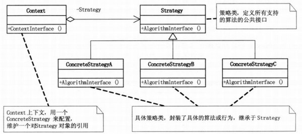
Strategy（抽象算法接口）：定义了所有支持算法的公共接口

ConcreteStrategyA、ConcreteStrategyB和ConcreteStrategyC：继承于Strategy，封装了具体的算法

Context（上下文）：用来维护不同对象的不同算法实现

## 3，代码
例子1
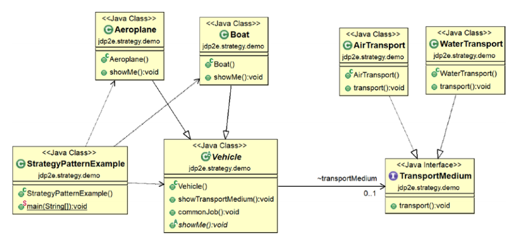

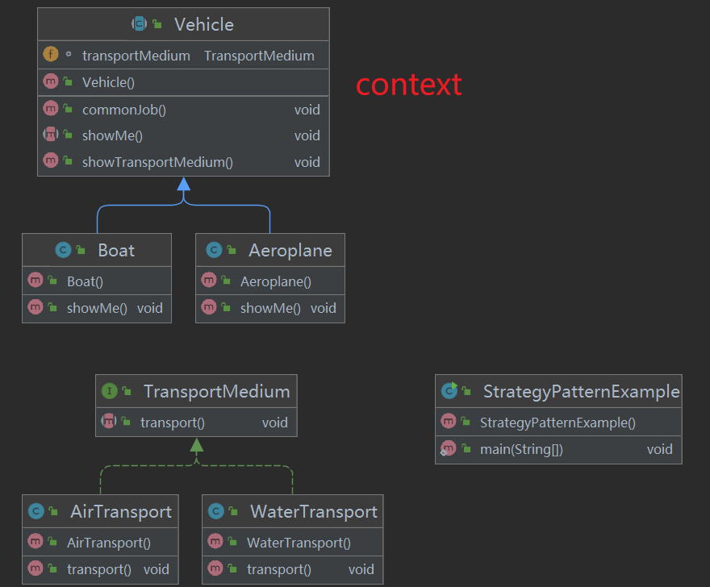

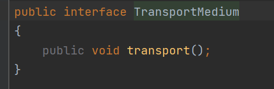

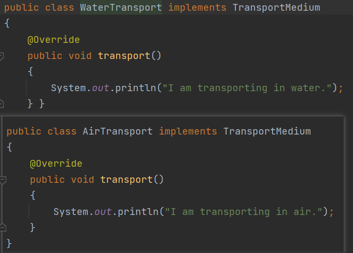

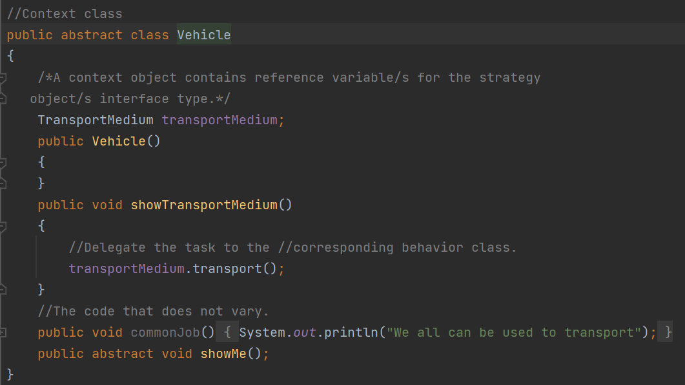

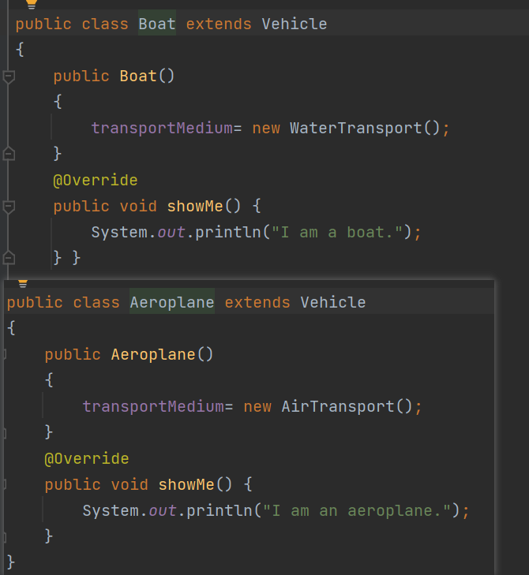

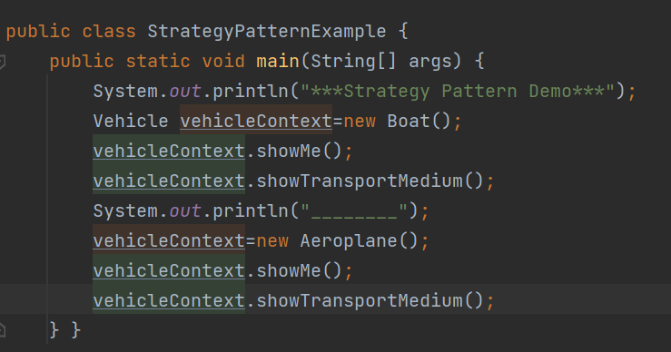

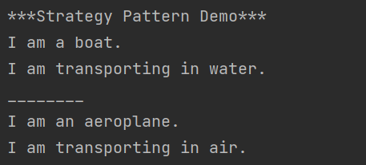
例子2
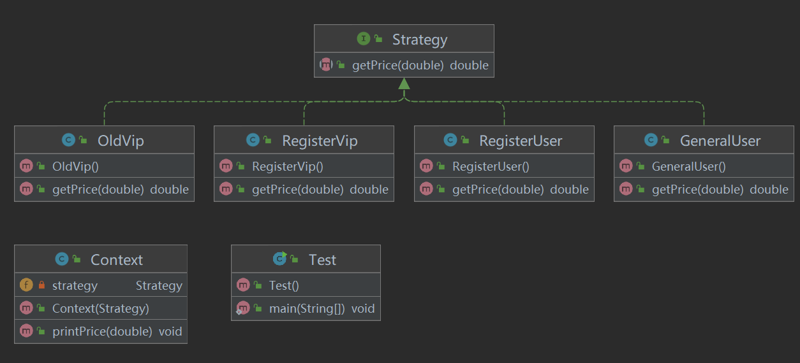

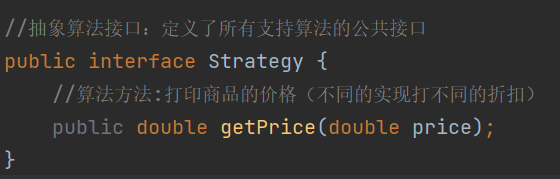

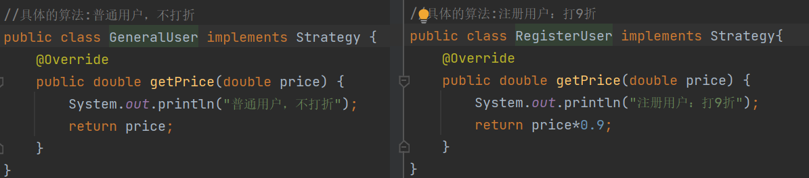

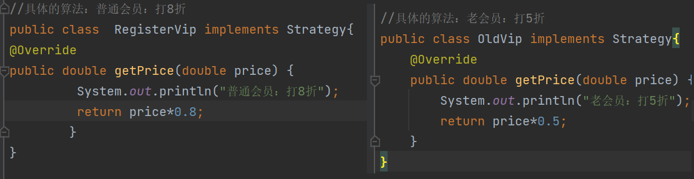

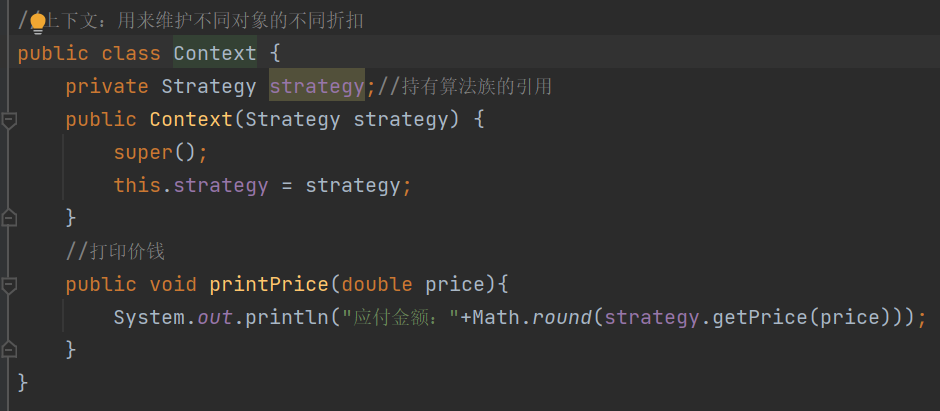

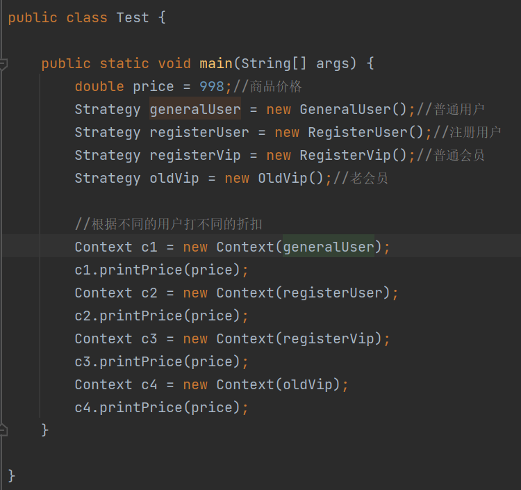

例子3：加减法
<https://www.runoob.com/design-pattern/strategy-pattern.html>

## 4，优缺点
优点：
1、算法可以自由切换。 2、避免使用多重条件判断。 3、扩展性良好。

缺点：
1、策略类会增多。 2、所有策略类都需要对外暴露。

## 5，适用场景
1、如果在一个系统里面有许多类，它们之间的区别仅在于它们的行为，那么使用策略模式可以动态地让一个对象在许多行为中选择一种行为。
2、一个系统需要动态地在几种算法中选择一种。
3、如果一个对象有很多的行为，如果不用恰当的模式，这些行为就只好使用多重的条件选择语句来实现

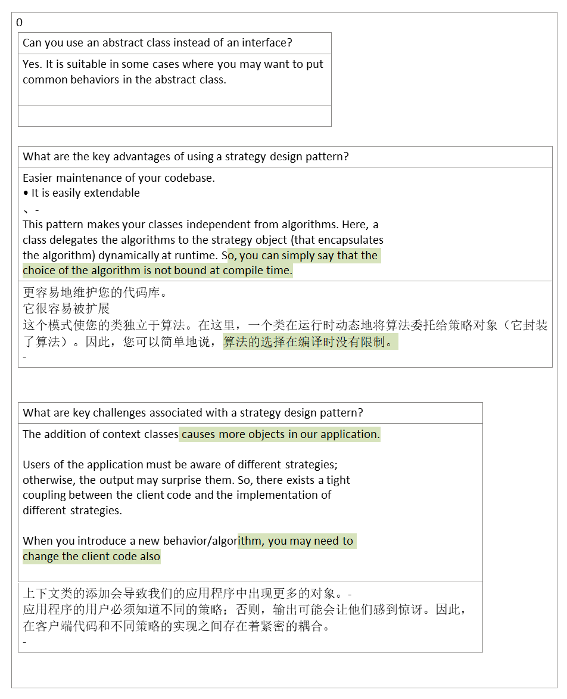

