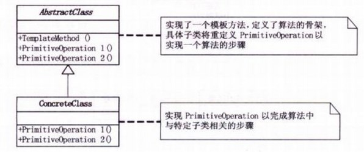
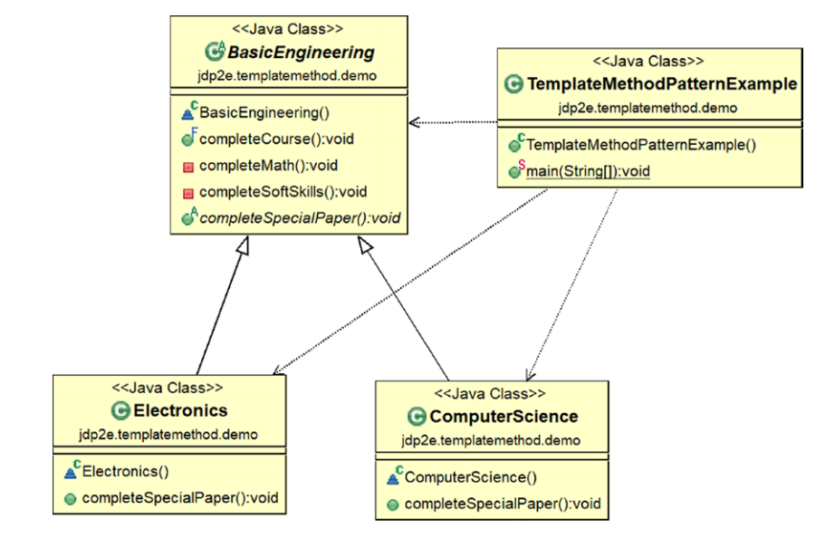
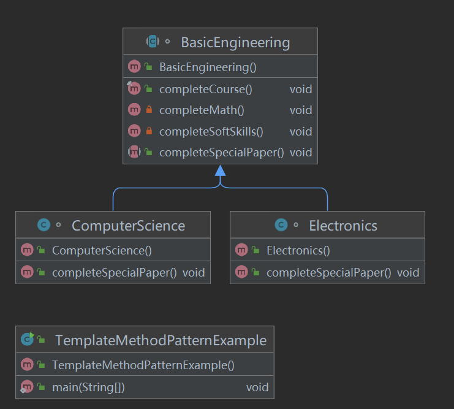
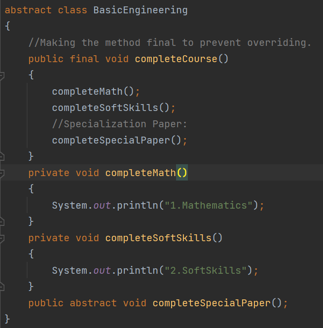
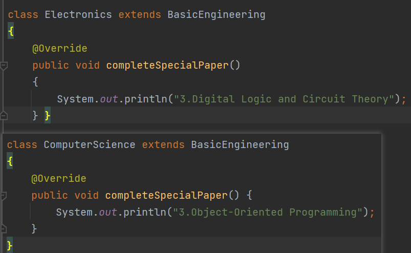
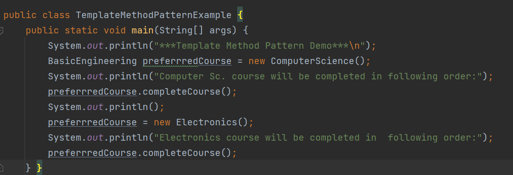
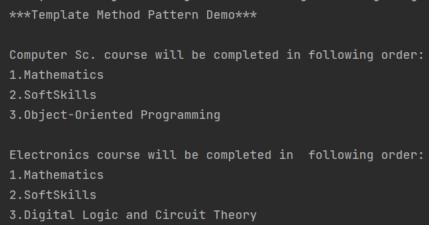
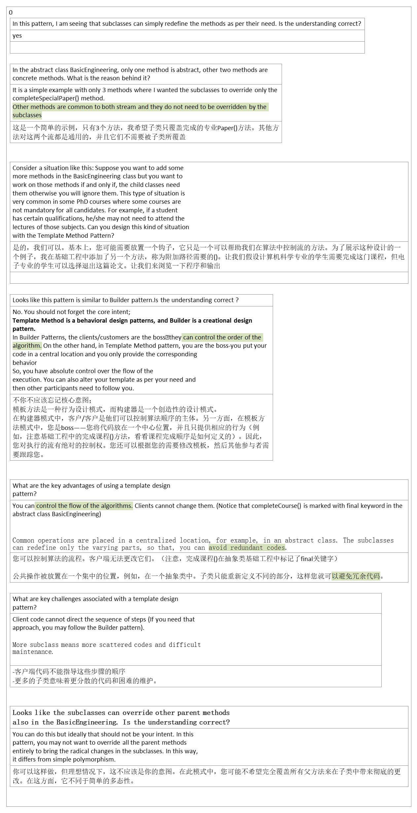

## 1，定义
官方的
定义一个操作中的算法骨架，而将一些步骤延迟到子类中。模板方法使得子类可以不改变一个算法的结构即可重定义该算法的

通俗的
就是将一些相同操作的代码，封装成一个算法的骨架。核心的部分留在子类中操作，在父类中只把那些骨架做好。
## 2，各类含义，UML

## 3，代码

首先，定义一个模板。模板中把业务用作核心部分，让子类来实现。

然后定义具体的模板方法的子类

输出

## 4，优缺点
优点：
1、封装不变部分，扩展可变部分。

2、提取公共代码，便于维护。

3、行为由父类控制，子类实现。

缺点：每一个不同的实现都需要一个子类来实现，导致类的个数增加，使得系统更加庞大。

# 5，适用场景
实现一些操作时，整体步骤很固定，但是呢。就是其中一小部分容易变，这时候可以使用模板方法模式，将容易变的部分抽象出来，供子类实现。

开发中常见场景：

数据库访问的封装
Junit单元测试
servlet中关于doGet/doPost方法的调用

