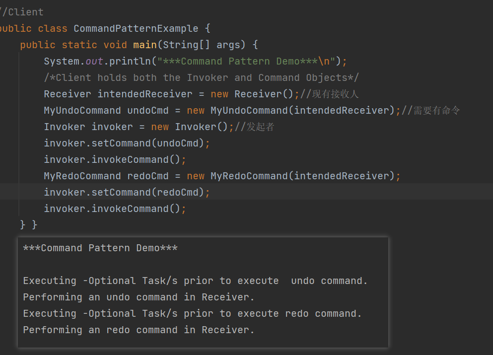

## 1，定义
| 官方的 | 将一个请求封装为一个对象，从而使你可用不同的请求对客户进行参数化，对请求排队或记录请求日志。以及支持可撤销的操作。 |
|--------|--------------------------------------------------------------------------------------------------------------------|
| 通俗的 | 就是将一系列的请求命令封装起来，不直接调用真正执行者的方法，这样比较好扩展。                                       |

## 2，各类含义，UML

Command（抽象命令类）：抽象出命令对象，可以根据不同的命令类型。写出不同的实现类
ConcreteCommand（具体命令类）：实现了抽象命令对象的具体实现
Invoker（调用者/请求者）：**请求的发送者，它通过命令对象来执行请求**。一个调用者并不需要在设计时确定其接收者，因此它只与抽象命令来之间存在关联。在程序运行时，将调用命令对象的execute() ，间接调用接收者的相关操作。

Receiver（接收者）：接收者执行与请求相关的操作，真正执行命令的对象。具体实现对请求的业务处理。未抽象前，实际执行操作内容的对象。

Client（客户端）：在客户类中需要创建调用者对象，具体命令类对象，在创建具体命令对象时指定对应的接收者。发送者和接收者之间没有之间关系。都通过命令对象来调用。

## 3，代码

先有receiver，接受命令的人【真正执行command的人】

定义命令

定义命令的发起者了，发起者需要持有一个命令对象。以便来发起命令

## 4，优缺点
<table>
<colgroup>
<col style="width: 100%" />
</colgroup>
<thead>
<tr class="header">
<th>
优点： 1、降低了系统耦合度。 2、新的命令可以很容易添加到系统中去。

缺点：使用命令模式可能会导致某些系统有过多的具体命令类。
</th>
</tr>
</thead>
<tbody>
</tbody>
</table>

## 5，适用场景
Struts2中action中的调用过程中存在命令模式

数据库中的事务机制的底层实现

命令的撤销和恢复

：增加相应的撤销和恢复命令的方法（比如数据库中的事务回滚）
