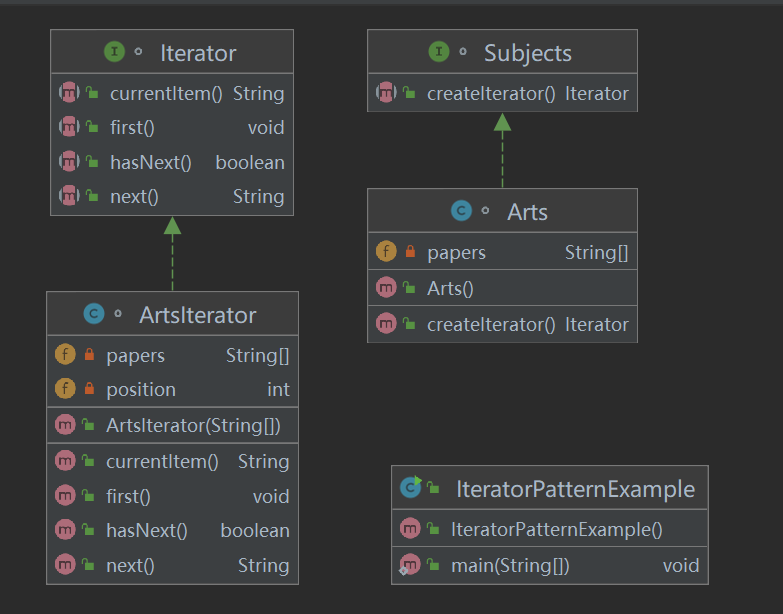
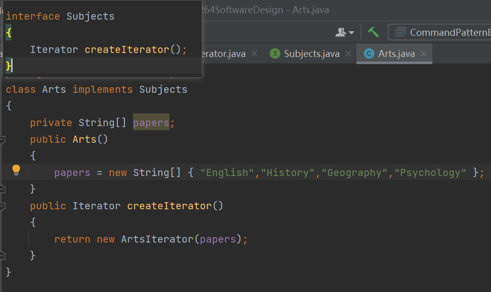
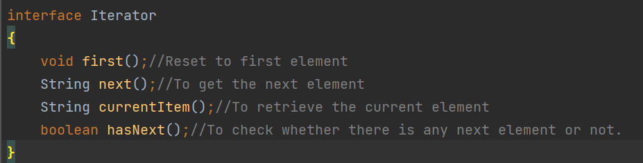
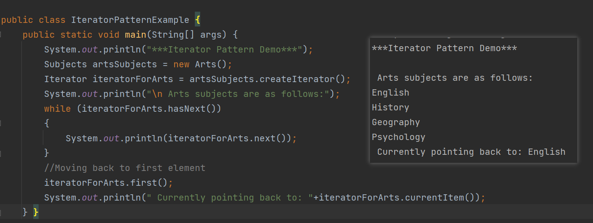
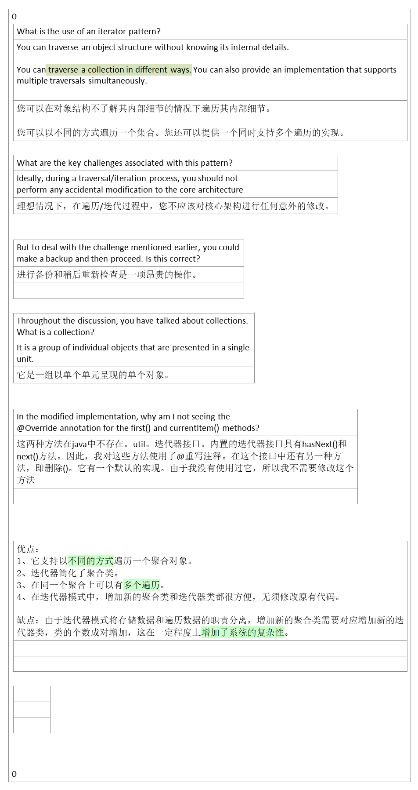

## 1，定义
| 官方的 | 提供一种方法顺序的访问一个聚合对象中各个元素，而又不暴露该对象的内部表示。 |
|--------|----------------------------------------------------------------------------|
通俗的

迭代器是可以从前往后，或者从后往前遍历的。

## 2，各类含义，UML
关键代码：定义接口：hasNext, next。
为遍历不同聚集结构提供如：开始，下一个，是否有下一个，是否结束，当前哪一个等等的一个统一接口。

聚集类：Aggregate(抽象类)和ConcreteAggregate(具体聚集类)表示聚集类，是用来存储迭代器的数据。

在Aggregate(抽象类)中有一个CreateIterator方法，用来获取迭代器

迭代器：迭代器用来为聚集类提供服务，提供了一系列访问聚集类对象元素的方法。

## 3，代码

<table>
<colgroup>
<col style="width: 100%" />
</colgroup>
<thead>
<tr class="header">
<th>
package learn.book.iterator;

class ArtsIterator implements Iterator

{

private String[] papers;

private int position;

public ArtsIterator(String[] papers)

{

this.papers = papers;

position = 0;

}

@Override

public void first()

{

position = 0;

}

@Override

public String next()

{

//System.out.println("Currently pointing to: "+ this.

currentItem();

return papers[position++];

}

@Override

public String currentItem()

{

return papers[position];

}

@Override

public boolean hasNext()

{

if(position &gt;= papers.length)

return false;

return true;

}

}
</th>
</tr>
</thead>
<tbody>
</tbody>
</table>

## 4，优缺点
优点：
1、它支持以不同的方式遍历一个聚合对象。
2、迭代器简化了聚合类。
3、在同一个聚合上可以有多个遍历。
4、在迭代器模式中，增加新的聚合类和迭代器类都很方便，无须修改原有代码。

缺点：由于迭代器模式将存储数据和遍历数据的职责分离，增加新的聚合类需要对应增加新的迭代器类，类的个数成对增加，这在一定程度上增加了系统的复杂性。

## 5，适用场景
1、访问一个聚合对象的内容而无须暴露它的内部表示。

2、需要为聚合对象提供多种遍历方式。

3、为遍历不同的聚合结构提供一个统一的接口。

