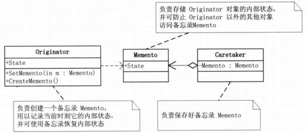
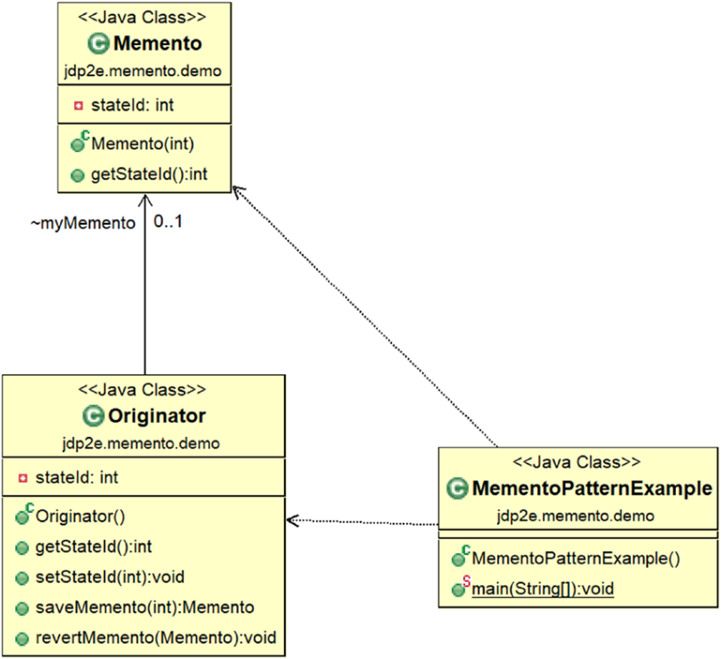
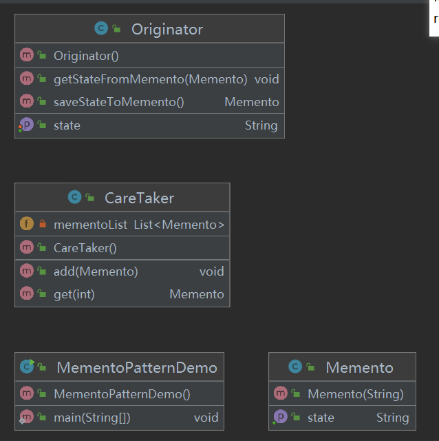
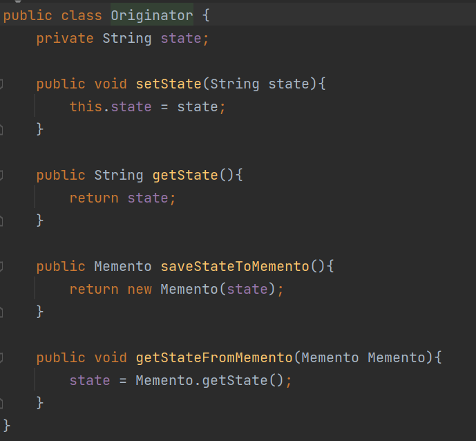
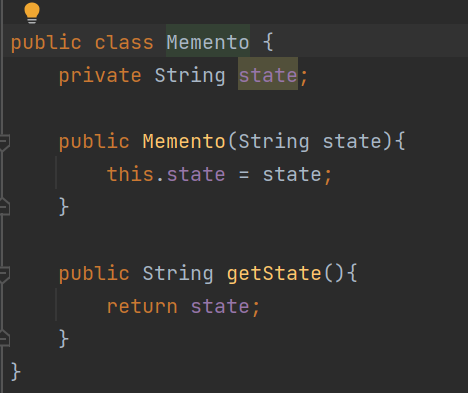
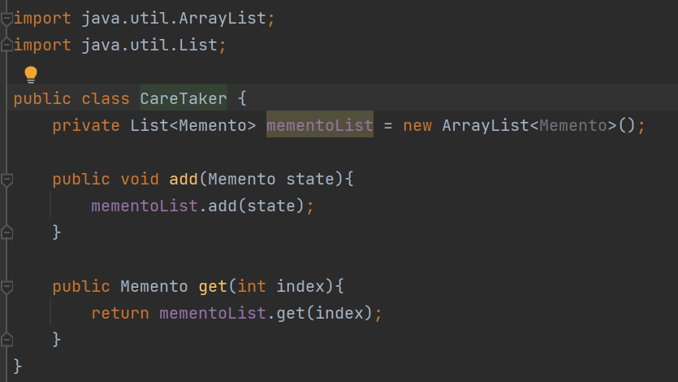
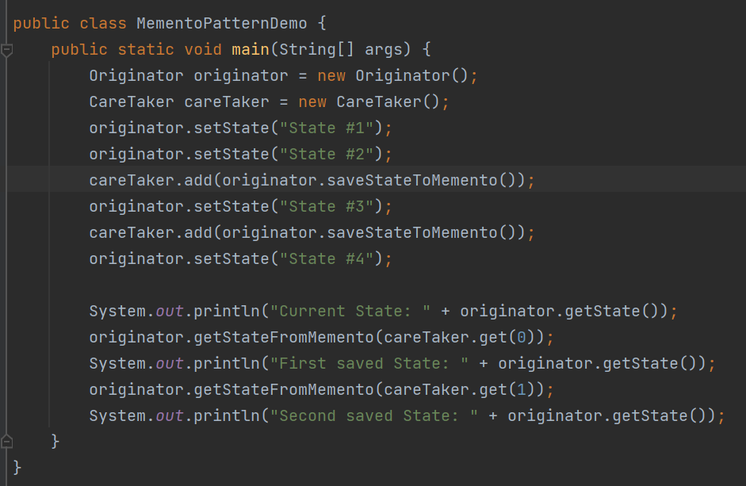
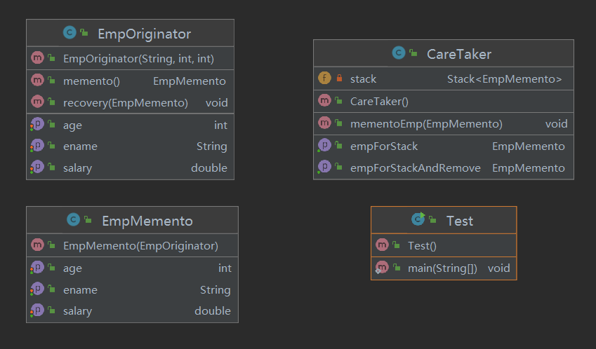
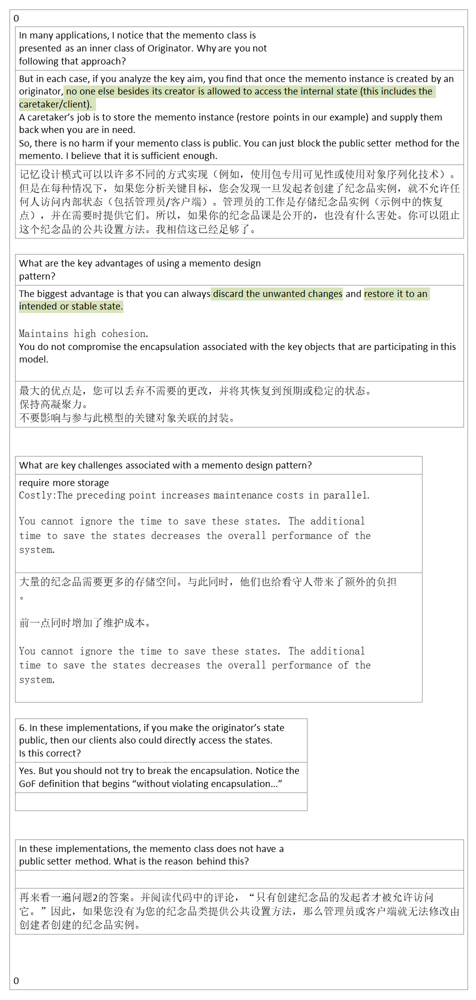

## 1，定义
| 官方的 | 在不破坏封装性的前提下，捕获一个对象的内部状态，并在该对象之外保存这个状态。这样以后就可将该对象恢复到原先保存的状态。 |
|--------|------------------------------------------------------------------------------------------------------------------------|
| 通俗的 | office重新打开时的恢复功能。允许在不暴露对象实现细节的情况下保存和恢复对象之前的状态                                   |

## 2，各类含义，UML
**Originator（发起人）**：负责创建一个备忘录Memento，用以记录当前时刻它的内部状态，并可使用备忘录恢复内部状态。Originator可根据需要决定Memento存储Originator的哪些内部状态
**Memento（备忘录）**：负责存储Originator对象的内部状态，并可防止Originator以外的其他对象访问备忘录Memento。
备忘录有两个接口，
Caretaker只能看到备忘录的窄接口，它只能将备忘录传递给其他对象。
Originator能够看到一个宽接口，允许它访问返回到先前状态所需的所有数据。
**Caretaker（管理者）**：负责保存好备忘录Memento，不能对备忘录的内存进行操作或检查。

可以用list或者stack
| Memento    | 备忘录，记录要存储的变量，对应的get,set                    |
|------------|------------------------------------------------------------|
| Originator | 发起人，保存备忘录语言的属性，建立备忘录, 从备忘录中拿东西 |
| CareTaker  | 备忘录管理者，用list来管理备忘录，add,get                  |

## 3，代码

首先，创建一个发起人：发起人内部保存着需要备忘的属性，它负责创建一个备忘录Memento，用以记录当前时刻它的内部状态，并可使用备忘录恢复内部状态。

创建备忘录对象：备忘录就是用来备份发起人的数据，所以构造器需要提供一个发起人对象

开始创建一个备忘录的管理者

例子2

## 4，优缺点
优点：
1、给用户提供了一种可以恢复状态的机制，可以使用户能够比较方便地回到某个历史的状态。
2、实现了信息的封装，使得用户不需要关心状态的保存细节。

缺点：消耗资源。如果类的成员变量过多，势必会占用比较大的资源，而且每一次保存都会消耗一定的内存。

## 5，适用场景
开发中常见场景：
1、后悔药。 2、打游戏时的存档。 3、Windows 里的 ctrl + z。 4、IE 中的后退。 5、数据库的事务管理。
棋类游戏中的悔棋操作

软件中的撤销操作

数据库中的事务回滚操作

常用软件中的历史记录功能

