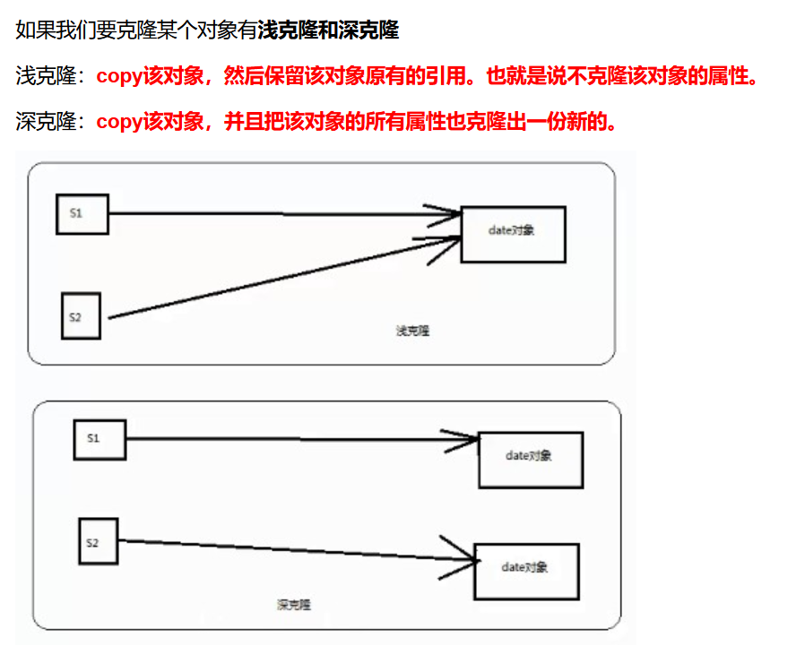
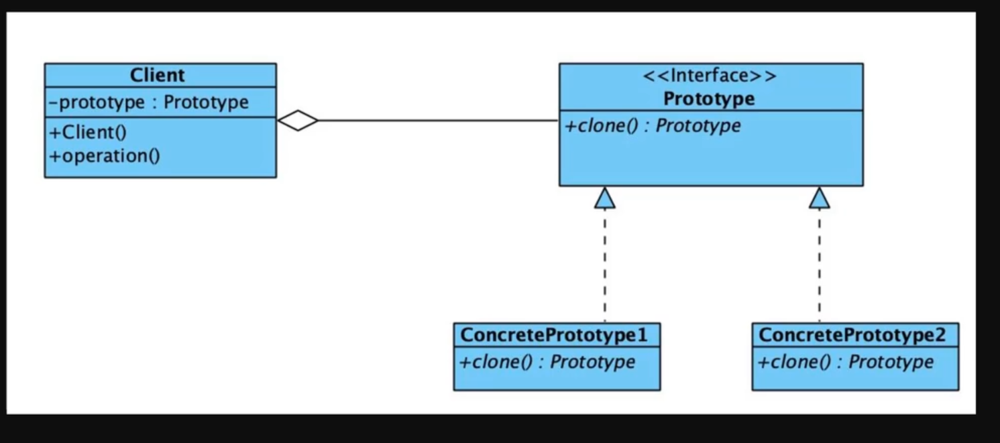
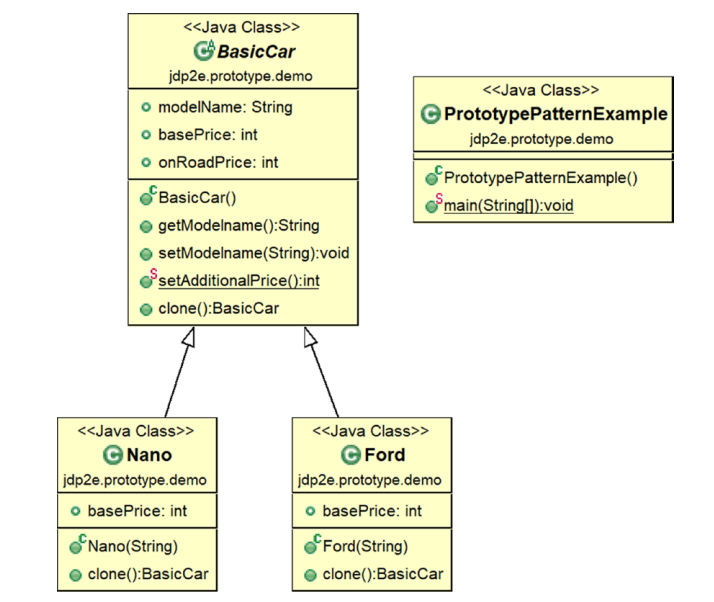
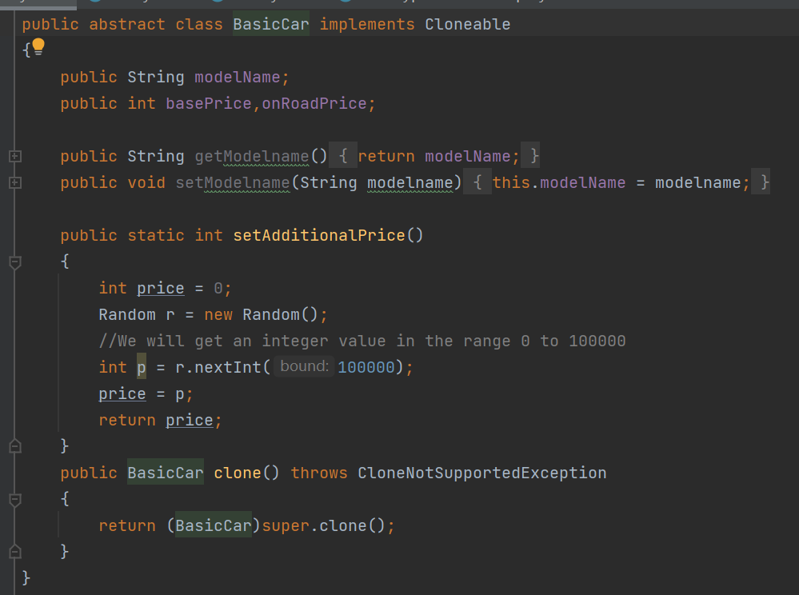
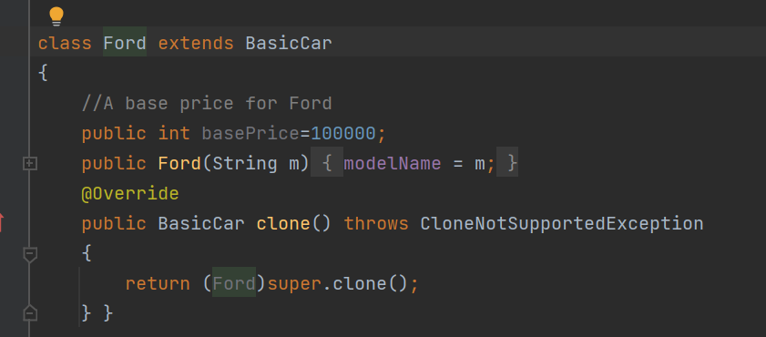
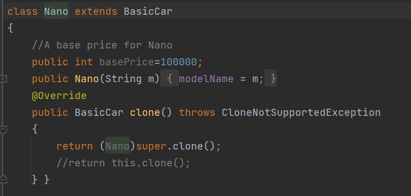
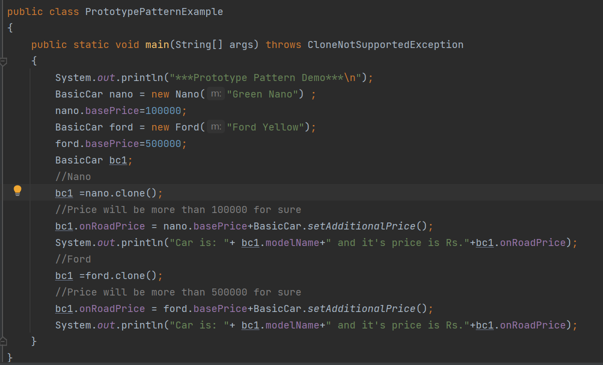
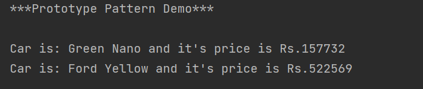
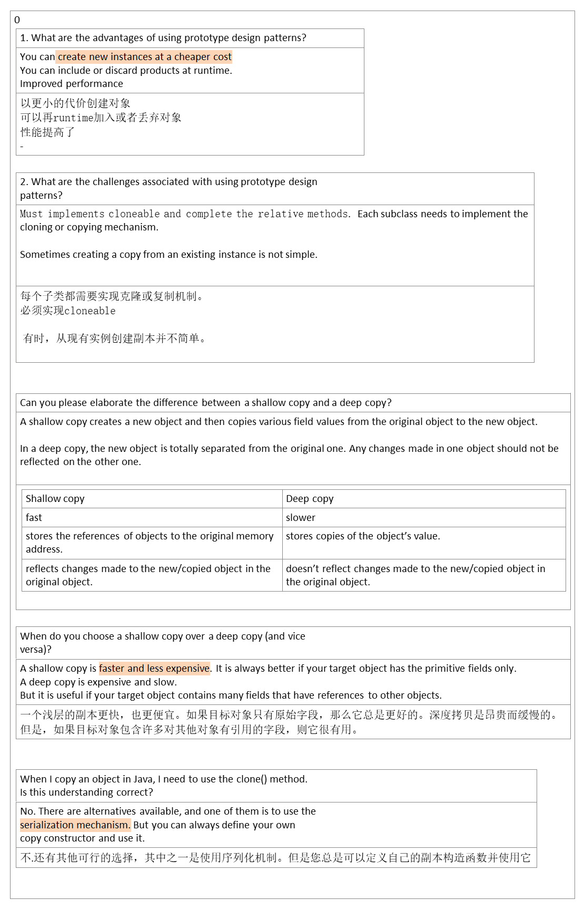

## 1，定义
| 官方的 |                                                                                 |
|--------|----------------------------------------------------------------------------------|
| 通俗的 | 原型模式就是从一个对象再创建另外一个可定制的对象，而且不需要知道任何创建的细节。 |
所谓原型模式，就是java中的克隆技术，以某个对象为原型。复制出新的对象。显然新的对象具备原型对象的特点。效率高（避免了重新执行构造过程步骤）

克隆类似于new，但和new不同。new创建新的对象属性采用的是默认值。克隆出来的对象的属性值完全和原型对象相同。并且克隆出的新对象不会影响原型对象，克隆后。还可以再修改克隆对象的值。

要实现原型模式，必须实现Cloneable接口，而这个接口里面是空的。

Cloneable接口是一个空接口，使用Cloneable接口都不用导入包。而clone方法是属于Object对象的。如果要克隆某个对象的话必须实现Cloneable接口

原型模式适用场景：如果某个对象new的过程中很耗时，则可以考虑使用原型模式。

## 2，各类含义，UML

## 3，代码

## 4，优缺点
优点： 1、性能提高。 2、逃避构造函数的约束。

缺点：
1、配备克隆方法需要对类的功能进行通盘考虑，这对于全新的类不是很难，但对于已有的类不一定很容易，特别当一个类引用不支持串行化的间接对象，或者引用含有循环结构的时候。
2、必须实现 Cloneable 接口。

## 5，适用场景
1、资源优化场景。 2、类初始化需要消化非常多的资源，这个资源包括数据、硬件资源等。 3、性能和安全要求的场景。 4、通过 new 产生一个对象需要非常繁琐的数据准备或访问权限，则可以使用原型模式。 5、一个对象多个修改者的场景。 6、一个对象需要提供给其他对象访问，而且各个调用者可能都需要修改其值时，可以考虑使用原型模式拷贝多个对象供调用者使用。 7、在实际项目中，原型模式很少单独出现，一般是和工厂方法模式一起出现，通过 clone 的方法创建一个对象，然后由工厂方法提供给调用者。原型模式已经与 Java 融为浑然一体，大家可以随手拿来使用。

