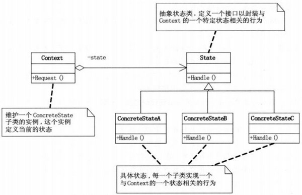
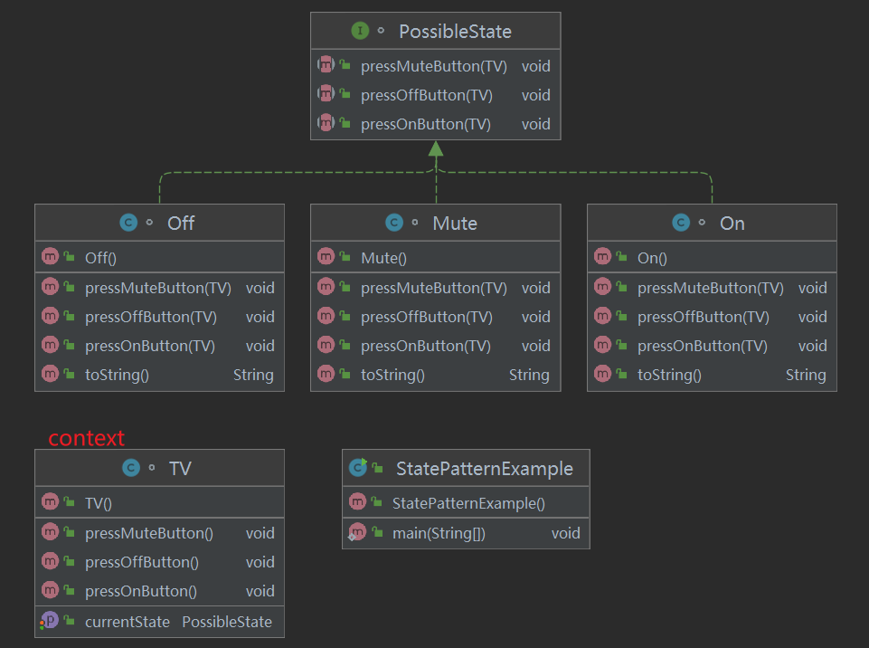
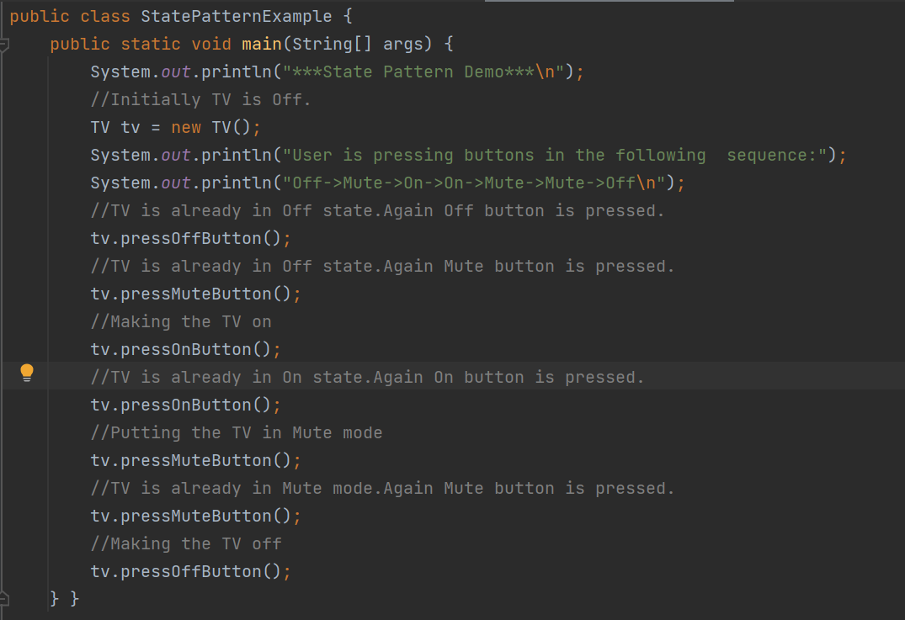
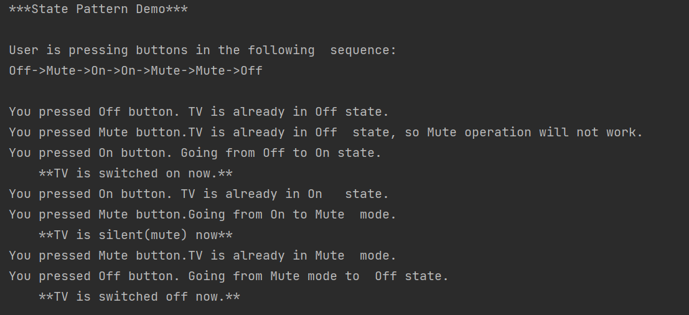
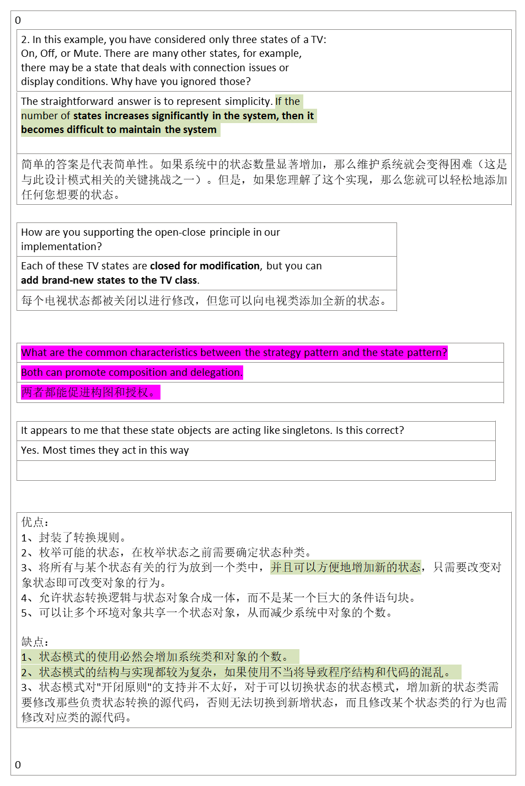

## 1，定义
<table>
<colgroup>
<col style="width: 10%" />
<col style="width: 89%" />
</colgroup>
<thead>
<tr class="header">
<th>官方的</th>
<th>当一个对象的内在状态改变时允许改变其行为，这个对象看起来像是改变了其类</th>
</tr>
</thead>
<tbody>
<tr class="odd">
<td>通俗的</td>
<td>
当遇到<strong>不同的状态遇到不同的行为</strong>的时候，可以使用状态模式

不用写if,else，swith语句，

可以实现复杂的程序状态迁移

我们创建表示各种状态的对象和一个行为随着状态对象改变而改变的 context 对象。

</td>
</tr>
</tbody>
</table>
## 2，各类含义，UML
State（抽象状态类）：定义一个接口以封装与Context的一个特定状态相关的行为。
ConcreteStateA，B，C（具体状态）：每一个子类实现一个不同的状态或行为
Context（上下文）：维护一个State子类状态的实例，这个实例中定义了当前的状态。

## 3，代码

<table>
<colgroup>
<col style="width: 100%" />
</colgroup>
<thead>
<tr class="header">
<th>
interface PossibleState

{

void pressOnButton(TV context);

void pressOffButton(TV context);

void pressMuteButton(TV context);

}

</th>
</tr>
</thead>
<tbody>
</tbody>
</table>

<table>
<colgroup>
<col style="width: 33%" />
<col style="width: 33%" />
<col style="width: 33%" />
</colgroup>
<thead>
<tr class="header">
<th>
package learn.book.state;

//On state

class On implements PossibleState

{

//TV is On already, user is pressing On button again

@Override

public void pressOnButton(TV context)

{

System.out.println("You pressed On button. TV is already in On state.");

}

//User is pressing Off button when the TV is in On state

@Override

public void pressOffButton(TV context)

{

System.out.println("You pressed Off button.Going from On to Off state.");

context.setCurrentState(new Off());

System.out.println(context.getCurrentState().toString());

}

//User is pressing Mute button when the TV is in On state

@Override

public void pressMuteButton(TV context)

{

System.out.println("You pressed Mute button.Going from On to Mute mode.");

context.setCurrentState(new Mute());

System.out.println(context.getCurrentState().toString());

}

public String toString()

{

return "\t**TV is switched on now.**";

} }
</th>
<th>
package learn.book.state;

class Off implements PossibleState

{

//User is pressing Off button when the TV is in Off state

@Override

public void pressOnButton(TV context)

{

System.out.println("You pressed On button. Going from Off to On state.");

context.setCurrentState(new On());

System.out.println(context.getCurrentState().toString());

}

//TV is Off already, user is pressing Off button again

@Override

public void pressOffButton(TV context)

{

System.out.println("You pressed Off button. TV is already in Off state.");

}

//User is pressing Mute button when the TV is in Off state

@Override

public void pressMuteButton(TV context)

{

System.out.println("You pressed Mute button.TV is already in Off state, so Mute operation will not work.");

}

public String toString()

{

return "\t**TV is switched off now.**";

} }
</th>
<th>
package learn.book.state;

//Mute state

class Mute implements PossibleState

{

//User is pressing On button when the TV is in Mute mode

@Override

public void pressOnButton(TV context)

{

System.out.println("You pressed On button.Going from Mute mode to On state.");

context.setCurrentState(new On());

System.out.println(context.getCurrentState().toString());

}

//User is pressing Off button when the TV is in Mute mode

@Override

public void pressOffButton(TV context)

{

System.out.println("You pressed Off button. Going from Mute mode to Off state.");

context.setCurrentState(new Off());

System.out.println(context.getCurrentState().toString());

}

//TV is in mute mode already, user is pressing mute button again

@Override

public void pressMuteButton(TV context)

{

System.out.println("You pressed Mute button.TV is already in Mute mode.");

}

public String toString()

{

return "\t**TV is silent(mute) now**";

} }
</th>
</tr>
</thead>
<tbody>
</tbody>
</table>

<table>
<colgroup>
<col style="width: 100%" />
</colgroup>
<thead>
<tr class="header">
<th>
package learn.book.state;

class TV

{

private PossibleState currentState;

public TV()

{

//Initially TV is initialized with Off state

this.setCurrentState(new Off());

}

public PossibleState getCurrentState()

{

return currentState;

}

public void setCurrentState(PossibleState currentState)

{

this.currentState = currentState;

}

public void pressOffButton()

{

currentState.pressOffButton(this);//Delegating the state

}

public void pressOnButton()

{

currentState.pressOnButton(this);//Delegating the state

}

public void pressMuteButton()

{

currentState.pressMuteButton(this);//Delegating the state

} }
</th>
</tr>
</thead>
<tbody>
</tbody>
</table>

## 4，优缺点
优点：
1、封装了转换规则。
2、枚举可能的状态，在枚举状态之前需要确定状态种类。
3、将所有与某个状态有关的行为放到一个类中，并且可以方便地增加新的状态，只需要改变对象状态即可改变对象的行为。
4、允许状态转换逻辑与状态对象合成一体，而不是某一个巨  
对象的个数。

缺点：
1、状态模式的使用必然会增加系统类和对象的个数。
2、状态模式的结构与实现都较为复杂，如果使用不当将导致程序结构和代码的混乱。
3、状态模式对"开闭原则"的支持并不太好，对于可以切换状态的状态模式，增加新的状态类需要修改那些负责状态转换的源代码，否则无法切换到新增状态，而且修改某个状态类的行为也需修改对应类的源代码。

## 5，适用场景

当一个对象的行为取决于它的状态，并且它必须在运行时刻根据状态改变它的行为时，就可以考虑使用状态模式了。

开发中场景：

银行系统中账号状态的管理

OA系统中公文状态的管理

酒店系统中，房间状态的管理

线程对象各状态之间的切换

