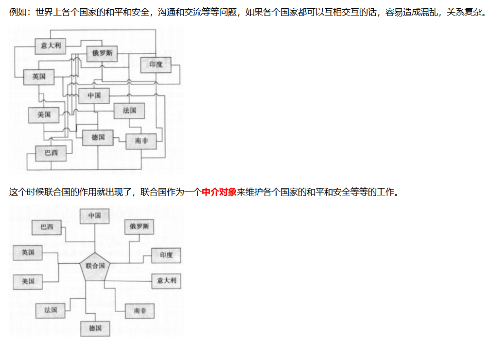
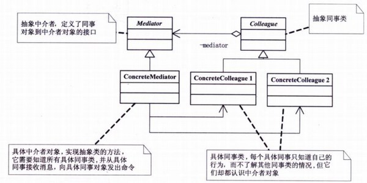
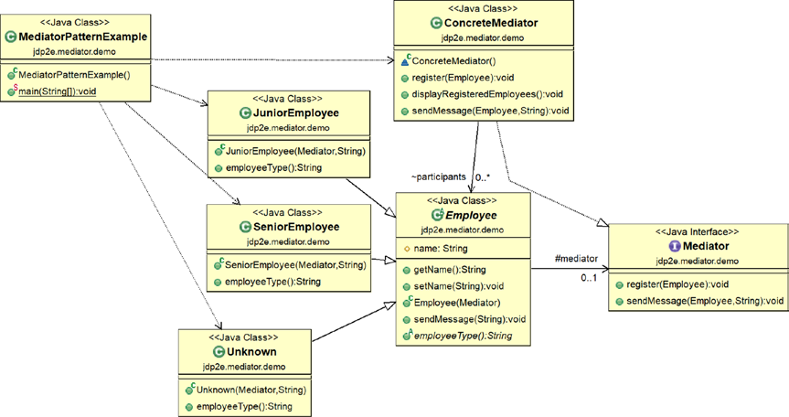
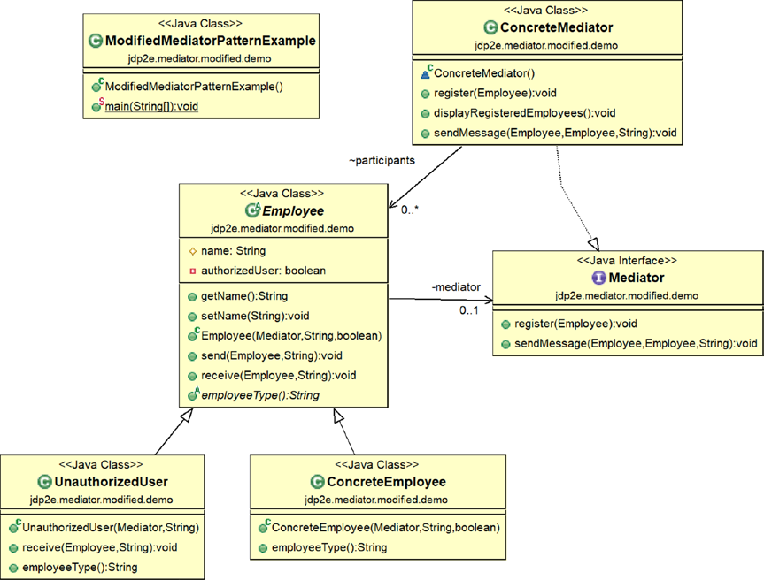

21-Mediator Pattern
2021年12月15日
8:25

## 1，定义
<table>
<colgroup>
<col style="width: 10%" />
<col style="width: 89%" />
</colgroup>
<thead>
<tr class="header">
<th>官方的</th>
<th>
中介者模式：用一个中介对象来封装一系列的对象交互，中介者使各对象不需要显示地相互引用。从而使其耦合松散，而且可以独立地改变它们之间的交互。

中介者模式核心：1.就是将网状结构处理成星型结构 2.将多对多处理成一对多
</th>
</tr>
</thead>
<tbody>
<tr class="odd">
<td>比如</td>
<td>世界各国和联合国</td>
</tr>
</tbody>
</table>
通俗的

## 2，各类含义，UML

例如：公司中如果没有部门经理，部门中的职员之间的工作沟通，职员和总监工作的沟通，职员和其他部门职员的沟通等等。会造成混乱，每个部门或者每个层级，都需要一个领导人来作为中介和其他组织的人沟通。

Colleague（抽象同事类）：

ConcreteColleague（具体同事类）：每个具体同事只知道自己的行为，而不了解其他同事类的情况，但他们都认识中介者对象。

Mediator（抽象中介者）：定义了同事对象和中介者对象的接口

ConcreteMediator（具体中介者对象）：实现抽象中介者的方法，它需要知道所有具体同事类，并从具体同事接收消息，向具体同事对象发出命令。

## 3，代码
案例1： <https://www.runoob.com/design-pattern/mediator-pattern.html>

案例2

**
**

## 4，优缺点
优点：
1、降低了类的复杂度，将一对多转化成了一对一。
2、各个类之间的解耦。 3、符合迪米特原则。

缺点：中介者会庞大，变得复杂难以维护

## 5，适用场景
开发中常见应用场景：

MVC模式中的C部分，M和V都和它打交道

