22-Chain-of-Responsibility
2021年12月15日
8:23

## 1，定义
| 官方的 | 将能够处理同一类请求的对象连成一条链，使这些对象都有机会处理请求，所提交的请求沿着链传递。从而避免请求的发送者和接受者之间的耦合关系。链上的对象逐个判断是否有能力处理该请求，如果能则就处理，如果不能，则传给链上的下一个对象。直到有一个对象处理它为止。 |
|--------|------------------------------------------------------------------------------------------------------------------------------------------------------------------------------------------------------------------------------------------------------------|
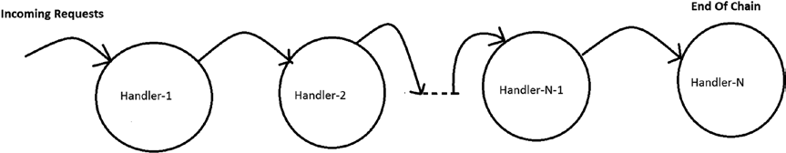

通俗的
## 2，各类含义，UML

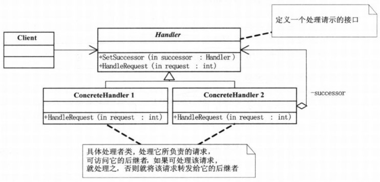
Handler：表示处理请求的接口，在这个接口里可以定义链上的下一个继承者，和一个处理请求的抽象方法。

ConcreteHandler1和ConcreteHandler2：表示具体的处理者

## 3，代码
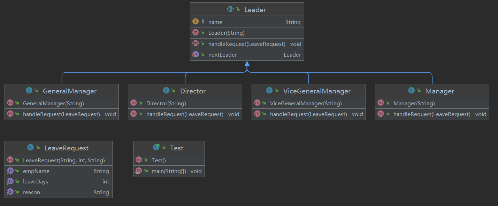

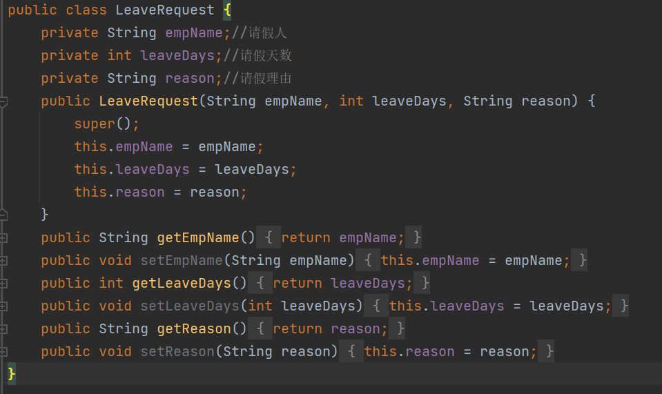

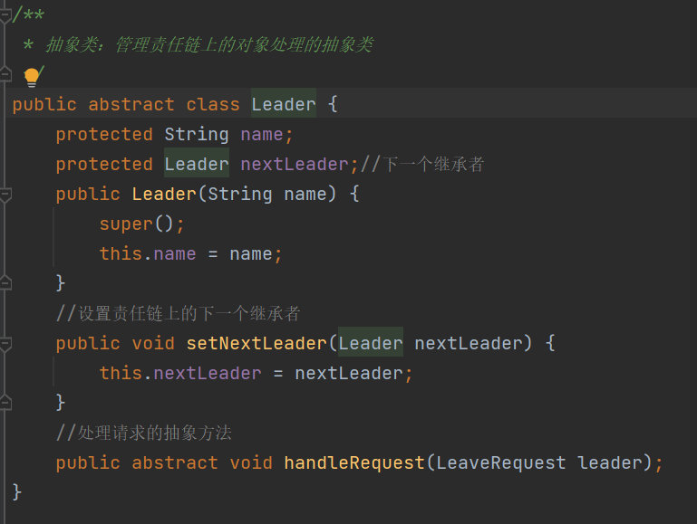

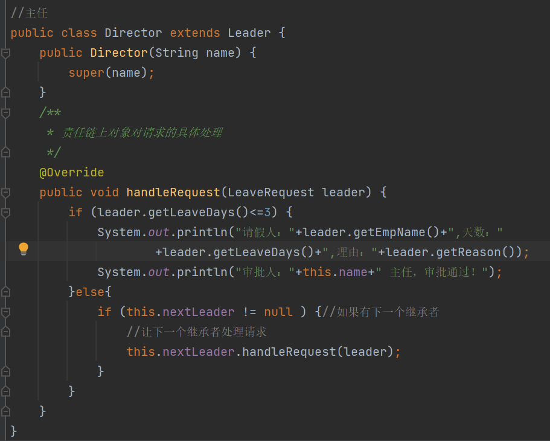

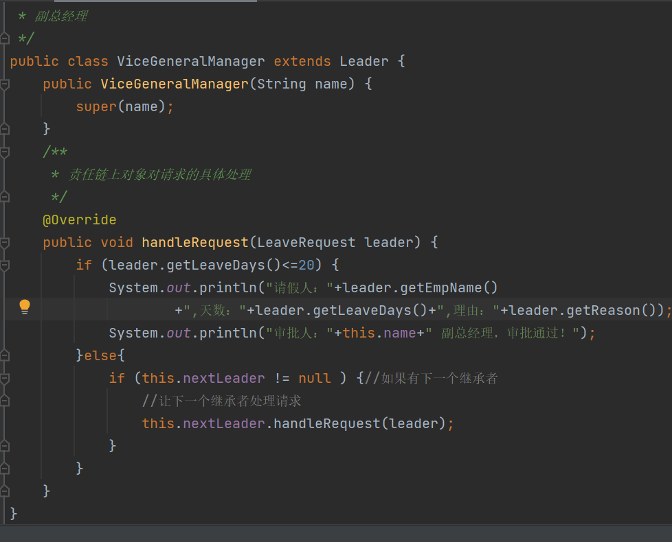

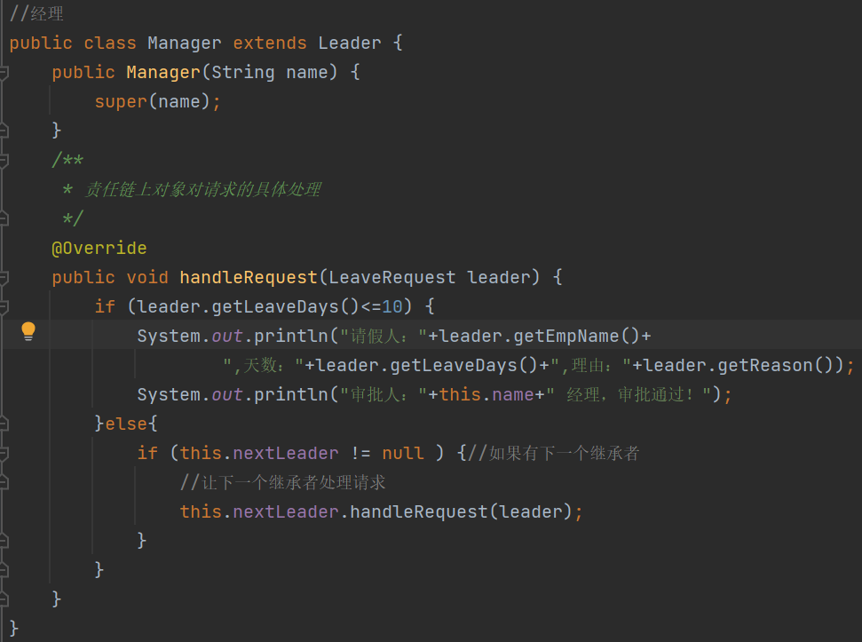
注意
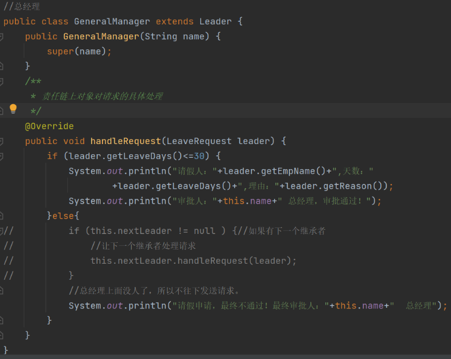

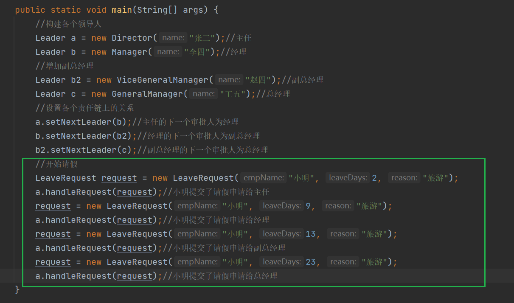

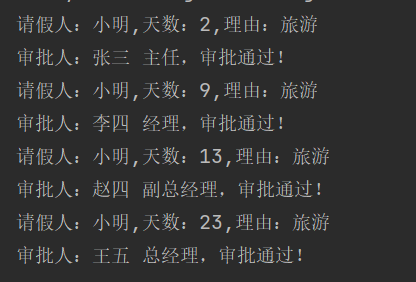

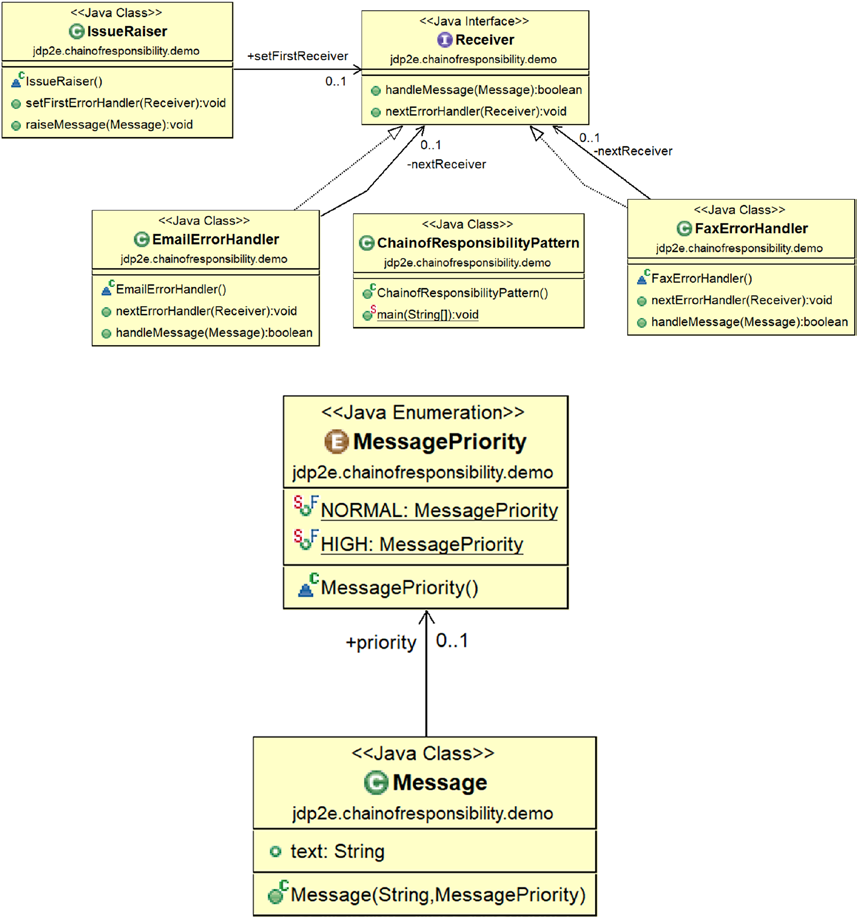
## 4，优缺点
优点： 1、降低耦合度。它将请求的发送者和接收者解耦。 2、简化了对象。使得对象不需要知道链的结构。 3、增强给对象指派职责的灵活性。通过改变链内的成员或者调动它们的次序，允许动态地新增或者删除责任。 4、增加新的请求处理类很方便。

缺点： 1、不能保证请求一定被接收。 2、系统性能将受到一定影响，而且在进行代码调试时不太方便，可能会造成循环调用。 3、可能不容易观察运行时的特征，有碍于除错
## 5，适用场景
场景：

1、打牌时，轮流出牌

2、接力赛跑

3、请假审批

4、公文审批

1、红楼梦中的"击鼓传花"。 2、JS 中的事件冒泡。 3、JAVA WEB 中 Apache Tomcat 对 Encoding 的处理，Struts2 的拦截器，jsp servlet 的 Filter

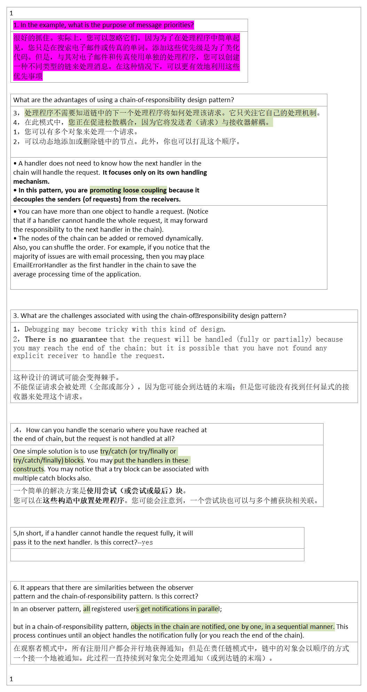

