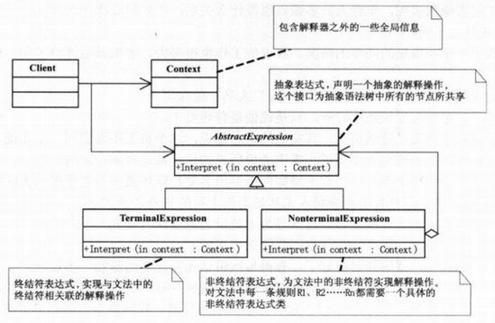
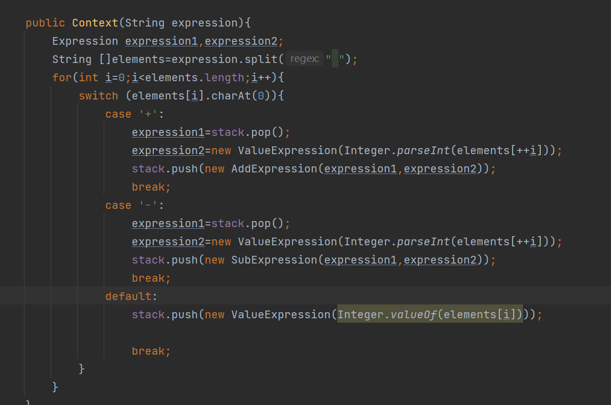
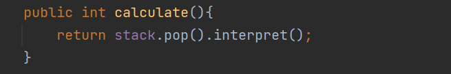
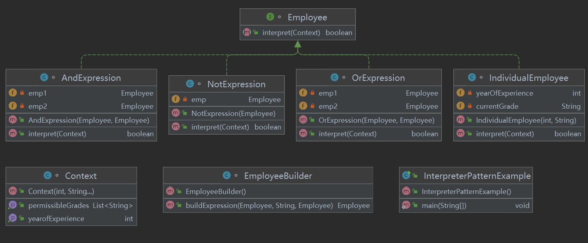
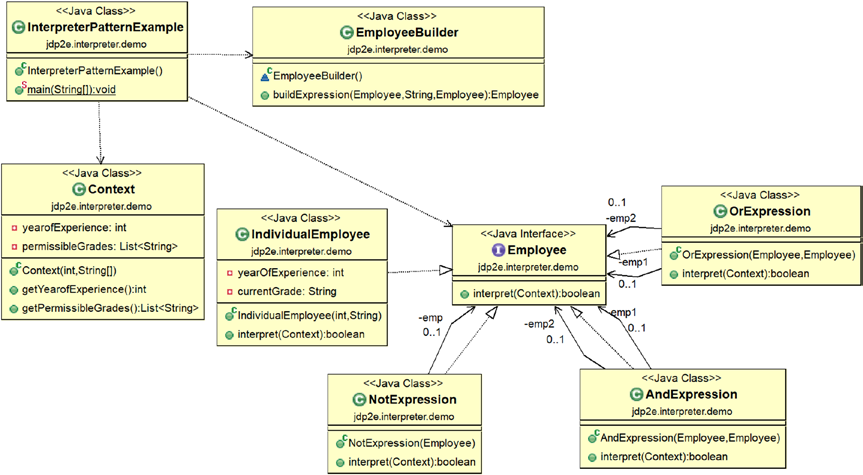
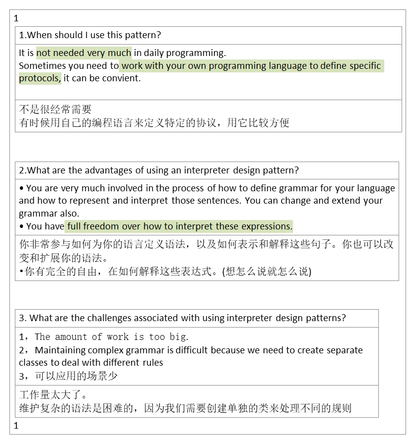

## 1，定义
<table>
<colgroup>
<col style="width: 10%" />
<col style="width: 89%" />
</colgroup>
<thead>
<tr class="header">
<th>官方的</th>
<th>给定一个语言，定义它的文法一种表示。并定义一个解释器，这个解释器使用该表示来解释语言中的句子。</th>
</tr>
</thead>
<tbody>
<tr class="odd">
<td>通俗的</td>
<td>
也就是说，如果你想自己开发一种语言来解释执行某些语言的特定语法，可以考虑使用解释器模式。

该模式对于我们开发人员来说，基本上都用不到。除非你想自己开发一种语言。

解释器模式真正开发起来很难，就相当于自己开发了一种语言给别人用。
</td>
</tr>
</tbody>
</table>

## 2，各类含义，UML

## 3，代码
例子1：or,and的
<https://www.runoob.com/design-pattern/interpreter-pattern.html>

例子2：计算器四则运算

例子3：课本

## 4，优缺点
优点：
1、可扩展性比较好，灵活。 2、增加了新的解释表达式的方式。 3、易于实现简单文法。
缺点：
1、可利用场景比较少。 2、对于复杂的文法比较难维护。
3、解释器模式会引起类膨胀。 4、解释器模式采用递归调用方法。

## 5，适用场景
通常来说，当有一个语言需要解释执行，并且你可将该语言中的句子表示为一个抽象语法树叶，则可以使用解释器模式。

EL表达式的处理
正则表达式解释器
SQL语法的解释器
数学表达式解释器：Math 、 Expression String Parser 、 Expression4J

