## 1，定义
<table>
<colgroup>
<col style="width: 10%" />
<col style="width: 89%" />
</colgroup>
<thead>
<tr class="header">
<th>官方的</th>
<th>
使用多个简单的对象一步一步构建成一个复杂的对象。这种类型的设计模式属于创建型模式，它提供了一种创建对象的最佳方式。

假如一个对象的构建很复杂，需要很多步骤。则可以使用建造者模式，将其构建对象和组装成一个对象这两步给分开来。构建部分为（builder）和组织部分（director），实现了构建和装配的解耦。
</th>
</tr>
</thead>
<tbody>
<tr class="odd">
<td>通俗的</td>
<td>去肯德基，汉堡、可乐、薯条、炸鸡翅等是不变的，而其组合是经常变化的，生成出所谓的"套餐"。</td>
</tr>
</tbody>
</table>
与工厂模式的区别是：建造者模式更加关注与零件装配的顺序。
与抽象工厂的区别：在建造者模式里，有个指导者，由指导者来管理建造者，用户是与指导者联系的，指导者联系建造者最后得到产品。即建造模式可以强制实行一种分步骤进行的建造过程。
## 2，各类含义，UML
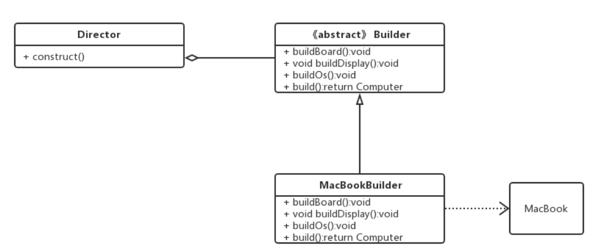
## 3，代码
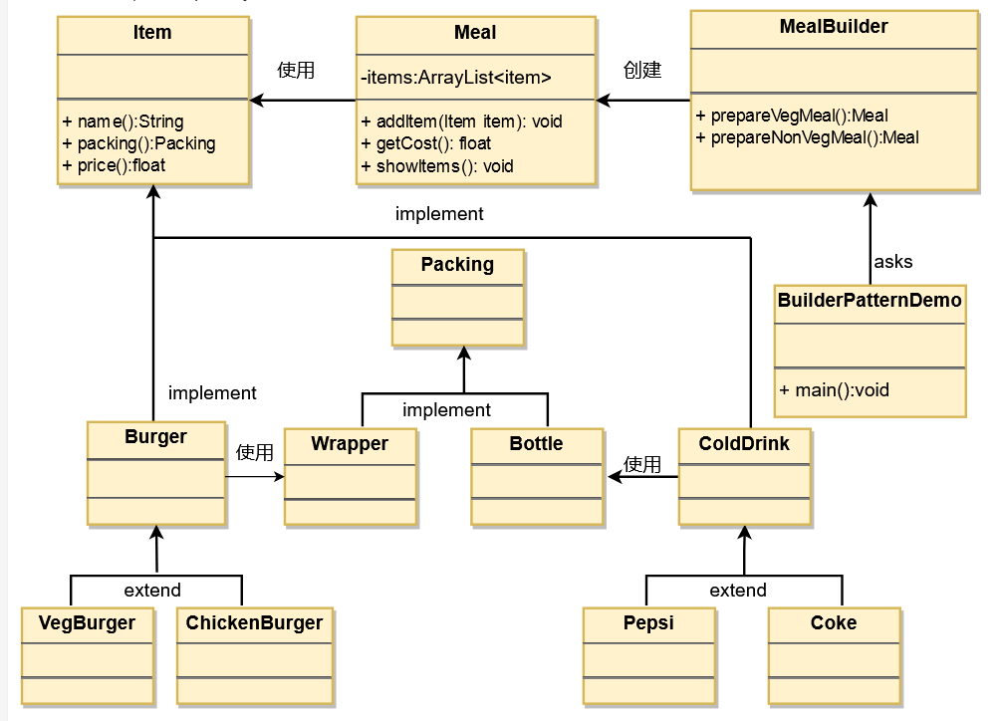

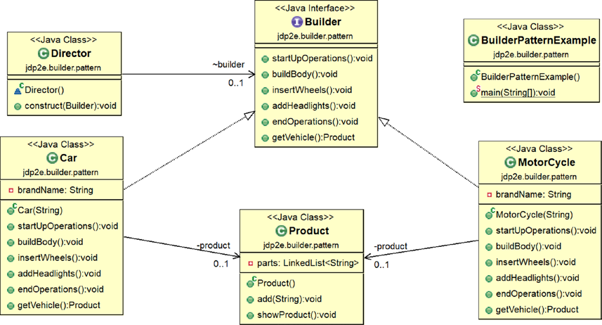

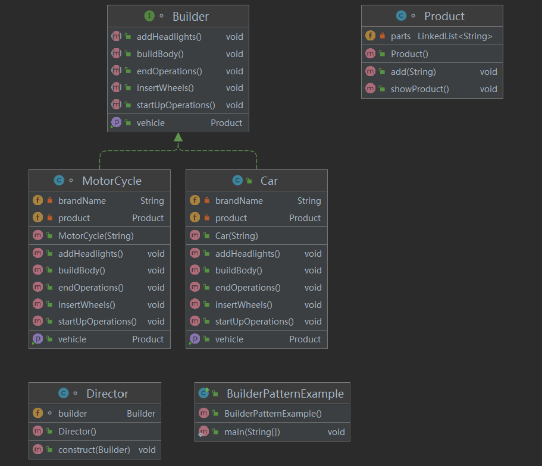

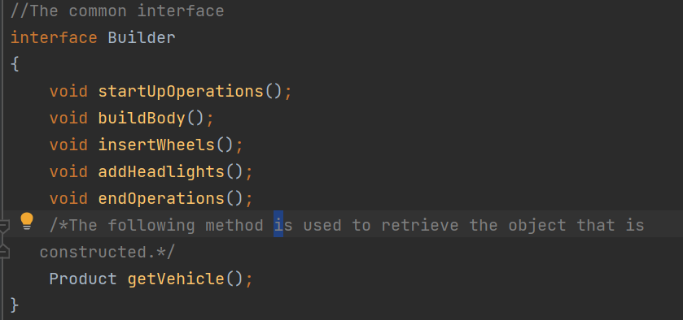

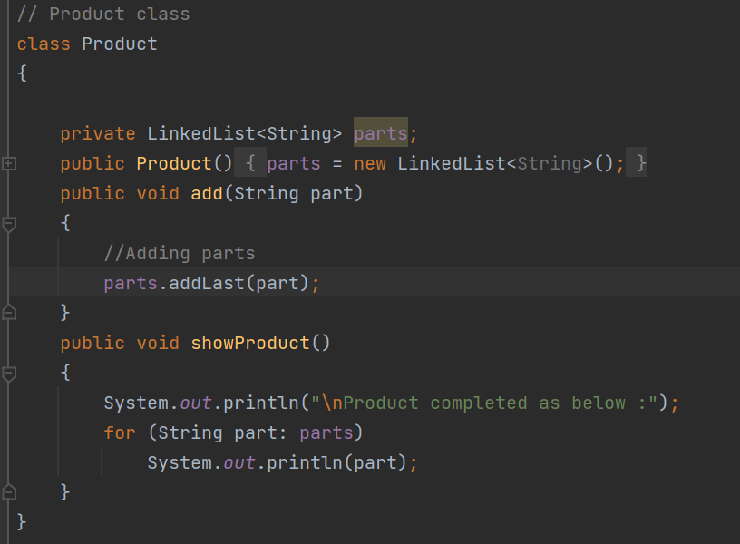

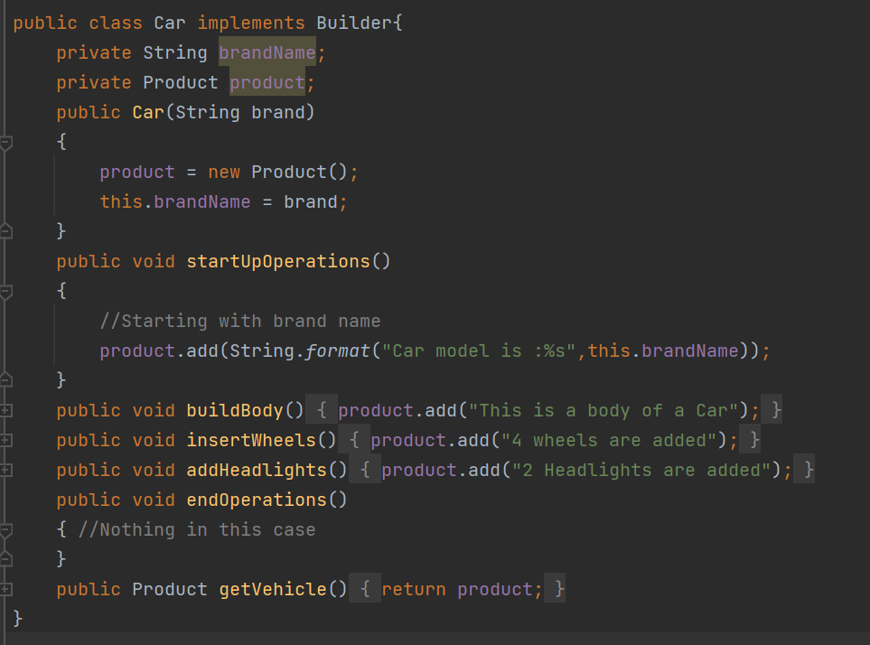

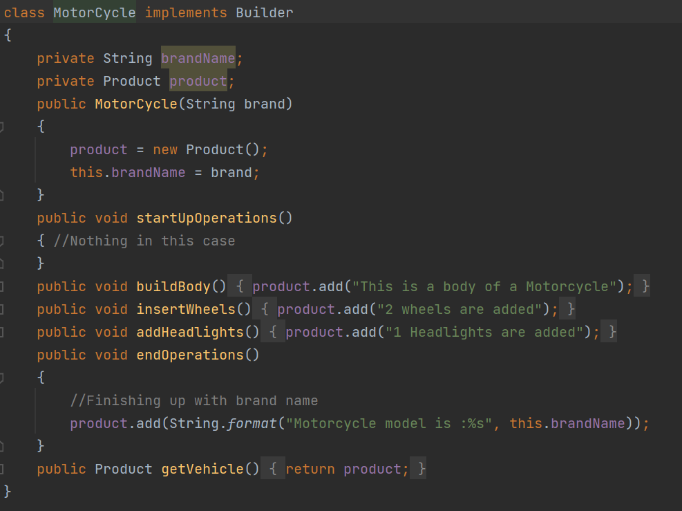

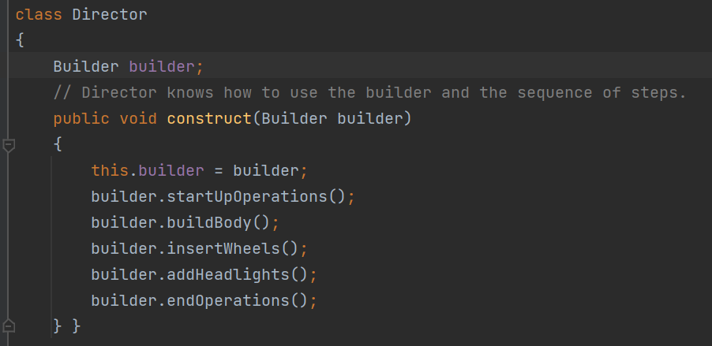

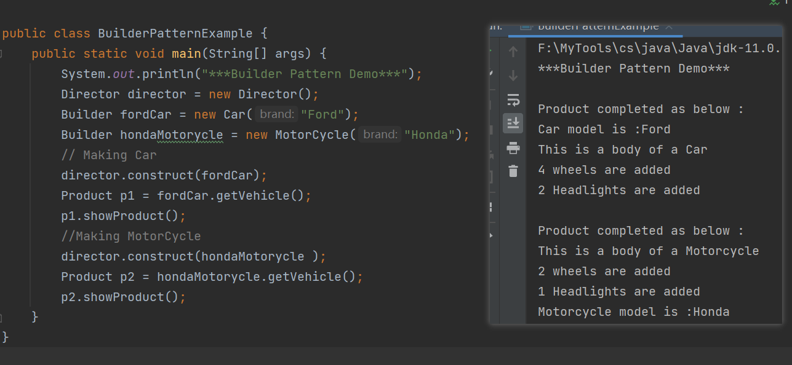
## 4，优缺点
优点： 1、建造者独立，易扩展。 产品2、便于控制细节风险。
缺点： 1、产品必须有共同点，范围有限制。 2、如内部变化复杂，会有很多的建造类。

## 5，适用场景
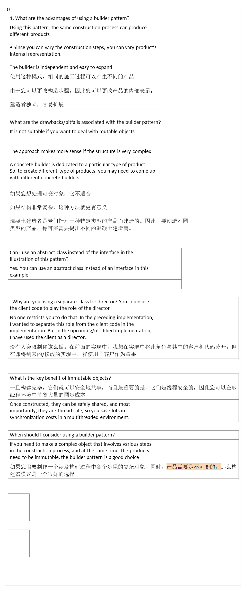

