## 1，定义
| 官方的 | 定义一个创建对象的接口，让其子类自己决定实例化哪一个工厂类，工厂模式使其创建过程延迟到子类进行。 |
|--------|--------------------------------------------------------------------------------------------------|
| 通俗的 |                                                                                                 |
工厂模式实现了创建者和调用者的分离

工厂模式分类：

1.简单工厂模式

2.工厂方法模式：定义一个用于创建对象的接口，让子类决定实例化哪一个类，工厂方法使一个类的实例化延迟到其子类

​3.抽象工厂模式：提供一个创建一系列相关或相互依赖对象的接口，而无需指定它们具体的类。

## 2，各类含义，UML
## 3，代码
例子1
<https://www.cnblogs.com/meet/p/5116400.html>

例子2：
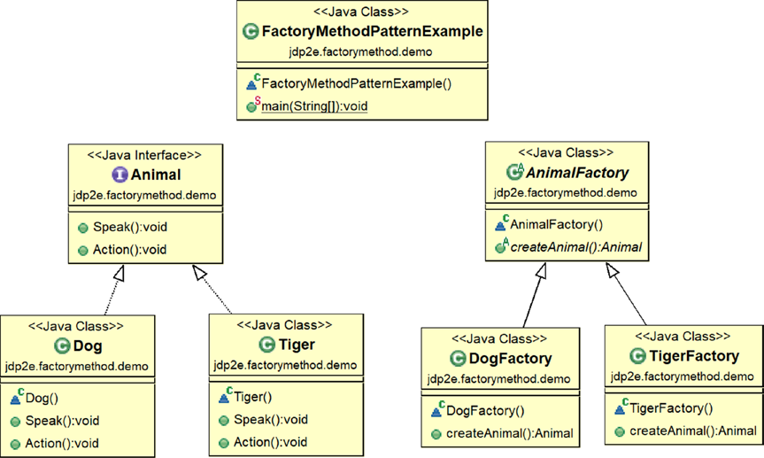

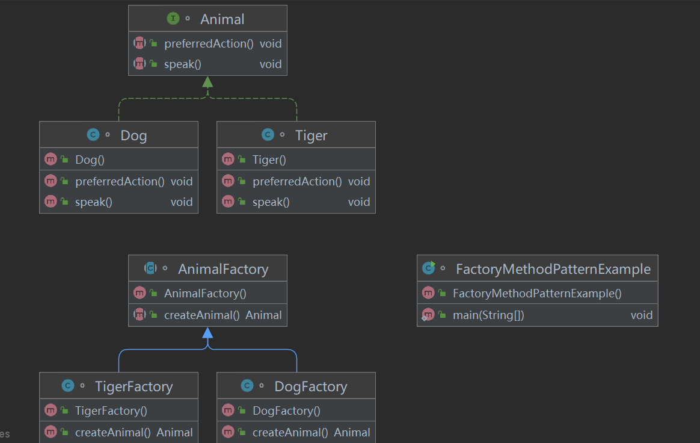

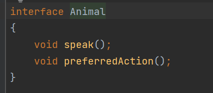

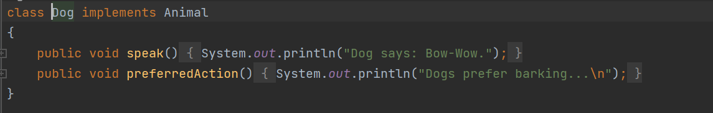

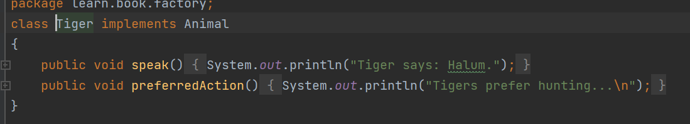

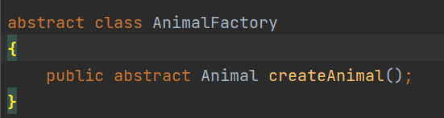

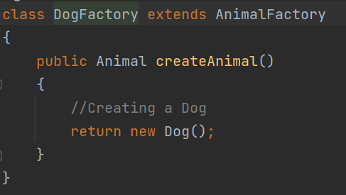

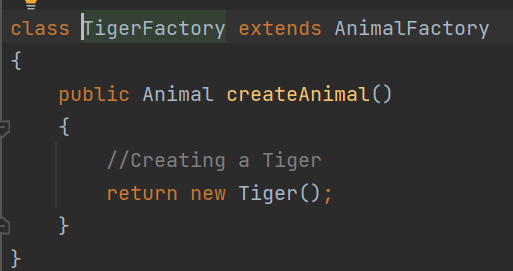

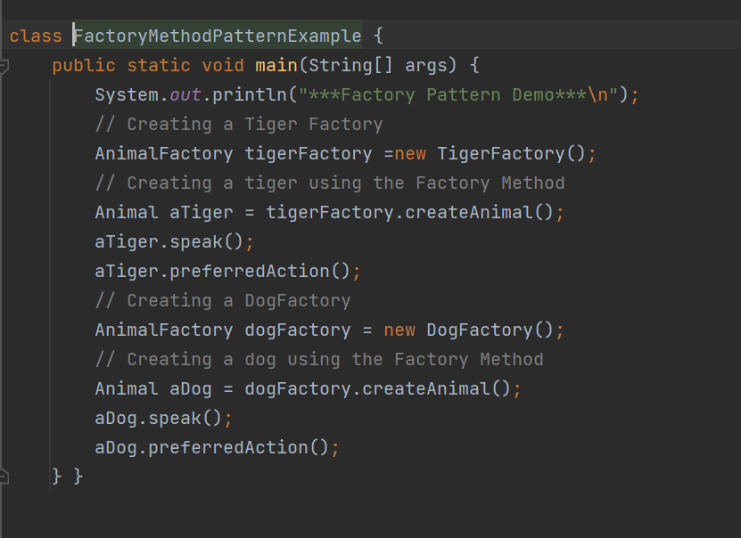

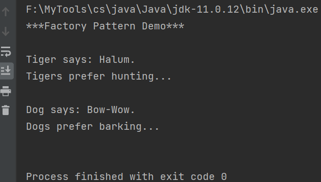
## 4，优缺点
优点： 1、一个调用者想创建一个对象，只要知道其名称就可以了。 2、扩展性高，如果想增加一个产品，只要扩展一个工厂类就可以。 3、屏蔽产品的具体实现，调用者只关心产品的接口。

缺点：每次增加一个产品时，都需要增加一个具体类和对象实现工厂，使得系统中类的个数成倍增加，在一定程度上增加了系统的复杂度，同时也增加了系统具体类的依赖。这并不是什么好事。

## 5，适用场景
1、日志记录器：记录可能记录到本地硬盘、系统事件、远程服务器等，用户可以选择记录日志到什么地方。 2、数据库访问，当用户不知道最后系统采用哪一类数据库，以及数据库可能有变化时。 3、设计一个连接服务器的框架，需要三个协议，"POP3"、"IMAP"、"HTTP"，可以把这三个作为产品类，共同实现一个接口。

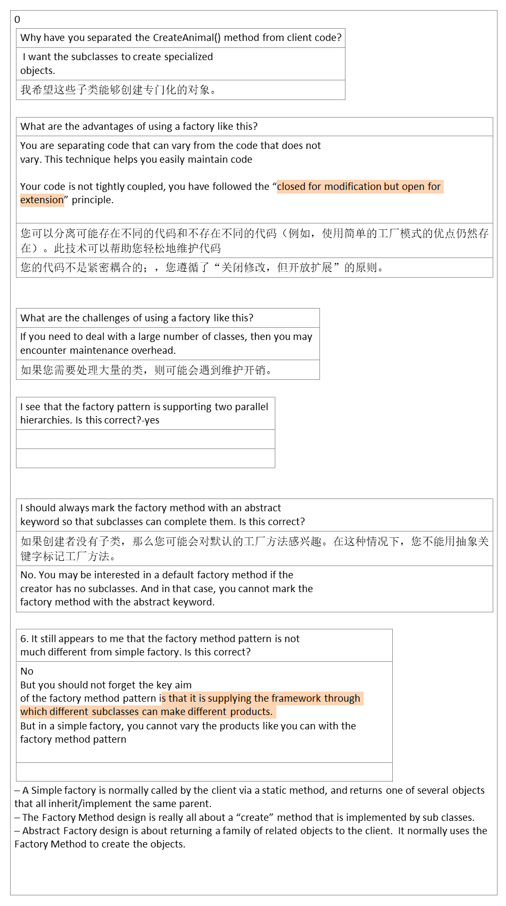
