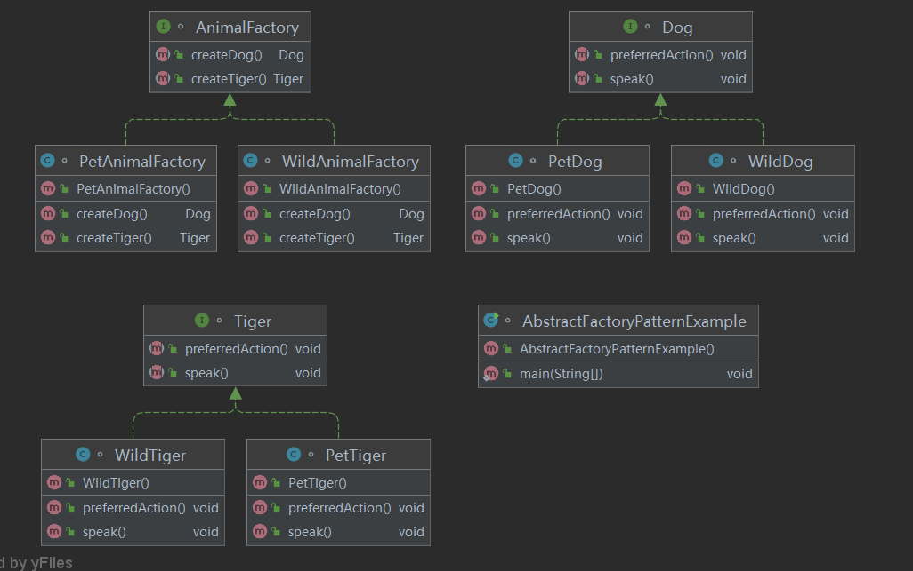
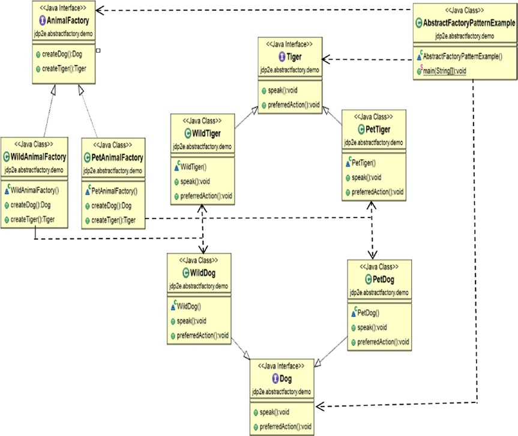
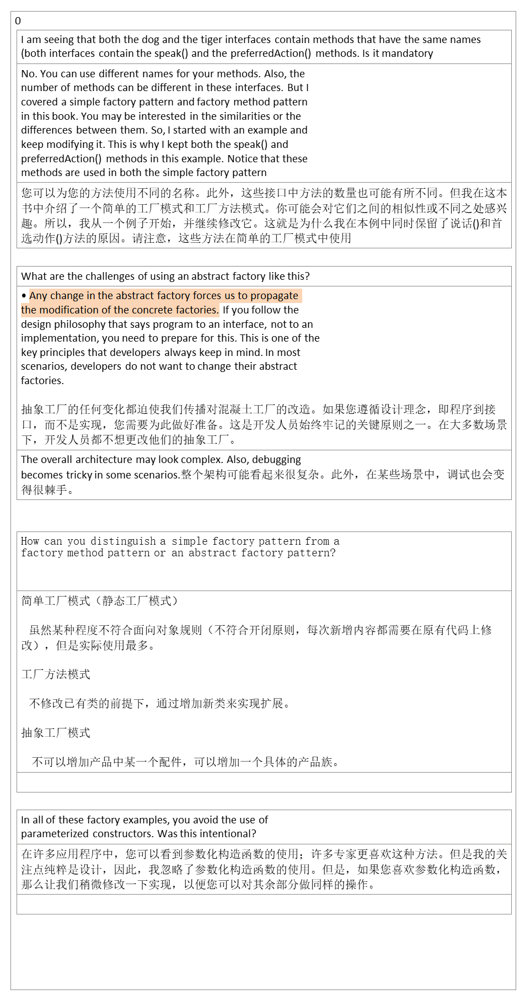
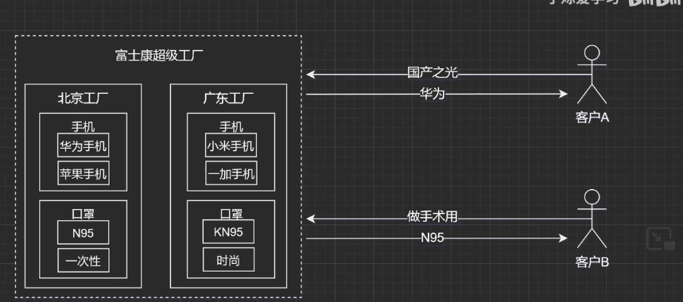
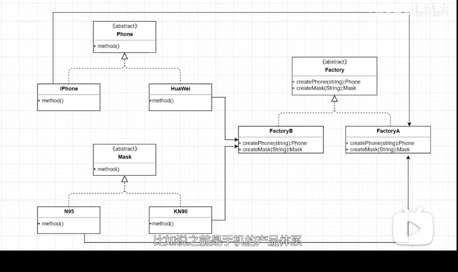

## 1，定义
| 官方的 | 提供一个创建一系列相关或相互依赖对象的接口，而无需指定它们具体的类             |
|--------|--------------------------------------------------------------------------------|
| 通俗的 | 相比较与工厂模式，抽象工厂模型不但可以生产某一类得产品，还可以生产其他类得产品 |
## 2，各类含义，UML
## 3，代码

## 4，优缺点
优点：当一个产品族中的多个对象被设计成一起工作时，它能保证客户端始终只使用同一个产品族中的对象。

缺点：产品族扩展非常困难，要增加一个系列的某一产品，既要在抽象的 Creator 里加代码，又要在具体的里面加代码

| factory    | Abstract Factory |
|------------|------------------|
| Create one |                 |

相比较与工厂模式，抽象工厂模型不但可以生产某一类得产品，还可以生产其他类得产品

