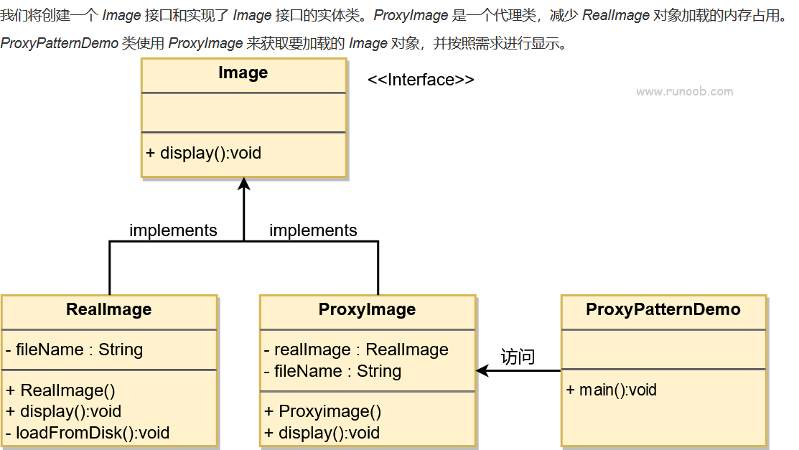
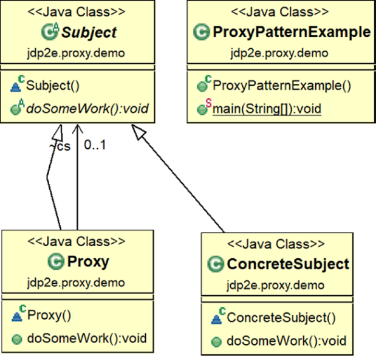
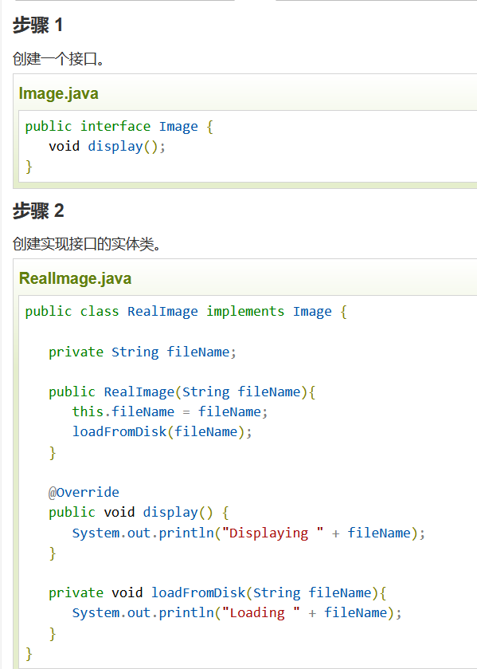
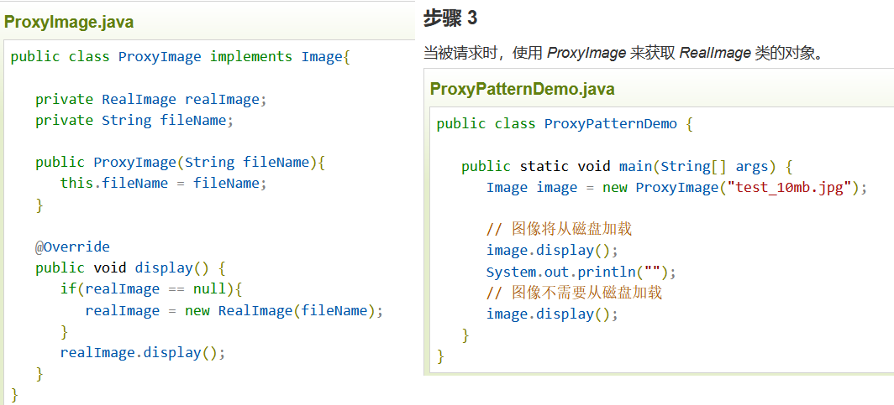
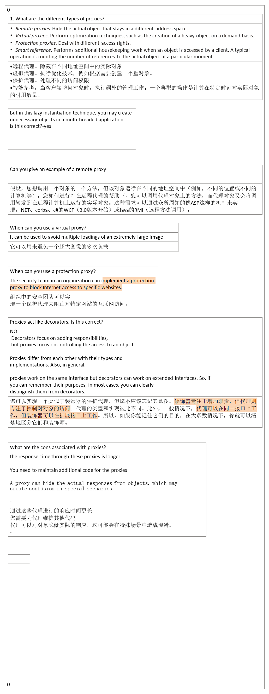

## 1，定义
| 官方的 | 为其他对象提供一种代理以便控制对这个对象的访问。 |
|--------|--------------------------------------------------|
| 通俗的 | 明星的经纪人，租房的中介等等都是代理             |
## 2，各类含义，UML

## 3，代码

## 4，优缺点
优点：
1、职责清晰。 2、高扩展性。 3、智能化。

缺点：
1、由于在客户端和真实主题之间增加了代理对象，因此有些类型的代理模式可能会造成请求的处理速度变慢。
2、实现代理模式需要额外的工作，有些代理模式的实现非常复杂。

## 5，适用场景

