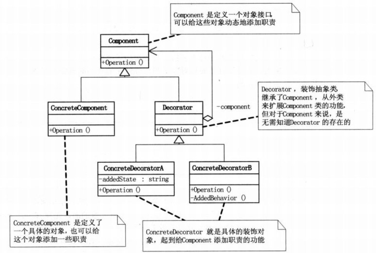
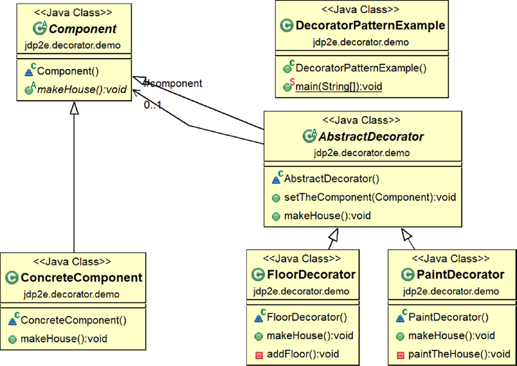
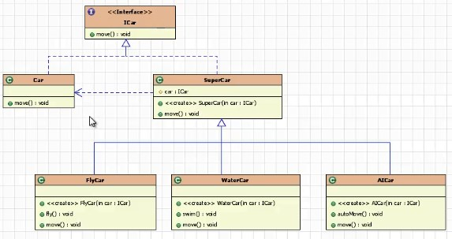
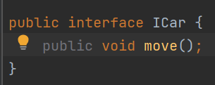
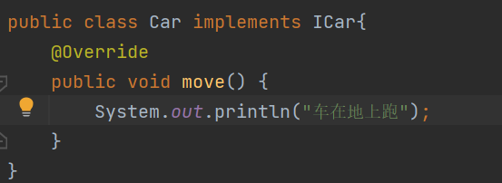
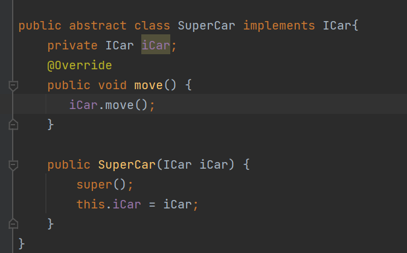
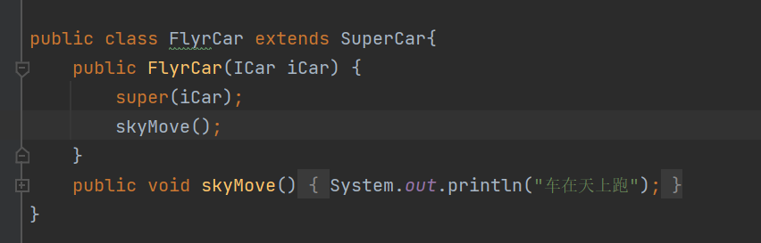
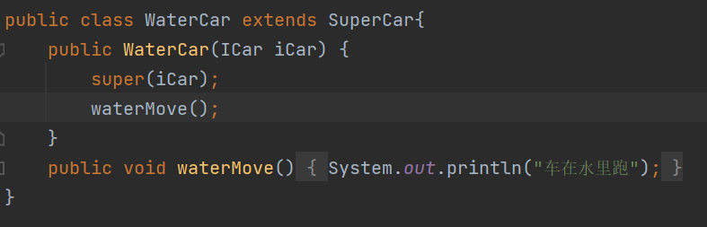
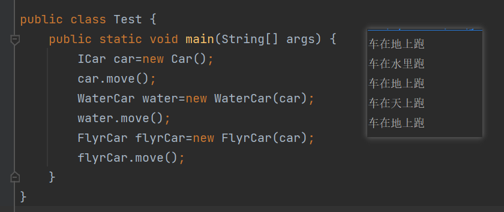
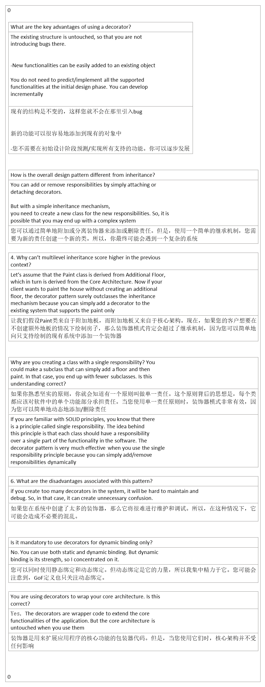

## 1，定义
<table>
<colgroup>
<col style="width: 9%" />
<col style="width: 90%" />
</colgroup>
<thead>
<tr class="header">
<th>官方的</th>
<th>允许向一个现有的对象添加新的功能，同时又不改变其结构。这种类型的设计模式属于结构型模式，它是作为现有的类的一个包装。</th>
</tr>
</thead>
<tbody>
<tr class="odd">
<td>通俗的</td>
<td>
表示动态的给一个对象添加一些新的功能（利用子类继承父类也可以实现），但是比生成子类方式更灵活。

也叫装饰者模式或者装饰器模式

例如：我们每个人身上穿的衣服，鞋子，领带，披风都可以理解为是对人的装饰。
</td>
</tr>
</tbody>
</table>
主要解决：一般的，我们为了扩展一个类经常使用继承方式实现，由于继承为类引入静态特征，并且随着扩展功能的增多，子类会很膨胀。

何时使用：在不想增加很多子类的情况下扩展类

## 2，各类含义，UML

Component：定义一个对象接口，可以给这些对象动态添加职责。真实对象和装饰者对象有相同的接口，这样客户端不用知道内部有装饰者对象（Decorator）存在的，还是以之前处理真实对象的相同方式来和装饰者对象交互。

ConcreteComponent：是定义了一个具体的对象（例如：人），也可以给这个对象添加一些其他职责。

Decorator：装饰抽象类，继承了Component，从外类来扩展Component类的功能，但对Component来说，是无需知道Decorator存在的。

ConcreteDecorator：就是具体的装饰对象了（衣服，鞋子..），它起到了给Component添加职责的功能。

# 3，代码

## 4，优缺点

优点：装饰类和被装饰类可以独立发展，不会相互耦合，装饰模式是继承的一个替代模式，装饰模式可以动态扩展一个实现类的功能。

缺点：多层装饰比较复杂。
优点：
扩展功能强，相比继承来说更灵活。继承的话会导致子类个数增加。而装饰者模式不会出现这种情况。
可以对一个对象进行多次装饰，创造出不同行为的组合，得到功能更加强大的对象。
具体构建类和具体装饰类可以独立变化，用户可以根据需要自己增加新的构件子类和具体装饰类。

缺点：

产生很多小对象，大量小对象会占据内存。一定程度上影响了性能。

装饰模式易于出错，调试排查比较麻烦。

## 5，适用场景
使用场景： 1、扩展一个类的功能。 2、动态增加功能，动态撤

销。

