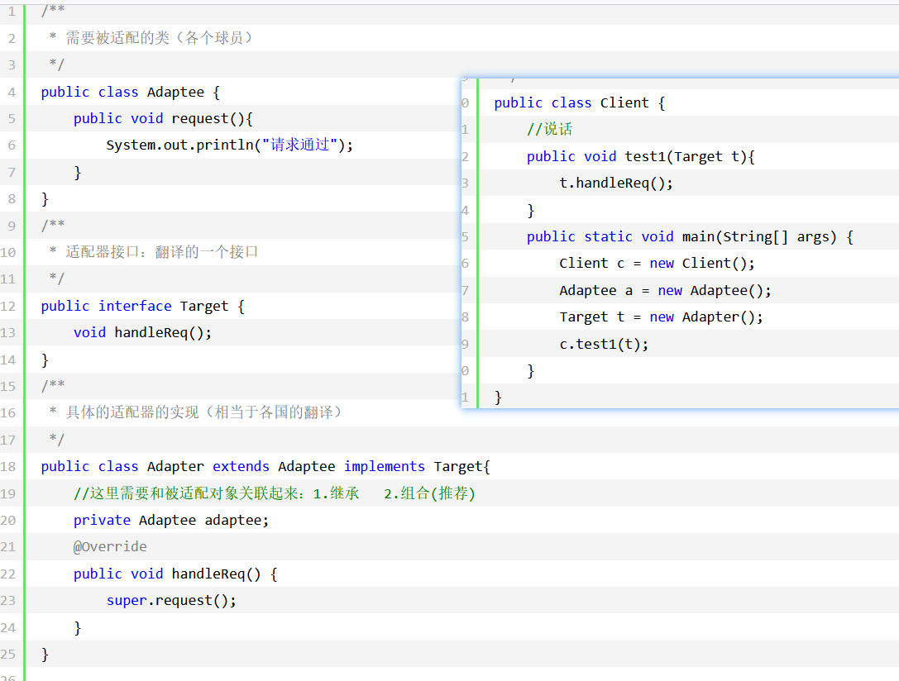
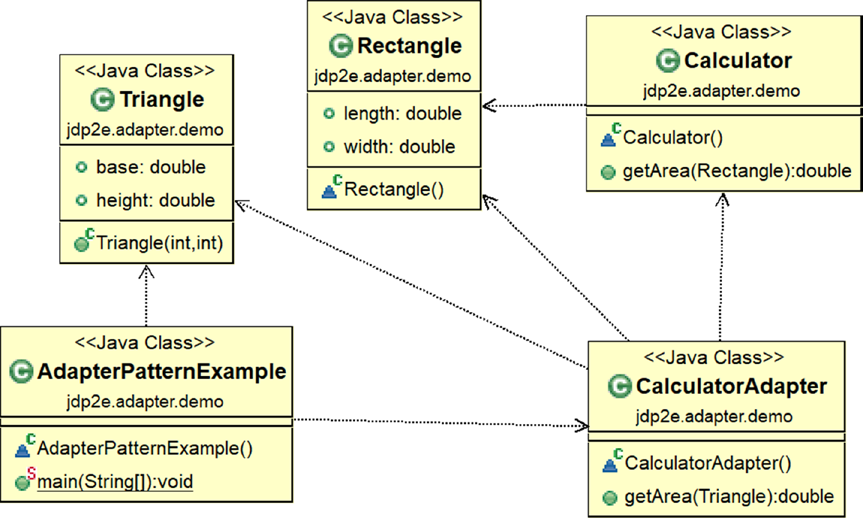
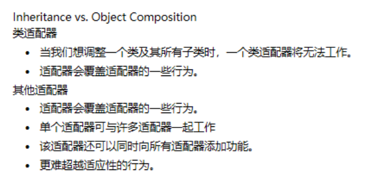
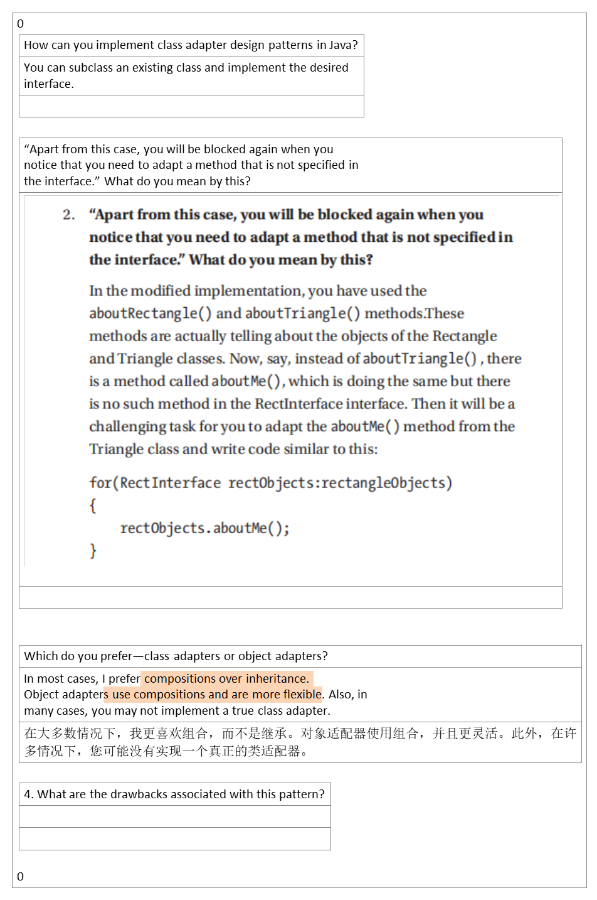

## 1，定义
<table>
<colgroup>
<col style="width: 9%" />
<col style="width: 90%" />
</colgroup>
<thead>
<tr class="header">
<th>官方的</th>
<th>是作为两个不兼容的接口之间的桥梁。</th>
</tr>
</thead>
<tbody>
<tr class="odd">
<td>通俗的</td>
<td>
NBA中的球员来自不同国家，而世界标准语言是英语。那他们不会英语，也不能各自学习所有国家的语言。所以，最好的办法就是请不同的翻译

将这些球员国家的语言翻译成英语。而这些翻译就是适配器
</td>
</tr>
</tbody>
</table>
## 2，各类含义，UML
# 3，代码
案例1

案例2

## 4，优缺点
优点：
1、可以让任何两个没有关联的类一起运行。
2、提高了类的复用。
3、增加了类的透明度。 4、灵活性好。

缺点： 1、过多地使用适配器，会让系统非常零乱，不易整体进行把握。比如，明明看到调用的是 A 接口，其实内部被适配成了 B 接口的实现，一个系统如果太多出现这种情况，无异于一场灾难。因此如果不是很有必要，可以不使用适配器，而是直接对系统进行重构。
2.由于 JAVA 至多继承一个类，所以至多只能适配一个适配者类，而且目标类必须是抽象类。

## 5，适用场景

