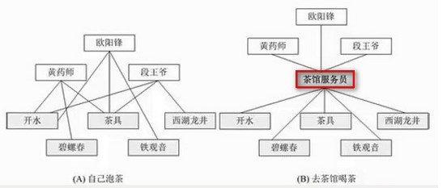
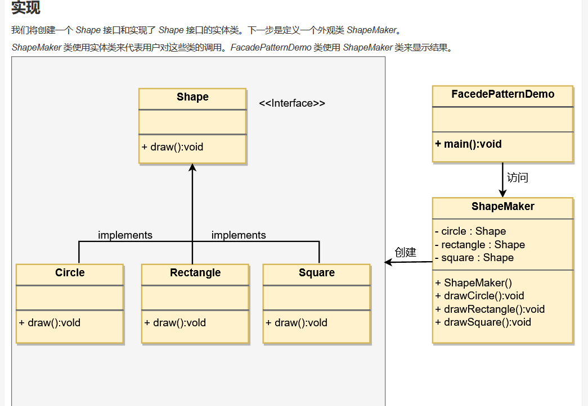
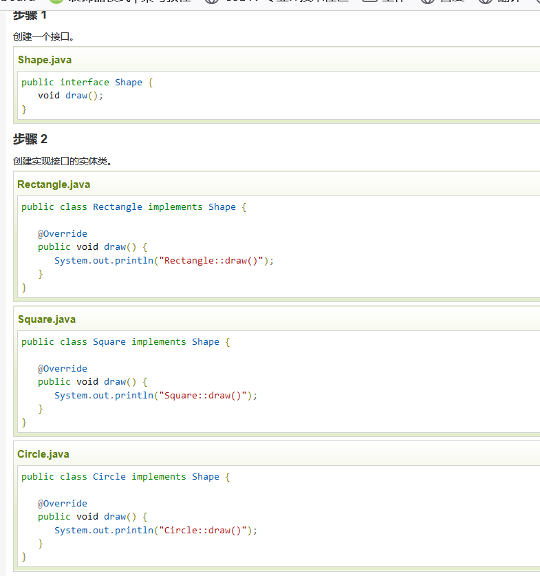
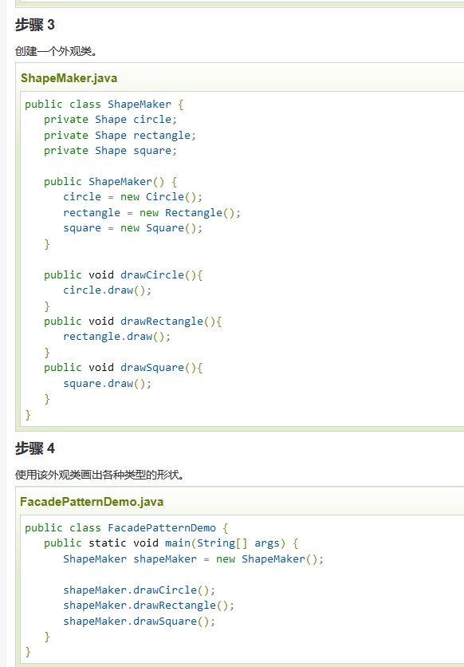
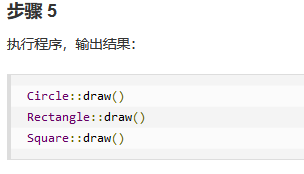
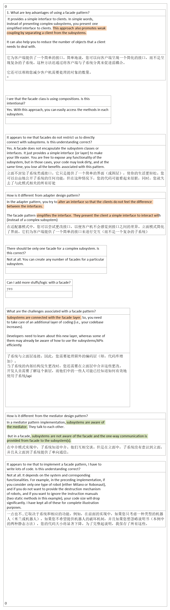

面向对象的一个比较重要的法则：迪米特法则（最少知识原则）：一个软件实体应当尽可能少的与其他实体发生相互作用。

## 1，定义
<table>
<colgroup>
<col style="width: 9%" />
<col style="width: 90%" />
</colgroup>
<thead>
<tr class="header">
<th>官方的</th>
<th>
隐藏系统的复杂性，并向客户端提供了一个客户端可以访问系统的接口。这种类型的设计模式属于结构型模式，它向现有的系统添加一个接口，来隐藏系统的复杂性。

这种模式涉及到一个单一的类，该类提供了客户端请求的简化方法和对现有系统类方法的委托调用。
</th>
</tr>
</thead>
<tbody>
<tr class="odd">
<td>通俗的</td>
<td>
<strong>说白了，就可以理解为封装</strong>

<strong>外观模式的核心：为子系统提供统一的入口，封装子系统的复杂性，便于客户端调用</strong>
</td>
</tr>
</tbody>
</table>
何时使用： 1、客户端不需要知道系统内部的复杂联系，整个系统只需提供一个"接待员"即可。 2、定义系统的入口。

## 2，各类含义，UML
## 3，代码

## 4，优缺点
优点： 1、减少系统相互依赖。 2、提高灵活性。 3、提高了安全性。

缺点：不符合开闭原则，如果要改东西很麻烦，继承重写都不合适。

## 5，适用场景
应用实例： 1、去医院看病，可能要去挂号、门诊、划价、取药，让患者或患者家属觉得很复杂，如果有提供接待人员，只让接待人员来处理，就很方便。 2、JAVA 的三层开发模式。

