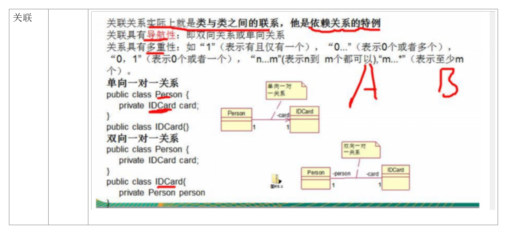

复习
2022年1月1日
9:32

一、UML
| 依赖 | 类中用到对方                      | 虚线+箭头         |
|------|-----------------------------------|-------------------|
| 继承 | 继承关系extends                   | 实线+空心三角箭头 |
| 实现 | 实现接口implements                | 虚线+空心三角箭头 |
| 聚合 | 整体和部分（可分离，还没new）     | 实线+空心菱形     |
| 组合 | 整体和部分（不可分离，已经new了） | 实现+实心菱形     |

二、设计模型
<table>
<colgroup>
<col style="width: 19%" />
<col style="width: 22%" />
<col style="width: 10%" />
<col style="width: 20%" />
<col style="width: 27%" />
</colgroup>
<thead>
<tr class="header">
<th>模式</th>
<th><strong>意图</strong></th>
<th>例子</th>
<th>优点</th>
<th>
缺点

</th>
</tr>
</thead>
<tbody>
<tr class="odd">
<td>1-single pattern</td>
<td><strong>保证一个类仅有一个实例，并提供一个访问它的全局访问点</strong>。</td>
<td>
要求生产唯一序列号。

数据库的连接
</td>
<td>
1，减少内存开销

2，避免对资源的多重占用

1. Reduce memory overhead

2. Avoid multiple occupation of resources

</td>
<td>
1，没有接口，不能实现继承

2，与单一职责原则冲突，一个类应该只关心内部逻辑，而不是关心外界如何实例化

1. No interface, no inheritance

2. In conflict with the SRP, a class should only care about the internal logic, not how it is instantiated externally

</td>
</tr>
<tr class="even">
<td>2-prototype pattern</td>
<td>原型模式就是从一个对象再创建另外一个可定制的对象，而且不需要知道任何创建的细节。</td>
<td></td>
<td>
以更小的代价创建对象

可以再runtime加入或者丢弃对象

性能提高了

You can create new instances at a cheaper cost

You can include or discard products at runtime.

Improved performance

</td>
<td>
每个子类都需要实现克隆或复制机制。

必须实现cloneable

有时，从现有实例创建副本并不简单。

Must implements cloneable and complete the relative methods. Each subclass needs to implement the cloning or copying mechanism.

Sometimes creating a copy from an existing instance is not simple.

</td>
</tr>
<tr class="odd">
<td>3-builder pattern</td>
<td>假如一个对象的构建很复杂，需要很多步骤。则可以使用建造者模式，将其构建对象和组装成一个对象这两步给分开来。构建部分为（builder）和组织部分（director），实现了构建和装配的解耦。</td>
<td>去肯德基，汉堡、可乐、薯条、炸鸡翅等是不变的，而其组合是经常变化的，生成出所谓的"套餐"。</td>
<td></td>
<td></td>
</tr>
<tr class="even">
<td>4</td>
<td></td>
<td></td>
<td></td>
<td></td>
</tr>
<tr class="odd">
<td>5</td>
<td></td>
<td></td>
<td></td>
<td></td>
</tr>
<tr class="even">
<td>6</td>
<td></td>
<td></td>
<td></td>
<td></td>
</tr>
<tr class="odd">
<td>7</td>
<td></td>
<td></td>
<td></td>
<td></td>
</tr>
<tr class="even">
<td>8</td>
<td></td>
<td></td>
<td></td>
<td></td>
</tr>
<tr class="odd">
<td>9</td>
<td></td>
<td></td>
<td></td>
<td></td>
</tr>
<tr class="even">
<td>10</td>
<td></td>
<td></td>
<td></td>
<td></td>
</tr>
<tr class="odd">
<td>11-composite patter</td>
<td>组合的感觉（不是简单的组合），菜单含一级菜单，二级菜单，分支</td>
<td>部分、整体场景，如树形菜单，文件、文件夹的管理。</td>
<td></td>
<td></td>
</tr>
<tr class="even">
<td>12 bridge pattern</td>
<td>
将抽象部分与它的实现部分分离，使它们都可以独立的变化。而不会直接影响到其他部分。

联想戴尔 台式手提
</td>
<td></td>
<td></td>
<td></td>
</tr>
<tr class="odd">
<td>13-Visitor pattern</td>
<td>
它使你可以在不改变各元素的类的前提下<mark>定义作用于这些元素的新操作。</mark>

您需要向一组对象添加新的操作，而不更改它们相应的类。
</td>
<td>
XML文档解析器设计

编译器设计
</td>
<td></td>
<td></td>
</tr>
<tr class="even">
<td>14-Observer pattern</td>
<td>定义了一种一对多的依赖关系，让多个观察者对象同时监听某一个主题对象，这个主题对象在状态发生变化时，会通知所有观察者对象。使它们能够自动更新自己。</td>
<td>
广播

邮件订阅
</td>
<td></td>
<td></td>
</tr>
<tr class="odd">
<td>15-strategy pattern</td>
<td>其实内部就是定义了一个算法家族，给每个会员或者商品都指定一个特定的算法，根据不同的算法，打不同的折扣。</td>
<td></td>
<td></td>
<td></td>
</tr>
<tr class="even">
<td>16-template pattern</td>
<td>就是将一些相同操作的代码，封装成一个算法的骨架。核心的部分留在子类中操作，在父类中只把那些骨架做好。</td>
<td>Junit单元测试</td>
<td></td>
<td></td>
</tr>
<tr class="odd">
<td><mark>17-command pattern</mark></td>
<td>就是将一系列的请求命令封装起来，不直接调用真正执行者的方法，这样比较好扩展。</td>
<td>命令的撤销和恢复</td>
<td></td>
<td></td>
</tr>
<tr class="even">
<td>18-Iterator pattern</td>
<td>提供一种方法顺序的访问一个聚合对象中各个元素，而又不暴露该对象的内部表示。</td>
<td>访问一个聚合对象的内容而无须暴露它的内部表示。</td>
<td></td>
<td></td>
</tr>
<tr class="odd">
<td>19-memento pattern</td>
<td>office重新打开时的恢复功能。允许在不暴露对象实现细节的情况下保存和恢复对象之前的状态</td>
<td>
后悔药

软件的历史记录
</td>
<td></td>
<td></td>
</tr>
<tr class="even">
<td>20-state pattern</td>
<td>
当遇到<strong>不同的状态遇到不同的行为</strong>的时候，可以使用状态模式

我们创建表示各种状态的对象和一个行为随着状态对象改变而改变的 context 对象。
</td>
<td>电视状态</td>
<td></td>
<td></td>
</tr>
<tr class="odd">
<td>21-mediator</td>
<td>中介器的关键目的是简化系统中对象之间的复杂通信</td>
<td>联合国</td>
<td></td>
<td></td>
</tr>
<tr class="even">
<td>22-chain-of responsibility</td>
<td>将能够处理同一类请求的对象连成一条链，链上的对象逐个判断是否有能力处理该请求，如果能则就处理，如果不能，则传给链上的下一个对象。</td>
<td>
请假流程

不过夜外出找刘导，外出过夜找游院
</td>
<td></td>
<td></td>
</tr>
<tr class="odd">
<td>23-interpret pattern</td>
<td>解释器模式，自己构造一个语言来实现某些功能</td>
<td>
计算器，

EL表达式的处理

正则表达式解释器

SQL语法的解释器
</td>
<td></td>
<td></td>
</tr>
<tr class="even">
<td></td>
<td></td>
<td></td>
<td></td>
<td></td>
</tr>
</tbody>
</table>

词语

优点
**1， you are promoting loose coupling because it decouples the senders (of requests) from the receivers【chain-of-r】** a loosely coupled system

2**,reduce the complexity of objects’ communication in a system**.

3, **reduces number of subclasses in the system**.

4，**simplify the complex communications among objects in a system**

5，
| ==What are the common characteristics between the strategy pattern and the state pattern?== |
|-------------------------------------------------------------------------------------------------------------------|
| ==Both can promote composition and delegation.==                                            |
| ==两者都能促进构图和授权。==                                                                |

6，Maintains high cohesion. 【memento】

**7,without affecting the existing system**
8\. New commands can be easily added to the system
9\. The coupling degree of the system is reduced

10， avoid redundant codes.

11，避免使用多重条件判断Avoid using multiple conditional judgments

12，You can easily add a new component to an existing architecture
or delete an existing component from your architecture

13，Also, you can independently add or remove observers at any time.

1、减少系统相互依赖。 2、提高灵活性。 3、提高了安全性。

减少内存开销
避免对资源的多种占用

缺点
1， object’s architecture may become complex
2，maintaining is a big concern
3，require more storage
4，costly
5,time,

Memory leak\[observer\]
The order of notification is not dependable

操作复杂
Open-close principle
SRP

