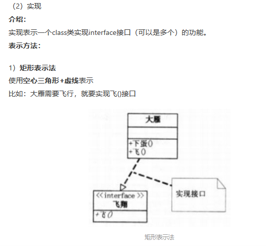
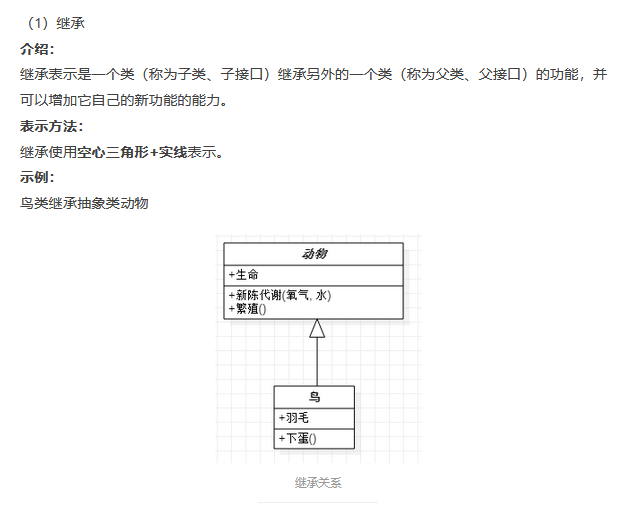
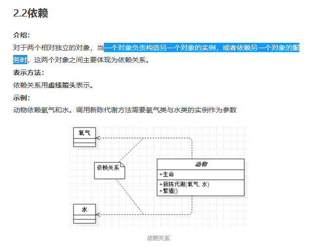
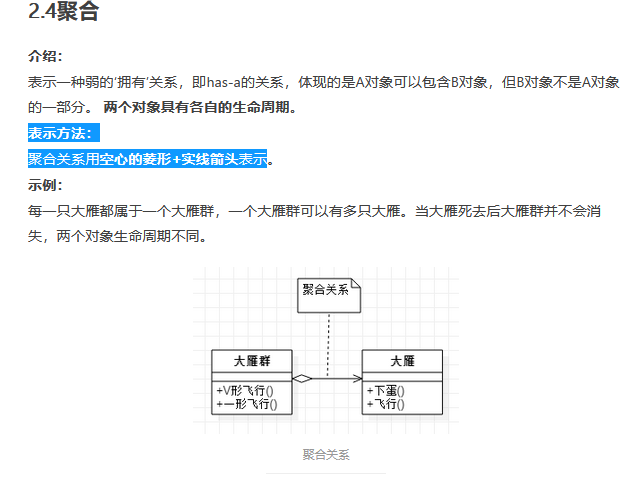
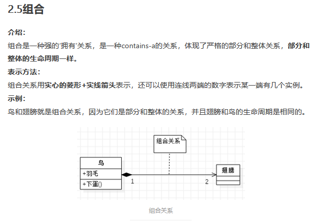

类图
2022年1月2日
9:10

<https://www.jianshu.com/p/57620b762160>

1，实现接口 implement interface
表现形式：使用空心三角形+虚线表示

2，继承 extends
表示方法：继承使用空心三角形+实线表示。

3,依赖
一个对象负责构造另一个对象的实例，或者依赖另一个对象的服务时
表示方法：依赖关系用虚线箭头表示

4，聚合 has a 关系
表示方法：聚合关系用空心的菱形+实线箭头表示

5，组合 contains-a 部分和整体

