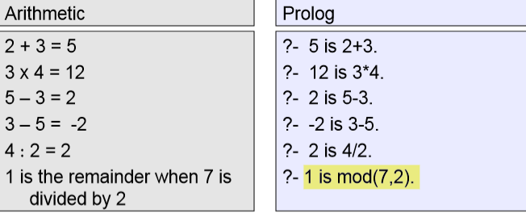
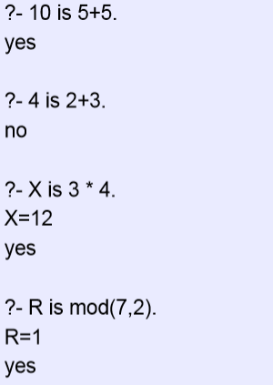
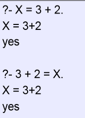
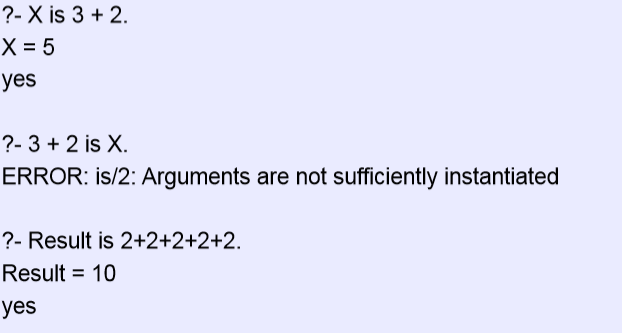
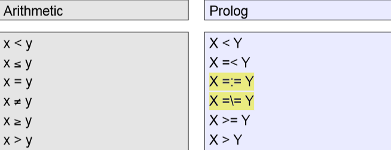
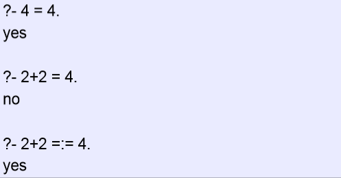
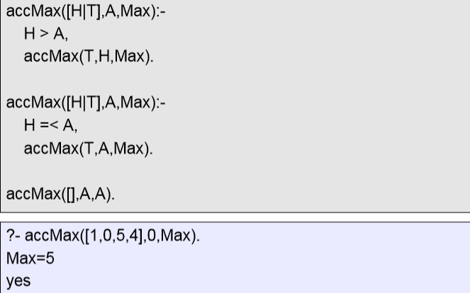
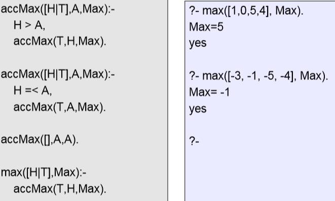

一、arithmetic
1，

2，
+, -, / and \* do not carry out any arithmetic
•  Expressions such as 3+2, 4-7, 5/5 are ordinary Prolog terms
– Functor: +, -, /, \*
– Arity: 2
– Arguments: integers

3，The is/2 predicate

Restrictions on use of is/2
•  **variables on the right hand side of the is predicate**
•  But when Prolog actually carries out the evaluation, the variables must be instantiated with a variable-free Prolog term
•  This Prolog term must be **an arithmetic expression**
**右边必须是表达式**
4，Notation
Two final remarks on arithmetic expressions
– 3+2, 4/2, 4-5 are just ordinary Prolog terms in a user-friendly notation:

3+2 is really +(3,2) and so on.

– Also the is predicate is a two-place Prolog predicate

二、 tail-recursive

三、Comparing Integers
1，

2，Force both left and right hand argument to be evaluated

The accumulator keeps track of the highest value encountered so far

the idea of using wrapper predicates ：

