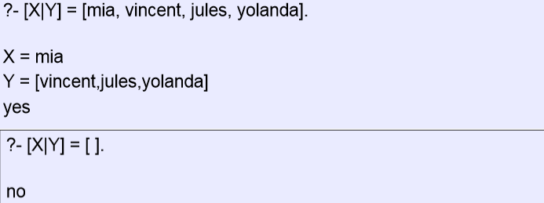
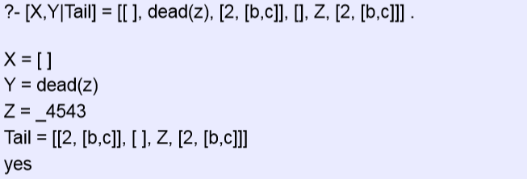
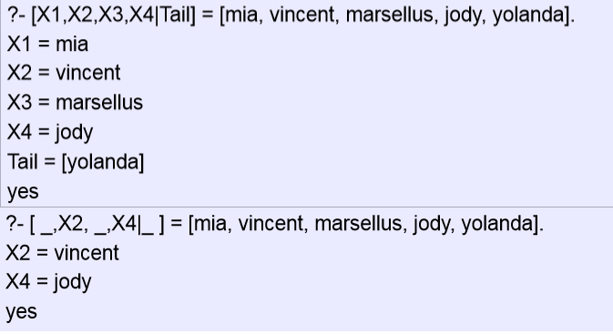
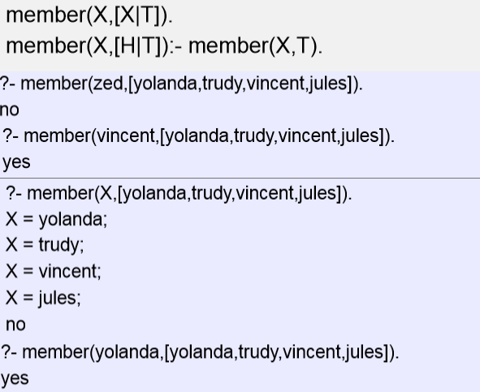
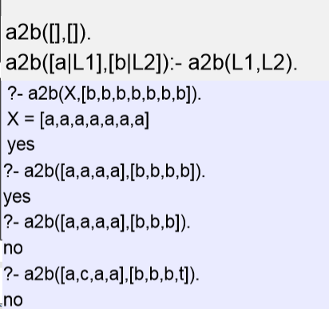

## 一、List
1,定义

A list is a **finite** sequence of elements

Eg
<table>
<colgroup>
<col style="width: 100%" />
</colgroup>
<thead>
<tr class="header">
<th>
[mia, vincent, jules, yolanda]

[mia, robber(honeybunny), X, 2, mia]

[ ] % <strong>a special list</strong>

[mia, [vincent, jules], [butch, friend(butch)]]

[[ ], dead(z), [2, [b,c]], [ ], Z, [2, [b,c]]]
</th>
</tr>
</thead>
<tbody>
</tbody>
</table>
2,特点

• List elements are enclosed in square brackets \[\]

• **The length of a list is the number of elements it has**

•All sorts of Prolog terms can be elements of a list
## 二、Head and Tail
### 1，介绍
（1）A **non-empty** list can be thought of as consisting of two parts

– The head:The head is **the first item** in the list

– The tail :The tail is everything else

– The tail is the list that remains when we take the first element away

– **The tail of a list is always a list**

案例
<table>
<colgroup>
<col style="width: 100%" />
</colgroup>
<thead>
<tr class="header">
<th>[mia, vincent, jules, yolanda]</th>
</tr>
</thead>
<tbody>
<tr class="odd">
<td>
Head: mia

Tail: [vincent, jules, yolanda]
</td>
</tr>
</tbody>
</table>
<table>
<colgroup>
<col style="width: 100%" />
</colgroup>
<thead>
<tr class="header">
<th>[[ ], dead(z), [2, [b,c]], [ ], Z, [2, [b,c]]]</th>
</tr>
</thead>
<tbody>
<tr class="odd">
<td>
Head: [ ]

Tail: [dead(z), [2, [b,c]], [ ], Z, [2, [b,c]]]
</td>
</tr>
</tbody>
</table>
<table>
<colgroup>
<col style="width: 100%" />
</colgroup>
<thead>
<tr class="header">
<th>[dead(z)]</th>
</tr>
</thead>
<tbody>
<tr class="odd">
<td>
Head: dead(z)

Tail: [ ]
</td>
</tr>
</tbody>
</table>
（2）The empty list has neither a head nor a tail

•  For Prolog, \[ \] is a special simple list without any internal structure

•  The empty list plays an important role in recursive predicates for list processing in Prolog
### 2，The built-in operator \| 
**\|** which can be used to **decompose** a list into its head and tail

案例

### 3，Anonymous variable 
**The underscore is the anonymous variable**

Is used when you need to use a variable, but you are not interested in what Prolog instantiates it to
## 三、member/2
1，member/2: a predicate that when given a term X and a list L, **tells us whether or not X belongs to L**

Rewriting member/2
<table>
<colgroup>
<col style="width: 100%" />
</colgroup>
<thead>
<tr class="header">
<th>
member(X,[X|_]).

member(X,[_|T]):- member(X,T).
</th>
</tr>
</thead>
<tbody>
</tbody>
</table>
2,

The member/2 predicate works by recursively working its way down a list  
– doing something to the head, and then

– recursively doing the same thing to the tail

案例：

The predicate a2b/2 takes two lists as arguments and succeeds

– if the first argument is a list of a's, and

– the second argument is a list of b's of exactly the **same length**

