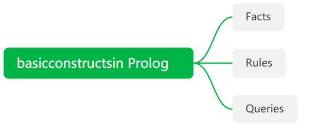
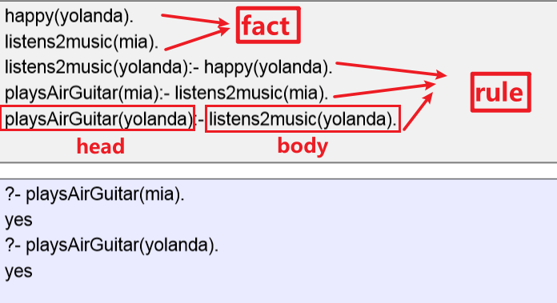
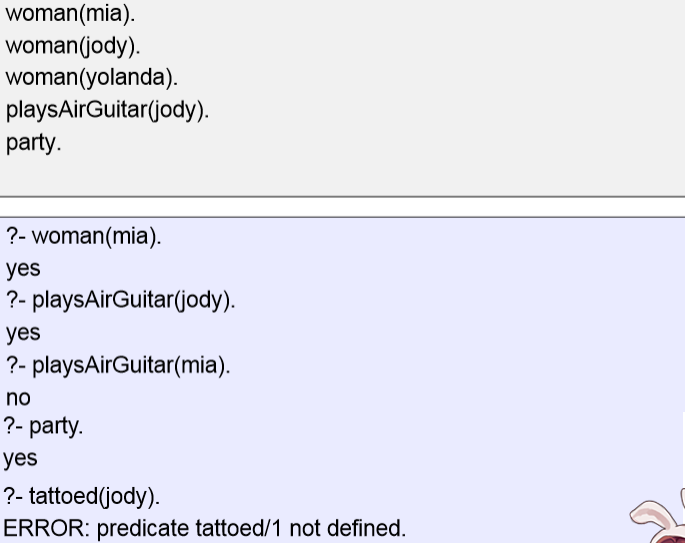
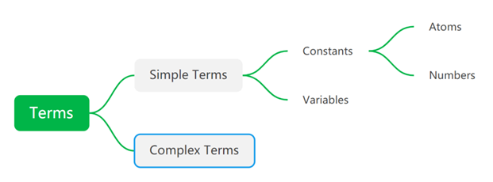
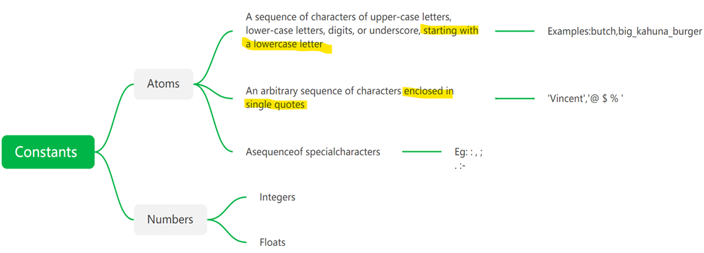
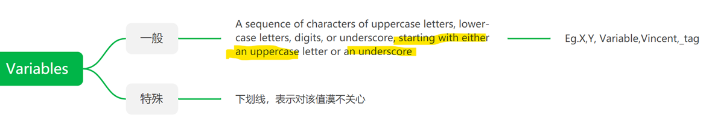
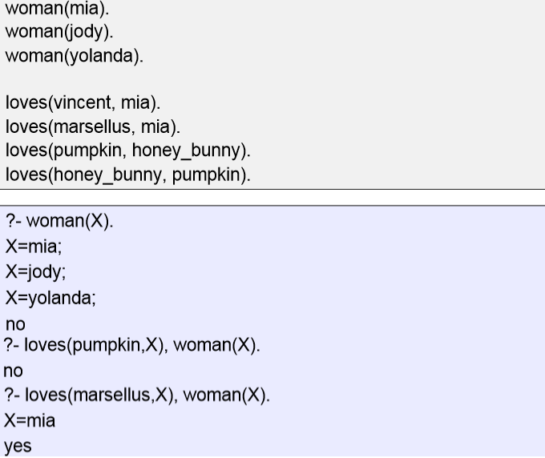

## 一、Introduction 
1，"Programming with Logic"
Different from other programming languages
– Declarative (not procedural)
– Recursion (**no “for” or “while” loops**)
– Relations (**no functions**)
– Unification
2，History
First 1972.

## 二、Basic
### 1、Structure
The **end** of a clause is marked with **a full stop**.

There are **five clauses** in this knowledge base: two facts, and three rules.
There are **three predicates** in this knowledge base: happy, listens2music, and playsAirGuitar
案例

facts, rules and queries built out of Prolog terms
### 2，Prolog Terms

#### *(1)Simple Terms*

注：**常量以小写开头，变量以大小或者_开头**

#### *(2)Complex terms*
Atoms, numbers and variables are building blocks for complex terms
Complex terms are built out of a functor **directly followed by a sequence of arguments**
– Arguments are put in **()**, separated **,**
– The functor must be an atom
Examples
– playsAirGuitar(jody)
– loves(vincent, mia)
–hide(X,father(father(father(butch))))

##### --Arity 
The **number of arguments** a complex term has is called its arity
<table>
<colgroup>
<col style="width: 100%" />
</colgroup>
<thead>
<tr class="header">
<th>
woman(mia) is a term with arity 1

loves(vincent,mia) has arity 2
</th>
</tr>
</thead>
<tbody>
</tbody>
</table>
You can define two predicates **with the same functor but with different arity**
In Prolog documentation, **arity of a predicate** is usually indicated with the suffix **"/"** followed by a number to indicate the arity
<table>
<colgroup>
<col style="width: 100%" />
</colgroup>
<thead>
<tr class="header">
<th>
happy(yolanda).

listens2music(mia).

listens2music(yolanda):- happy(yolanda).

playsAirGuitar(mia):- listens2music(mia).

playsAirGuitar(yolanda):- listens2music(yolanda).
</th>
</tr>
</thead>
<tbody>
<tr class="odd">
<td>
– happy/1

– listens2music/1

– playsAirGuitar/1
</td>
</tr>
</tbody>
</table>

## 三、logic
### 1，逻辑符号
|            | Prolog   | Logic |
|-------------|----------|-------|
| Implication | **A:-B** | B-\>A |
| Conjunction | **A,B**  | A∧B   |
| Disjunction | **A;B**  | A ∨ B |
| Negation    | **\\**   |      |
案例

