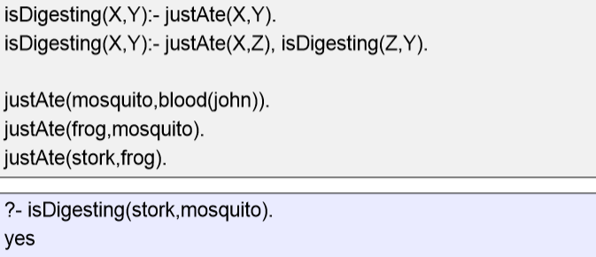
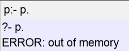
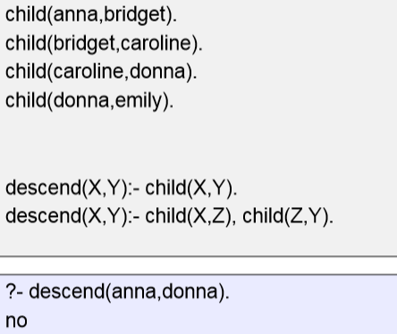
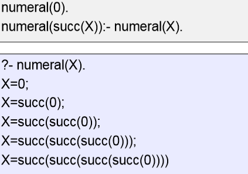
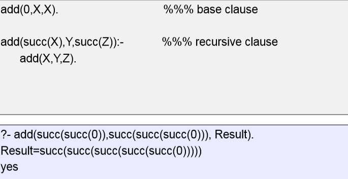
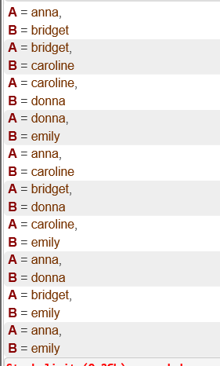

## 一、Recursion
1,A predicate is recursively defined if **one or more rules in its definition refers to itself**
2,example
\(1\)

\(2\)

\(3\)

\(4\)

\(5\)

（6）
<table>
<colgroup>
<col style="width: 100%" />
</colgroup>
<thead>
<tr class="header">
<th>
child(anna,bridget).

child(bridget,caroline).

child(caroline,donna).

child(donna,emily).

descend(X,Y):- child(X,Y).

descend(X,Y):- descend(Z,Y), child(X,Z).

？-descend(A,B).
</th>
</tr>
</thead>
<tbody>
</tbody>
</table>

## 二、Prolog and Logic 
1,Prolog was the first reasonable attempt to create a logic programming language
2,特点
not have to tell the computer what to do
To get information, simply asks a query
Prolog is not a full logic programming language!

