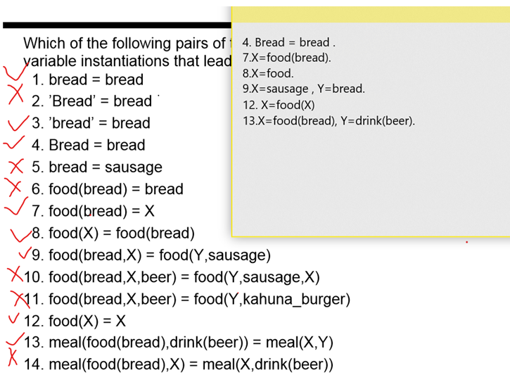
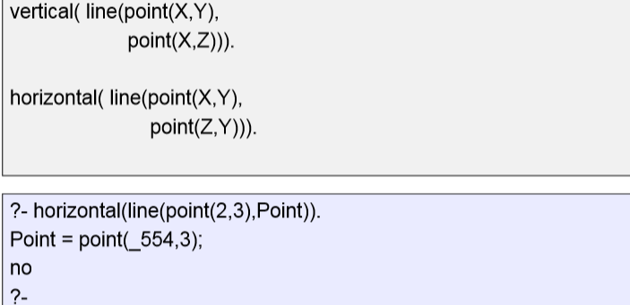
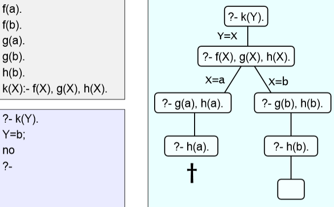
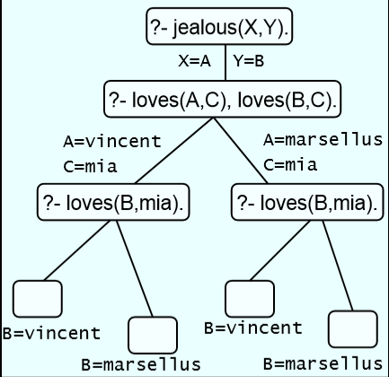

## 一、Unification
### 1,Definition 
– two terms unify:
•  if they are **the same term**, or
•  if they contain variables that can be uniformly instantiated with terms in such a way that the resulting terms are equal
2,how
-- If T1 and T2 are **constants**, then T1 and T2 unify if they **are the same atom, or the same number**  
--**T1 is a variable** and T2 is any type of term, then T1 and T2 unify, and T1 is instantiated to T2 (and vice versa)
3.  If T1 and T2 are complex terms then they unify if:
1.  They have the **same functor and arity**, and

2.  **all their corresponding arguments unify**, and

3.  the variable instantiations are compatible
Eg
<table>
<colgroup>
<col style="width: 100%" />
</colgroup>
<thead>
<tr class="header">
<th>
?- X=mia,

X=vincent.

no
</th>
</tr>
</thead>
<tbody>
<tr class="odd">
<td>Prolog has instantiated X with mia, so that it cannot unify it with vincent anymore</td>
</tr>
</tbody>
</table>
Which of the following pairs of terms unify?

### 3,Occurs Check 
Prolog does not use a standard unification algorithm
<table>
<colgroup>
<col style="width: 100%" />
</colgroup>
<thead>
<tr class="header">
<th>?- father(X) = X.</th>
</tr>
</thead>
<tbody>
<tr class="odd">
<td>
X=father(father(father(…))))

yes
</td>
</tr>
</tbody>
</table>

A standard unification algorithm carries out an occurs check
•  If it is asked to unify a variable with another term it checks whether the variable occurs in this term
•  In Prolog (ISO standard):
<table>
<colgroup>
<col style="width: 100%" />
</colgroup>
<thead>
<tr class="header">
<th>
?- unify_with_occurs_check(father(X), X).

no
</th>
</tr>
</thead>
<tbody>
</tbody>
</table>
### 
### 4,eaxmple

<table>
<colgroup>
<col style="width: 100%" />
</colgroup>
<thead>
<tr class="header">
<th>
house_elf(dobby).

witch(hermione).

witch("McGonagall").

witch(rita_skeeter).

magic(X):- house_elf(X).

magic(X):- witch(X).
</th>
</tr>
</thead>
<tbody>
<tr class="odd">
<td>
?-<em>magic</em>(Hermione).

<strong>Hermione</strong> = dobby

<strong>Hermione</strong> = hermione

<strong>Hermione</strong> = "McGonagall"

<strong>Hermione</strong> = rita_skeeter
</td>
</tr>
</tbody>
</table>
## 二、Search trees 
1,

**2,**
<table>
<colgroup>
<col style="width: 100%" />
</colgroup>
<thead>
<tr class="header">
<th>
loves(vincent,mia).

loves(marsellus,mia).

jealous(A,B):- loves(A,C), loves(B,C).
</th>
</tr>
</thead>
<tbody>
<tr class="odd">
<td>?-jealous(X,Y).</td>
</tr>
<tr class="even">
<td>
<strong>X</strong> = Y, <strong>Y</strong> = vincent

<strong>X</strong> = vincent,

<strong>Y</strong> = marsellus

<strong>X</strong> = marsellus,

<strong>Y</strong> = vincent

<strong>X</strong> = Y, <strong>Y</strong> = marsellus
</td>
</tr>
</tbody>
</table>

