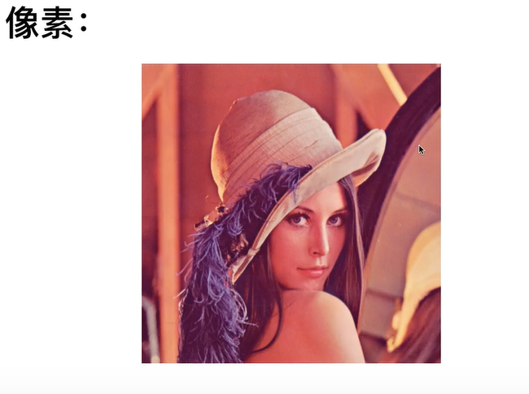
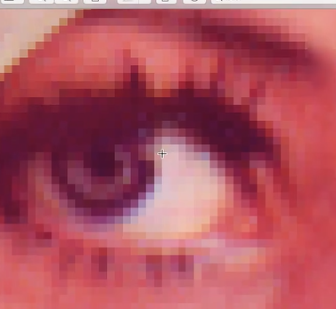
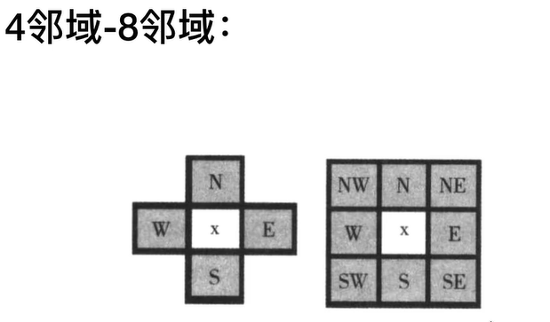
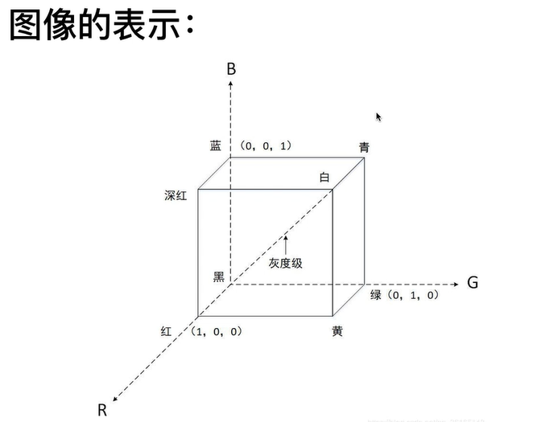
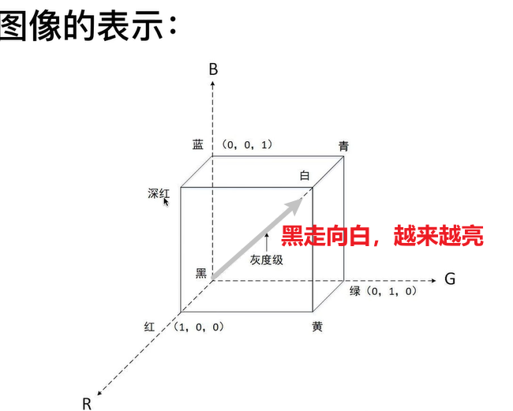
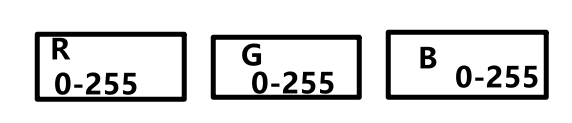
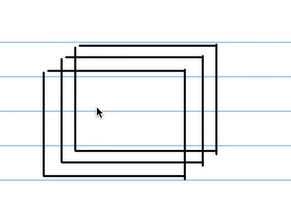
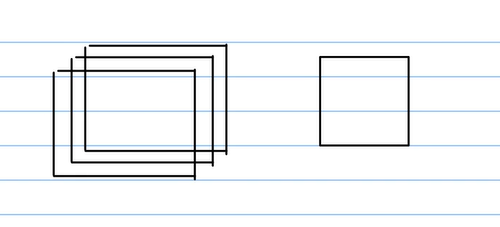
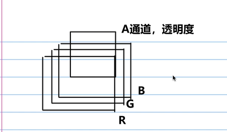
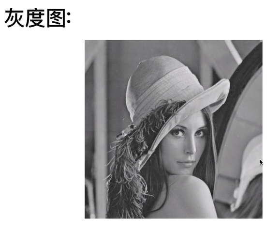

主要内容：
<table>
<colgroup>
<col style="width: 100%" />
</colgroup>
<thead>
<tr class="header">
<th>
Canny edge detection:边缘检测，轮廓

Image processing basics：基础知识

Hough transform：图像中，已经知道解析式的图形怎么检测出来，比如直线，圆，椭圆

Harris corner detection：检测角，识别，角的特征

Fast fourier transform:弗列变换

Scale-invariant feature transform（SIFT）:怎么发现不同图片中的同一个物品
</th>
</tr>
</thead>
<tbody>
</tbody>
</table>

## 1、像素
图像是一个连续的东西，但是计算机只能处理离散的数据
怎么办？
用像素，像素是图像的基本单元，图像是由一个个小像素组成的

看着连续，其实是离散的，由一个个小像素组成

小方块就是像素，内部元素相同，与周围不同

## 2、“4邻域”，“8邻域"

## 3、图像的表示
像素怎么存储？最常用是RGB颜色空间
以下的图进过归一化，所以单位1

一般来讲，取值是0-255（256个数，需要8bit）
RGB表示各需要一个字节，共三个字节
RGB理论上可以组成所有颜色

也可以看做以下
重合起来就是一张图片

确定一个像素的颜色

有时候会加一个a轴

## 4、灰度图

怎么做灰度图？
把所有不同通道变成一个通道，就是灰度化
灰度图（单通道的图）
他的值（0-255）表示亮度的大小
