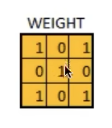
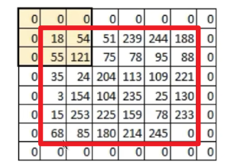
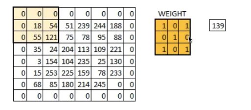
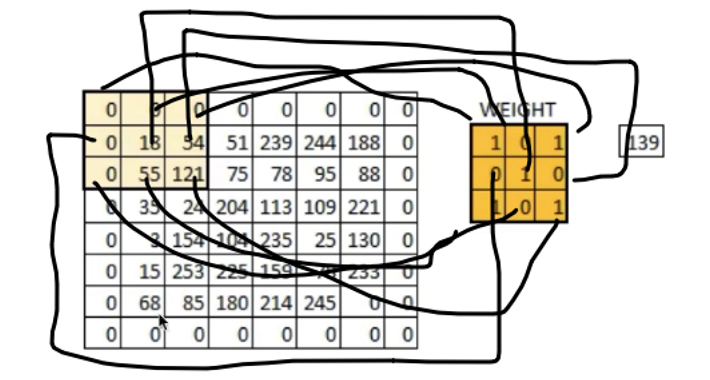
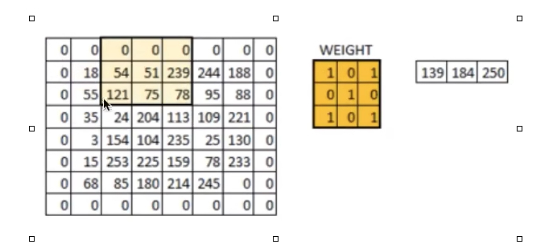
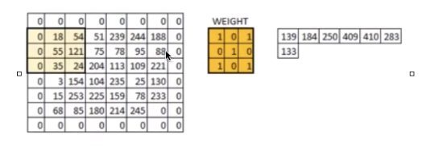
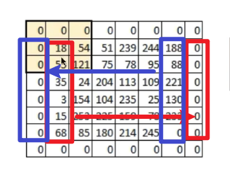
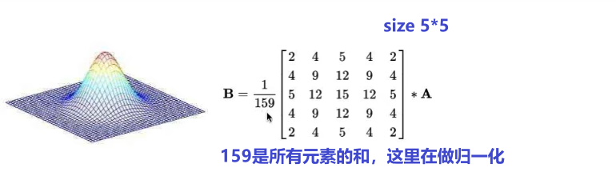
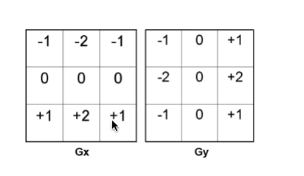

## 1、卷积操作
卷积核：大小一般是奇数\*奇数，为了有一个中心

原始图片是（单通道的灰度图）

为什么要加一圈0？为了保证新旧图片大小一样

计算过程
对应位置相乘，最后相加得出139
一步步移动计算
原始图片进过卷积得到一张新图片

padding：外面加的的圈数，和卷积核kernel的大小有关系，比如kernel size=3,padding=1； kernel size=5, padding=2
padding有多种方式
<table>
<colgroup>
<col style="width: 100%" />
</colgroup>
<thead>
<tr class="header">
<th><ol type="1">
<li>
补0
</li>
<li>
镜像补
</li>
</ol>
<blockquote>

3.循环的补

</blockquote></th>
</tr>
</thead>
<tbody>
</tbody>
</table>

stride步长：移动的步子（1，1），（2，2）

## 2、常见的卷积核
**高斯核**

目的：归一化后卷积的图片，计算的值还在0-255之间
性质：中间权值最大，向外变小，对称，线性可分
作用：
- 可以做平滑（过度平缓，跳度不大）
- 可以去掉随机噪声

**sobel核**

边缘检测会用到
相当于求上下/左右的差，相当于求导

