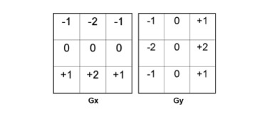
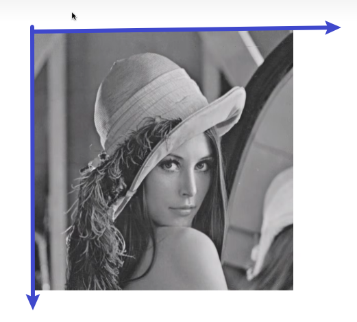
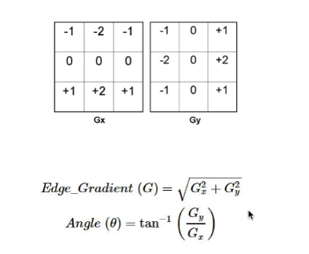
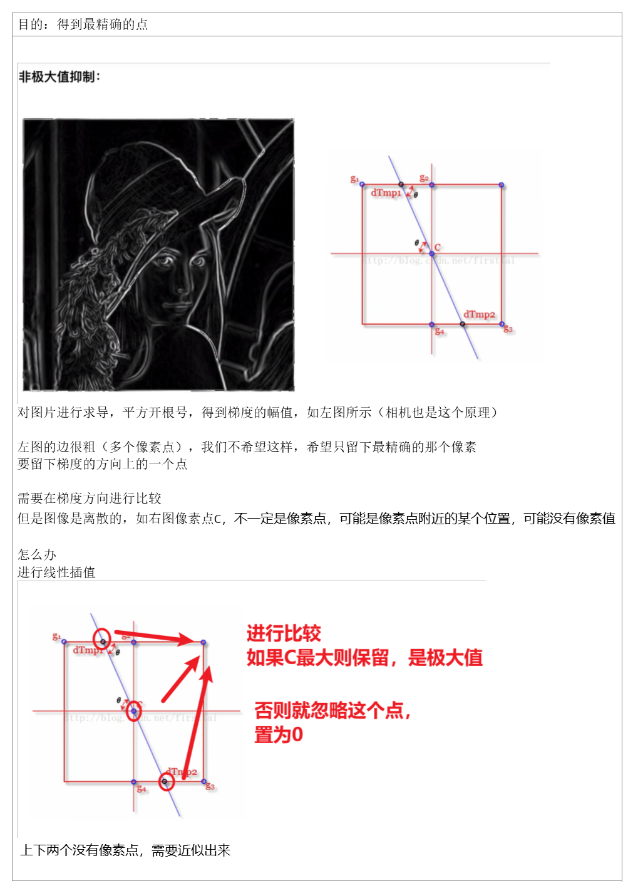
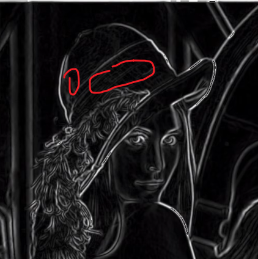
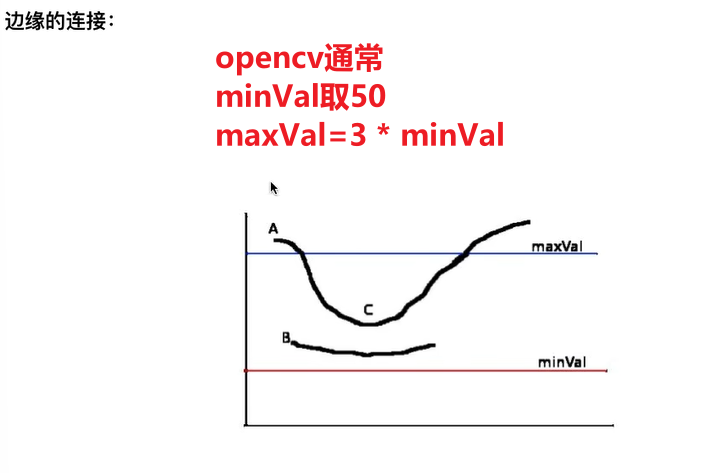

1、思路

观察哪些是边？ 边和非边的区别是什么？
**边是图像亮度变化很大的地方**
也就是要找在**某个方向是变化率很大**的地方
衡量变化率的参数----》求导，绝对值越大，变化率越大

但是图像是离散的怎么办（离散不连续，无法求导）
只能算近似，差商作为导数的近似值
思考用sobel（为什么是2，其实都可以，只是为了凸显中间，中间越近，影响越大，权值设置）

用sobel核对原图进行卷积
相当于竖向求导，谁的导数大，就可能是边

Gx是原始图片竖向导数，Gy是原始图片横向导数
梯度的幅值：衡量变化率的大小
梯度的方向θ：反正切

**为什么要求这两个？**
边是变化率比较大的地方，梯度的幅值是衡量变化率大小

梯度的方向呢？
要一个二值图，监测边缘大小，边可能很细很细，可能细到只有一个像素点，为了非常非常准确的找到边的位置，希望有一个梯度方向的角度

那么什么是准确的位置？
在这条的梯度方向，变化率最大，也就是说这是极大值的位子，这才是准确的边缘位置
希望在这个梯度方向比较，是不是极大值，如果是才保留，找的更加准确，所以需要梯度的方向θ

**非极大值抑制**

**阈值化**
可能还会有灰灰的点保留（可能是该方向最大的）

需要再进行阈值化
如果灰度小于门槛的值，全部置为0，去掉；反之保留

留下了断断续续的点（边
怎么办
连起来！
双阈值
梯度幅值大于高阈值的肯定是边
梯度幅值小于低阈值的肯定不是边

边的连接：
遍历所有的一定是边的点，
如果八领域内，存在灰度值在minVal和maxVal中间的点

那么认为 这个点也是边，连接起来
结束
（代码上可以用栈完成）

Canny detection算法步骤
<table>
<colgroup>
<col style="width: 45%" />
<col style="width: 54%" />
</colgroup>
<thead>
<tr class="header">
<th>
1. 用高斯的导数过滤图像

2. 找到梯度的大小和方向

3. 非最大限度的压制。

<blockquote>

- Thin wide “ridges” down to single pixel width

</blockquote>

4. 连接和阈值处理（hysteresis）。

<blockquote>

- 定义两个阈值：低和高

</blockquote>
<ul>
<li>
使用高阈值来找出强边缘线，使用低阈值来延续它们。（把有连接关系的边找回来）
</li>
</ul>

</th>
<th>
1. Filter image with derivative of Gaussian

2. Find magnitude and orientation of gradient

3. Non-maximum suppression:

<blockquote>

• Thin wide “ridges” down to single pixel width

</blockquote>

4. Linking and thresholding (hysteresis):

<blockquote>

• Define two thresholds: low and high

• Use the high threshold to start edge curves and the low threshold to continue them

</blockquote></th>
</tr>
</thead>
<tbody>
</tbody>
</table>

Canny detection步骤
1.去噪（**Noise reduction**）：用高斯滤波器减少图像中的噪声
2.梯度计算（**Gradient computation**）：计算每个像素的梯度大小和方向（可以用sobel算子）
3.非极大值抑制（**Non-maximum suppression**）：抑制不属于边缘的像素（将每个像素的大小与其八领域内的像素大小进行对比，如果是局部最大值，就保留，反之置为0）
4.双重阈值处理（**Double thresholding**）：设置两个阈值，高阈值和低阈值。如果像素的梯度大小高于高阈值，则认为是强边缘，如果像素梯度大小小于低阈值，则置为0。如果像素梯度大小介于二者中间，则认为是弱边缘
5.连接边缘（**Edge tracking by hysteresis**）：遍历每一个强边缘，将其八领域内的弱边缘与之连接，形成一组连续的曲线

Canny边缘检测被认为是最优的，因为它被设计为最小化检测到的假边缘的数量，同时最大化检测到的真边缘的数量。它通过使用高斯平滑、梯度计算、非最大抑制和迟滞阈值的组合来实现这一点。这些步骤共同作用于抑制噪声和像素强度的微小变化，同时保留图像中的强边缘。

