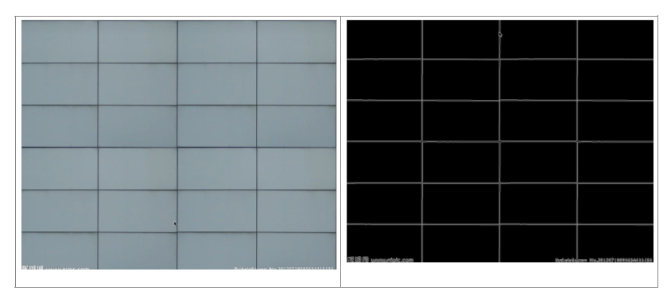
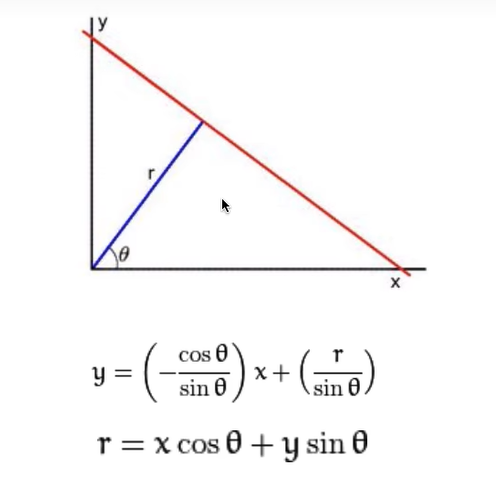
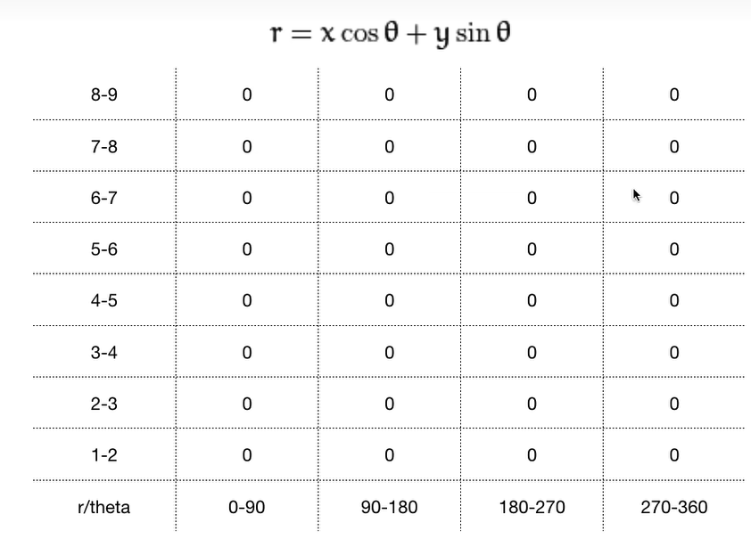
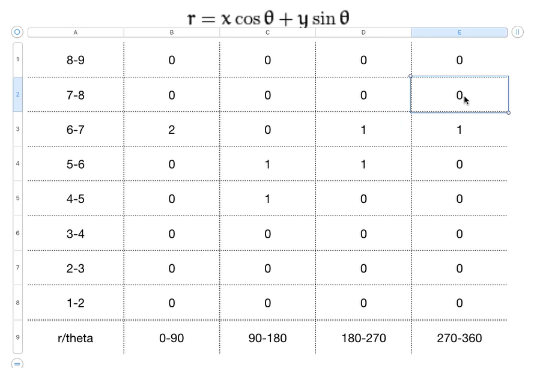

## 一、hough transform(霍夫变换直线检测)
目标：需要检测直线，需要知道边的信息

前置工作
先转为二值图

算法思路

注意：不是极坐标表示

**如何确定一条直线：需要r和θ**
怎么来的呢？原点做一条垂直的直线，夹角θ，距离r

投票箱思想：对每个像素进行计算和投票，最大票数的就是所求参数

取值
- 角只有360度
- r最大取图片对角线长度

怎么做
先canny detction
遍历每一个像素
发现一个边缘点的时候

把x,y带入r的计算式子，得到r，对每个区间进行计算进行投票

投票的过程

直到所有的边缘点完成投票
什么最有可能是直线？得票数最多的最可能是直线

二、伪代码
<table>
<colgroup>
<col style="width: 100%" />
</colgroup>
<thead>
<tr class="header">
<th>
def houghTransformLine(edge):

<strong>1、投票</strong>

<blockquote>

将累加器 "accumulator "初始化为全零

对于图像中的每一个点（x,y）来说

找到边缘点时

把x,y带入r的计算式子，得到r，对每个区间进行计算进行投票

对于每个θ，θ∈[0,pi) ，计算r的值并进行投票，r = x*cosθ + y * sinθ

累加器[θ,r]+=1

结束

结束

<strong>2、阈值化，当票数大于阈值时，就是一条直线</strong>

找到最大的投票数，M，根据M设置阈值

票数大于阈值时，就是一条直线

<strong>3、非极大值抑制</strong>

# 当坐标划分较小时，可能会出现投偏，无法得到最准确的参数。因此，应该抑制非最大值，获得最大值

结果 = 抑制非最大值 (结果)

返回线的坐标

</blockquote>

if __name__=='__main__':

<blockquote>

读取图像

高斯核卷积去噪

灰度化

做canny detetcion，得到二进制图片

霍夫直线检测并获得线条参数。

</blockquote>

绘制线条
</th>
</tr>
</thead>
<tbody>
<tr class="odd">
<td>
def houghTransformLine(edge):

<blockquote>

Initialize Accumulator "accumulator" to all zeros

for each point (x,y) in the image

if not edge[x,y] ==0 #(x,y) is an edge point

for each θ, θ ∈[0,pi)

# Calculate the value of r and Do voting

r = x*cosθ + y * sinθ

accumulator[θ,r]+=1

end

end

Find the Maximum number of votes, M

#There are multiple lines in an image, and when the number of votes is greater than the threshold, it is a straight line

set threshold according to M

result = np.array ( np.where (accumulator &gt; threshold))

# When the division of coordinates is small, the cast bias may occur and the most accurate parameter is not obtained. Therefore, the non-maximal values should be suppressed and the maximal values should be obtained

result = non-maxima suppression (result)

return coordinates of a line

</blockquote>

if __name__=='__main__':

<blockquote>

Read the image

Gaussian kernel convolution denoising

Grayscale

Do canny detetcion to get binary map

houghTransformLine(edge) and get the line parameters

Draw lines

</blockquote></td>
</tr>
</tbody>
</table>

