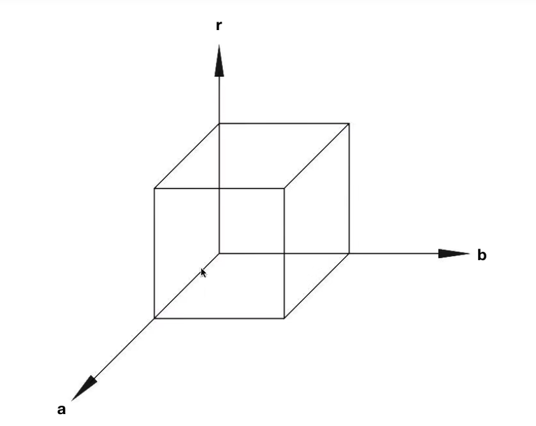
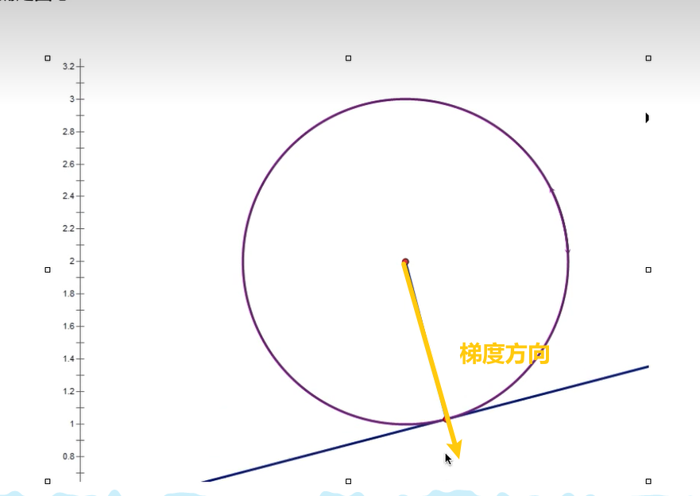

## 一、标准霍夫圆变化
霍夫梯度法
圆需要3个参数：半径长度r，圆心坐标(x,y)

先Canny detction得到二值图
进行投票，在三维空间进行投票

霍夫梯度法

圆周上面的点，梯度方向做一条直线，直线比过圆心

**思路：先找圆心，反过来确定半径大小**

怎么找梯度方向？
对每一个边缘点，通过solbel核卷积（对x,y方向），找到梯度方向，得到一条直线，，把梯度的直线上所有的点都投一票,得票数最多的就说圆心，

怎么确定圆心
算边缘上每个点到每个圆心的距离，然后投票，票最多的就说半径

<table>
<colgroup>
<col style="width: 100%" />
</colgroup>
<thead>
<tr class="header">
<th>
对图片进行canny detection得到二值图

初始化圆心累加器center_accumulator，半径累加器radius_accumulator

利用sobel卷积核计算x,y方向上的偏导，edge_x，edge_y，确定梯度方向

根据梯度方向来投票

for each point (x,y) in the image

<blockquote>

找到非0的像素点

计算偏导dx, dyCalculate the partial derivatives dx, dy

#如果dx==0 &amp;&amp; dy==0，相当于这不是圆周上的点

if not (dx==0 &amp;&amp; dy==0)

该梯度方向的直线上的点都投一票

圆心累加器[点坐标]+=1

</blockquote>

end

为了优化结构，进行非极大值抑制和阈值处理

对可能的圆心进行排序，优先处理得票数多的，越大的越可能是真实的圆心sort_centers

for 排序的圆心

<blockquote>

如果两个圆心相聚太近

可能是同一个圆心，处理得票数高的

if (x,y) is非0的像素点

计算像素点到圆心的距离

半径累加器[]+=1

</blockquote>

end

通过非极大值抑制和阈值处理

确定最终圆心和半径
</th>
</tr>
</thead>
<tbody>
</tbody>
</table>

二、伪代码

