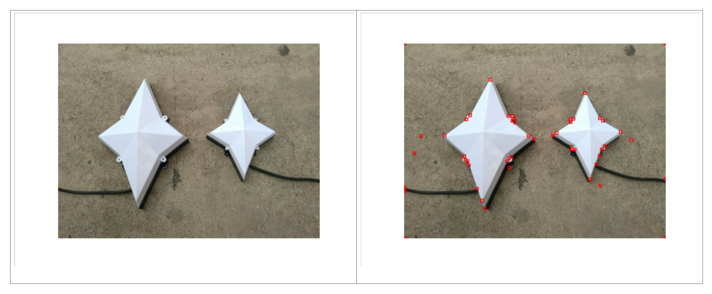
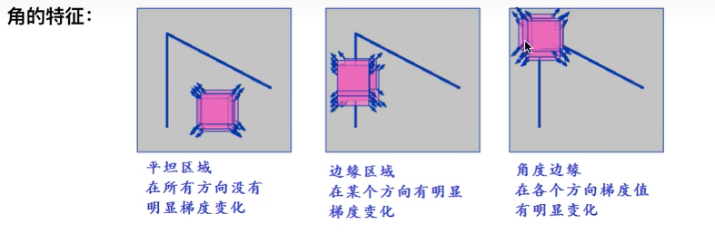
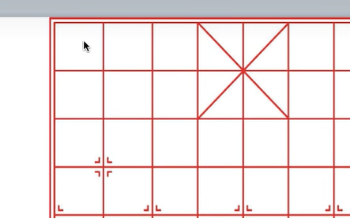
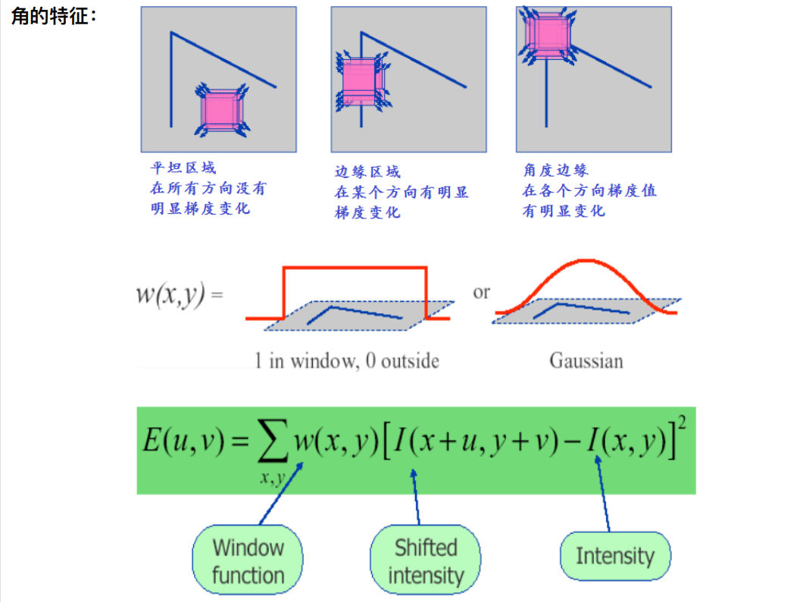
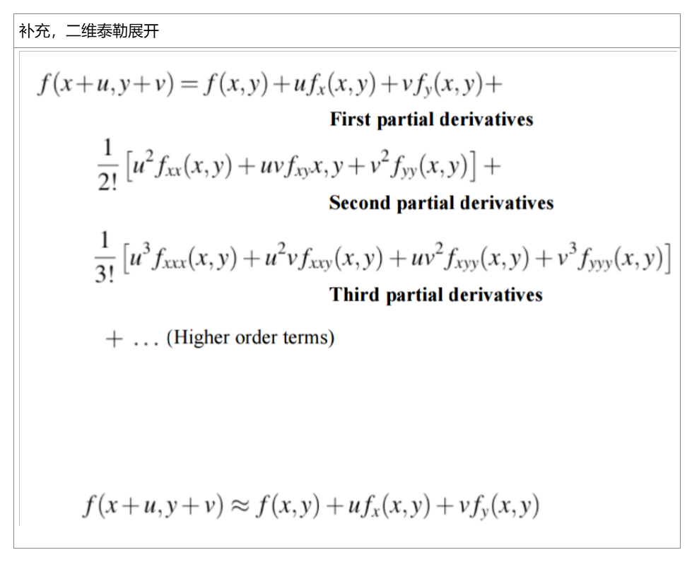
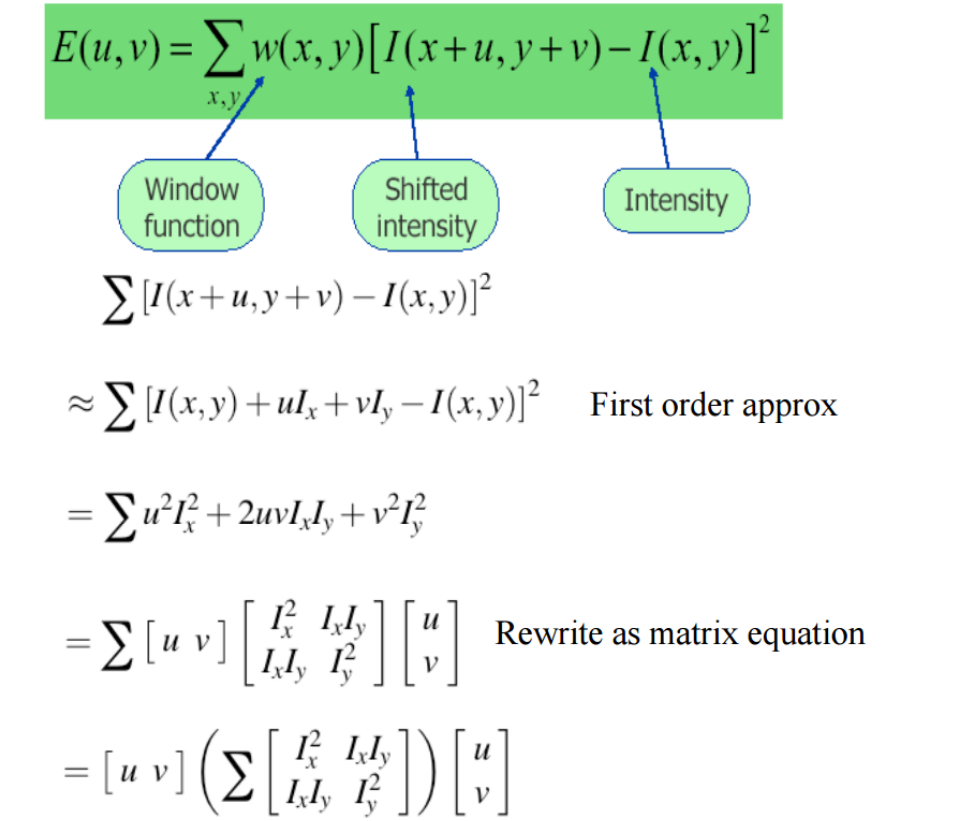
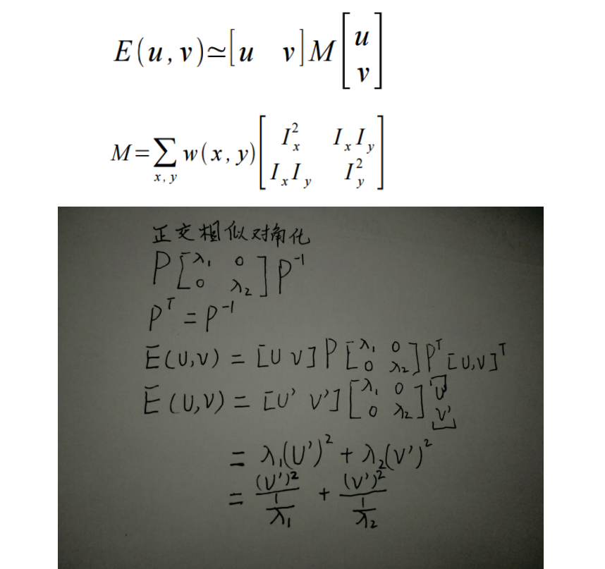
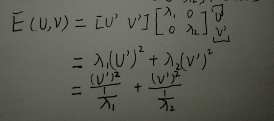
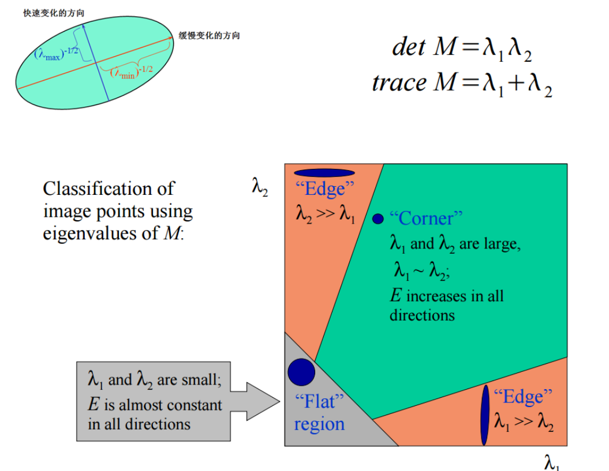
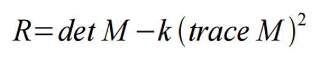

是一种检测图像中拐角的方法。它所依据的理念是，图像中的==角应该在所有方向上都有高度的强度变化==。该算法的工作原理是==计算每个像素在各个方向上的强度变化，并将那些具有高度变化的像素识别为角。==
## 
## 
## 一、角点检测
角点是什么：

角点通常被定义为**两条边的交点**，更严格地说法是，**角点的局部邻域应该具有两个不同区域的不同方向的边界**。

图像特征类型可以被分为如下三种：
- 边缘
- 角点（感兴趣关键点）
- 斑点（Blobs）（感兴趣区域）
角点检测算法
当前的图像处理邻域，角点检测算法可归纳为以下三类
- **基于灰度图像的角点检测**
- 基于二值图像的角点检测
- 基于轮廓曲线的角点检测

角点的作用：通过角点来定位，角点包含大量的位置信息，指向信息

计算机怎么识别角点？---角点检测算法

角点的特征是什么：

灰度化后
边的变化不明显（亮度
但是角的变化很大，与周围对比，一边白一边红
要看角的周围的窗口区域，在各个方向上的变化

二、公式推导

高斯：考虑了领域的贡献，距离中心点越远，影响越小
w代表权值
E(u,v)：向竖直方向移动u个单位，再向水平方向移动v个单位

这个式子是把窗口内移动后的数字和移动前的数字相减，平方，表达了窗口移动的变化，反应了图片的亮度变化

要找角点，在各个方向变化明显

u,v任意值，希望式子很大

带入泰勒展开

目的：让让大1让大2同时很大

只有一个很大：是边
两个都很小：平坦区域
两个都很大：角

## 二、伪代码
输出得分，得分大于这个阈值我就认为你是角点
<table>
<colgroup>
<col style="width: 100%" />
</colgroup>
<thead>
<tr class="header">
<th>
高级别的伪代码

1 . 将原图转为灰度图

2. 应用高斯滤波器来平滑噪音

3. 应用Sobel operator，找出灰度图像中每个像素的x和y梯度值

4. 对于灰度图像中的每个像素p，考虑它周围的3×3窗口并计算corner strength function。将其称为Harris value。

5. 找到所有超过某个阈值的像素，并且是某个窗口内的局部最大值（以防止多余的重复特征）。

6. 对于符合第5条标准的每个像素，计算出一个特征描述符

</th>
</tr>
</thead>
<tbody>
<tr class="odd">
<td>
High-level pseudocode

1. Take the grayscale of the original image

2. Apply a Gaussian filter to smooth out any noise

3. Apply Sobel operator to find the x and y gradient values for every pixel in the grayscale image

4. For each pixel p in the grayscale image, consider a 3×3 window around it and compute the corner strength function. Call this its Harris value.

5. Find all pixels that exceed a certain threshold and are the local maxima within a certain window (to prevent redundant dupes of features)

6. For each pixel that meets the criteria in 5, compute a feature descriptor.

</td>
</tr>
<tr class="even">
<td>
参考资料：

[1] <a href="https://medium.com/data-breach/introduction-to-harris-corner-detector-32a88850b3f6">https://medium.com/data-breach/introduction-to-harris-corner-detector-32a88850b3f6</a>
</td>
</tr>
</tbody>
</table>
