<https://towardsdatascience.com/sift-scale-invariant-feature-transform-c7233dc60f37>
<table>
<colgroup>
<col style="width: 100%" />
</colgroup>
<thead>
<tr class="header">
<th>总结</th>
</tr>
</thead>
<tbody>
<tr class="odd">
<td>

目的：是用于图像处理领域的一种描述。这种描述具有尺度不变性，可在图像中检测出关键点，

步骤：

1、建立高斯差分金字塔

2、（关键点）极值点（key points关键点）的精确定位

3、确定关键点主方向

4、构建关键点描述符（对关键点进行匹配）
</td>
</tr>
<tr class="even">
<td>
In general, SIFT algorithm can be decomposed into four steps:

Feature point (also called keypoint) detection

Feature point localization

Orientation assignment

Feature descriptor generation.
</td>
</tr>
</tbody>
</table>
一、SIFT
运用：手机全景照片
找不同照片里面相同的物品

原理
**1、建立高斯差分金字塔**
为什么需要它：模拟近大远小，近处清晰，远处模糊
高斯核模拟近大远小

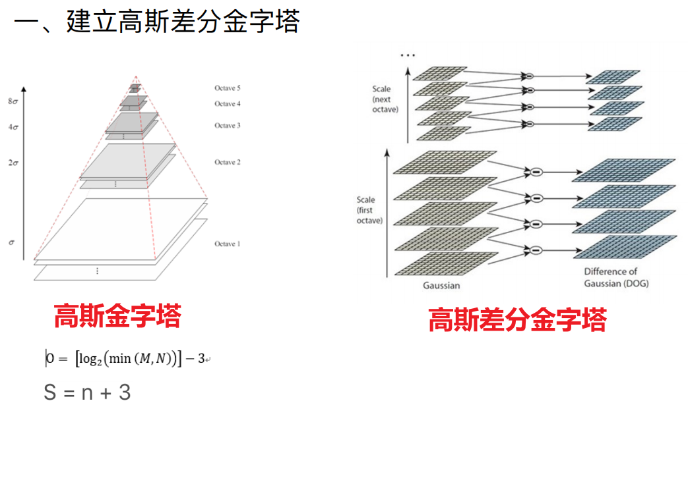
同样大小的图片为一组octave
一组内有很多层
（同样大小图片论层，不同大小图片论组）

用不同方差σ（尺度）高斯核对原图进行卷积，得到不同层
用σ得到第一层，用降采样求第二层（隔点取点），得到缩小两倍的图片
一个像素点影响很小，图片只是不嫌弃了
然后逐个降采样，得到高斯金字塔

同一组，相邻的两层相减，得到高斯差分金字塔
DOG：高斯核值的差异

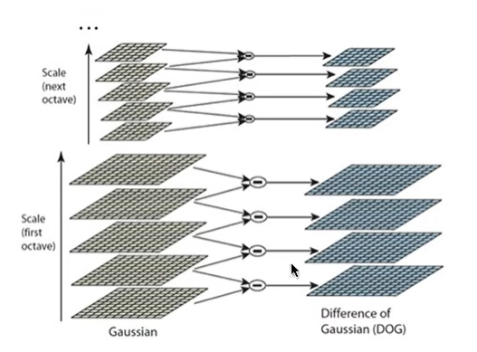

较好参数（论文）
M,N原图的长宽
n是希望提取多生长图片中的特征
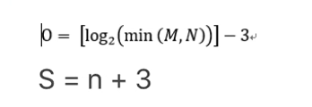
怎么定σ
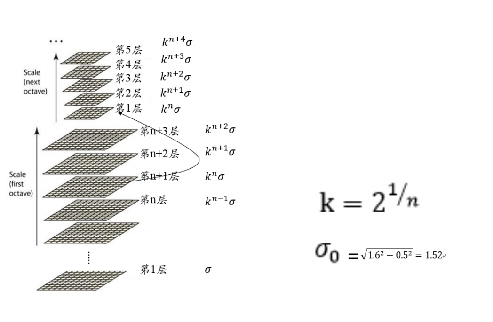

为什么要高斯差分金字塔
因为希望SIFT有远近普遍性，无论相机距离远近，同一个物体应该都能识别出来是同一个物体
这是在模拟近大远小
近处清晰远处模糊（高斯核是唯一做的这个的线性核）

**2、极值点（key points关键点）的精确定位**

关键点是稳定的点，稳定信息的点，通常是极值
之前是认为，在八领域内（八个点比较），最小/大的就是极值
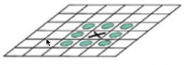

现在有了尺度的概念，xy轴需要与上下层（合计26个点进行比较）
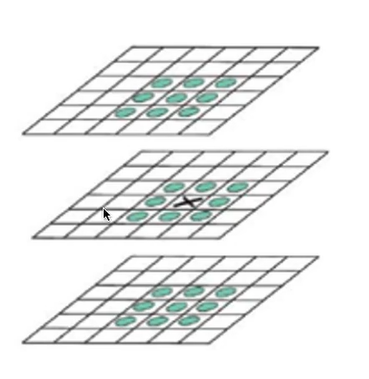

步骤
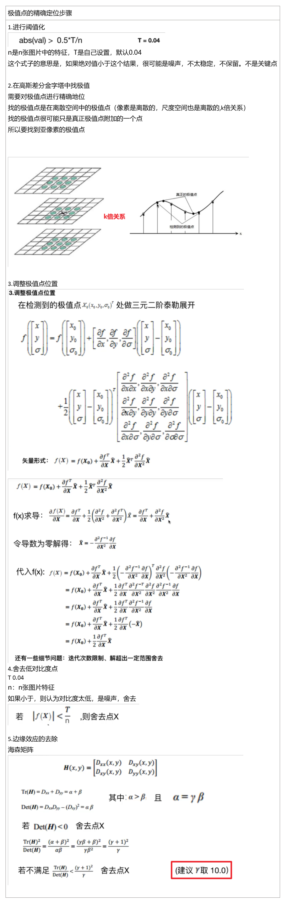

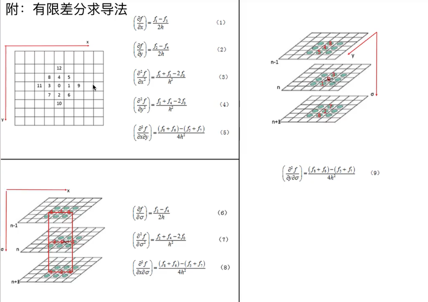

这一步目的是找到亚像素中极值点的准确位置

**3、确定关键点主方向**
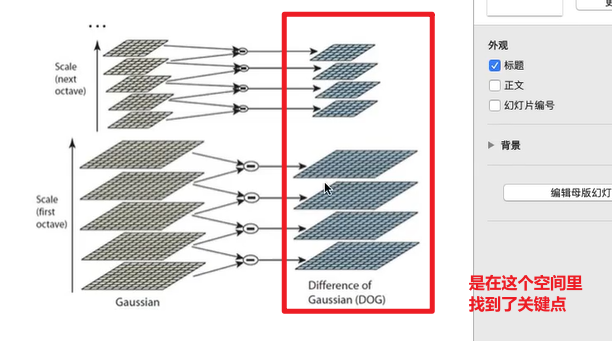
现在关键点有的参数（x,y,σ，可以都不是整数，σ也可以不落在某层 ）
找到和σ最接近的高斯图像
和哪个最接近就在哪个上面找（右到左，是在左边高斯金字塔找，不是在高斯差分金字塔找
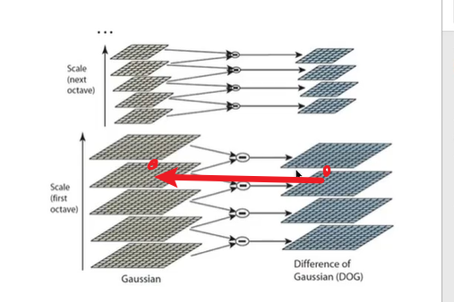
以这个点的位置为圆心，以尺度的1.5倍画一个圆，统计圆里面的梯度方向和幅值，进行投票统计，
再进行1.5σ高斯滤波（权值，越远影响越小
实际代码中每十度算一个方向

投票最大的是主方向，如果有一个大于主方向的百分之八十，设置为辅方向
所以一个点可以有一个主方向和一个辅方向
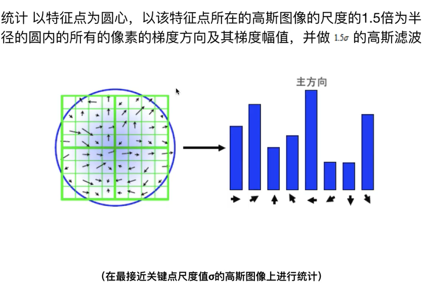

特征点标记
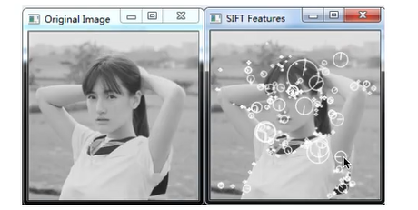

**4、构建关键点描述符**
目前关键点的参数：x,y,σ，主方向
为什么要构建描述符
在一张图片里面找到一个关键点还不够，需要匹配两个图片里面的关键点
需要一个描述符来匹配
描述符是一个128维度的向量
K近邻算法
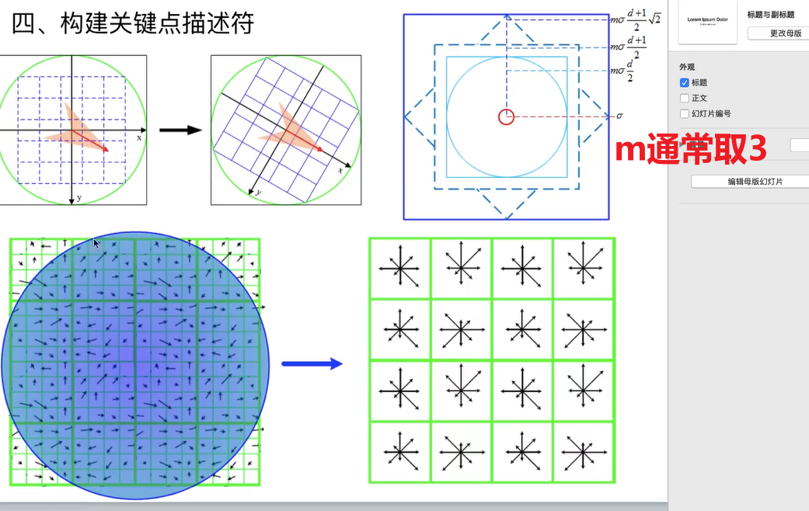

什么是描述符
在每个子区域内，统计八个方向上的梯度的尺度，结果高斯加权投票（不一定要这样，自定义）
有8\*16 =128个数，就是描述符
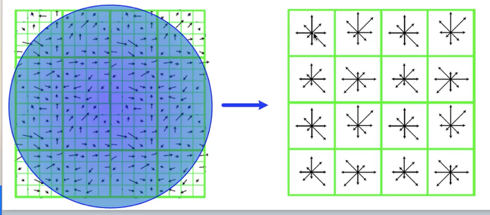

二、伪代码
