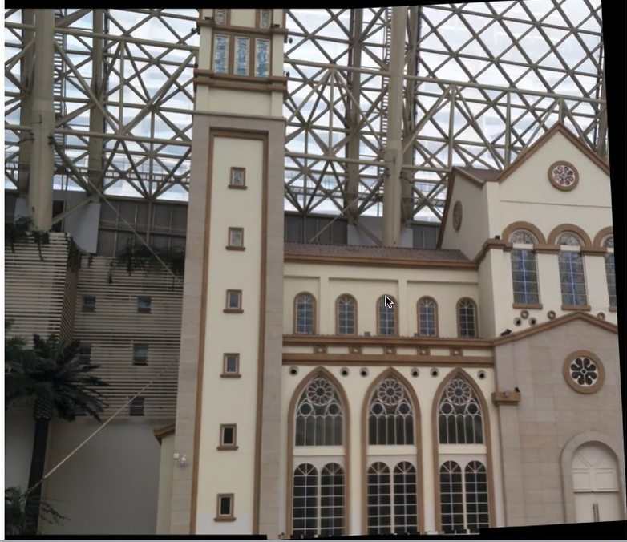

# 9 Ransac
2022年12月11日
9:11

算法步骤

举例子，直线
两点确定一条直线
1，从样本中随机拿两个点，画一条直线，得到模型参数
2，计算模型质量，计算所有的点到直线的距离，
设置阈值，
局内点会更多支持
3.重复

原理
1

不是一个好的模型的概率

迭代次数趋向于无限大的时候，好的模型的概率趋近于1（一定出现一个好的模型

### RANSAC计算单应性矩阵
应用
把这两个拼在一起

黑边：旋转后超出边界

怎么拼一起？一张不动，一张做变换（RANSAC）

把一张图的坐标转到另一张图

二维只能支持，旋转，坐标轴上比例变换，反射，错切

三维的可以

