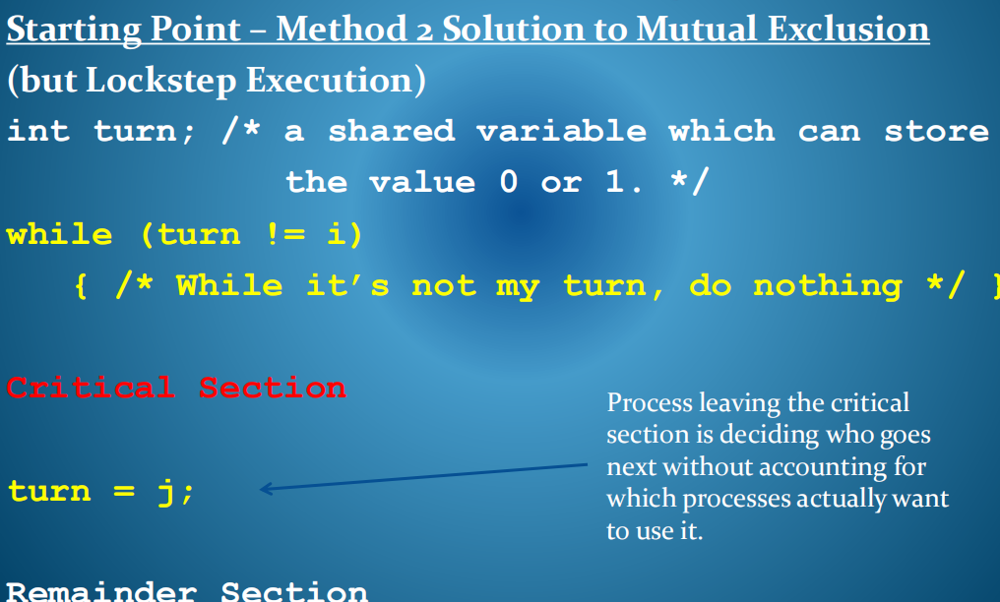
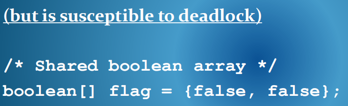
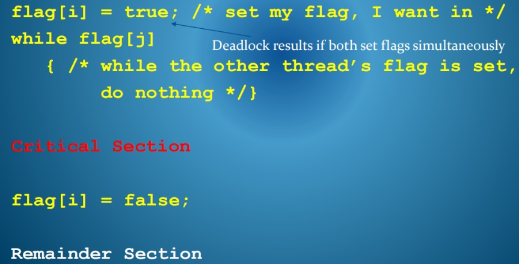
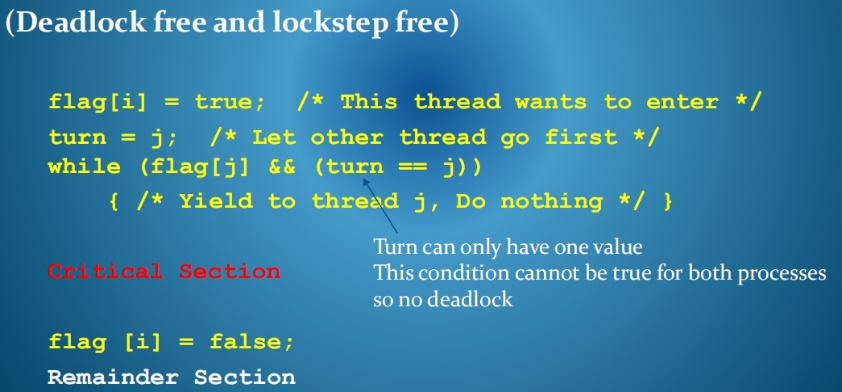
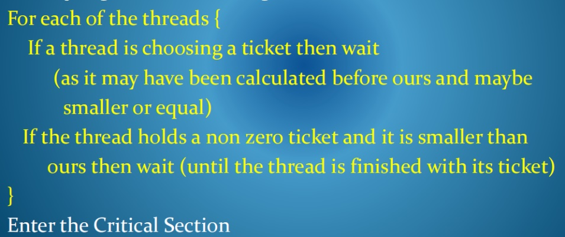
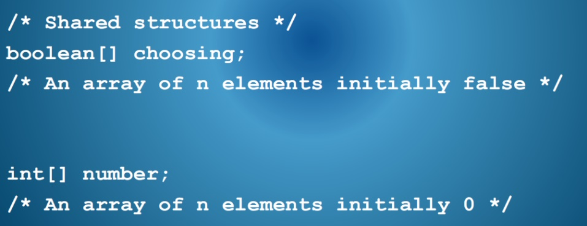
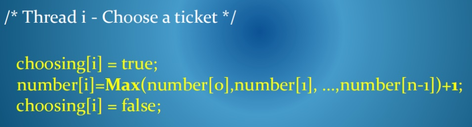
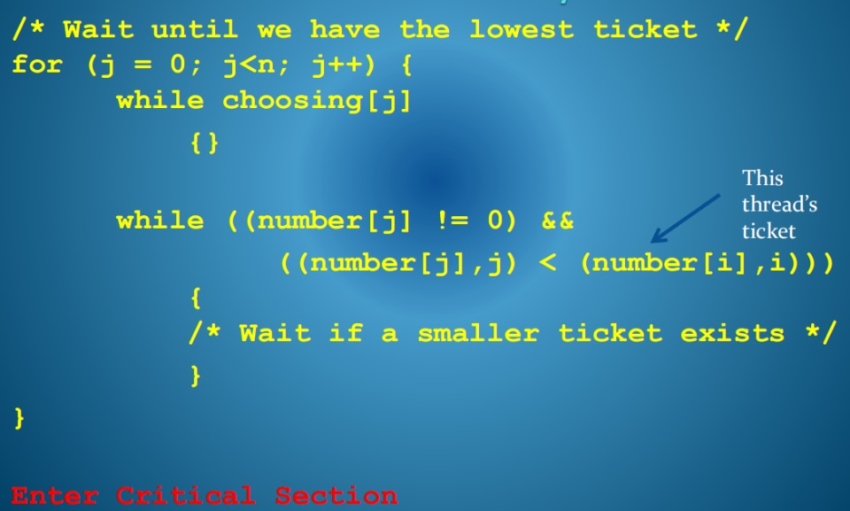
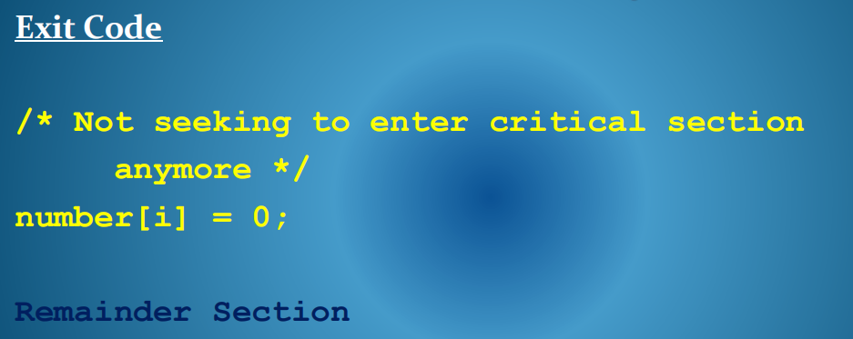
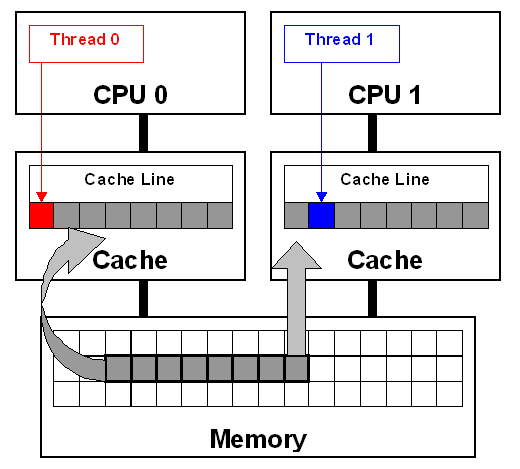

一、 Mutual Exclusion的算法求解
<table>
<colgroup>
<col style="width: 100%" />
</colgroup>
<thead>
<tr class="header">
<th>
正确解决互排除问题的必要条件

(a)相互排除

两个线程不能在the critical code section中同时执行。(i.e.操作不可共享资源的部分。）

(b) Progress

在关键部分以外操作的线程不能阻止另一个线程形式进入关键部分。

(c) Bounded Waiting

一旦线程表示希望进入关键部分，就保证在有限时间内这样做。

(a) Mutual Exclusion

No two threads can be able to execute simultaneously in the critical code

section. (i.e. the section which manipulates the nonshareable resource.)

(b) Progress

A thread operating outside the critical section cannot prevent another thread

form entering the critical section.

(c) Bounded Waiting

Once a thread has indicated its desire to enter a critical section, it is guaranteed

that it may do so in a finite time

</th>
</tr>
</thead>
<tbody>
</tbody>
</table>

二、
我们希望：设计一组指令，由任何线程执行，以公平的方式解决互排除问题
首先，我们解决了两个线程，然后是n个线程。

1，双线程软件解决方案
<table>
<colgroup>
<col style="width: 100%" />
</colgroup>
<thead>
<tr class="header">
<th>
这两个线程执行相同的进入和退出代码，我们将引用当前执行代码的线程为i，另一个线程为j

在i出现在代码中的地方，线程指的是它自己的Id，其中j出现的线程指的是另一个线程的Id。

此代码只能由两个进程同时执行
</th>
</tr>
</thead>
<tbody>
</tbody>
</table>

回顾
方法2：相互排除的解决方案

方法3（两碗）也是相互排除的解决方案
但很容易陷入死锁

Two Process Solution
确保相互排除，因为如果两个进程一起尝试输入，则设置两个标志，但是变量回合的值决定了哪个可以进入。它只能有一个值。

Progress
只有试图访问关键部分的过程才会参与决定下一个要去哪一个。

Bounded Waiting
如果另一个线程在等待，那么一个线程不能第二次访问关键部分，因为它通过设置回合首先返回给另一个线程。

2,针对N个流程的通用软件解决方案--bakery algorithm
该算法被称为烘焙算法bakery algorithm，是一种常用的队列服务方法。
线程**从一组有序的数字中选择一个票单，以确定其在关键部分的队列中的位置**

票是唯一的，有一个服务订单，所以等待是有限的

算法
<table>
<colgroup>
<col style="width: 100%" />
</colgroup>
<thead>
<tr class="header">
<th>
看看到目前为止所有线程的票，然后选择一个更大的

注意，此操作可以由其他线程并行执行，并且它们可能会生成<u>相同的票单号</u>。

在票证编号相同的情况下，我们将按其线程ID对线程进行排序，而较低的数字将先进行。
</th>
</tr>
</thead>
<tbody>
</tbody>
</table>

三、需要考虑的问题

1，解决高速缓存系统和多处理器系统的互排除
出于性能原因，内存被缓存在处理器中。这意味着可能会有几个数据的副本。

使用软件算法解决方案的假设相互排除问题是，当数据结构用于控制访问一个关键部分共享线程，所有线程必须有一个一致的数据结构视图，以便算法工作。
它们都必须使用相同的数据值

2.考虑到许多级别的缓存

编译器或虚拟机运行时间可能会试图通过使用处理器寄存器来存储变量或以某种方式重组代码来优化代码执行或数据访问

在多处理器系统中，共享数据结构可以保持在每个处理器的缓存或寄存器中，因此当一个线程改变其缓存副本时，接近该时间的其他线程可能从它们各自的副本中读取过时的值。其他处理器可能无法立即看到更改。
这意味着这些算法可能无法保持互排斥。

3，解决多处理器系统中的相互排除问题
禁用中断程序或禁用优先购买权

在单处理器系统上，如果禁用中断，当前线程不能被中断和交换，因此它可以对数据结构执行一系列测试和设置操作，而不会造成其他人可能交叉执行的后果。因此，用于测试和设置控制关键部分输入的变量的输入代码可以很容易地执行，同时关闭中断，使其不可分割。

但是，禁用优先购买权是有风险的。
同时对多处理器系统中的所有处理器禁用中断是效率低下和不切实际的。
【不想看了…】

