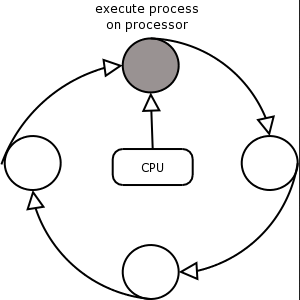

## 抢占式算法
### 一、Preemptive Scheduling using RR
1，时间片轮转 Round Robin.
在多任务处理系统中，一种用作调度基础的一种常见算法被称为 时间片轮转 Round Robin.
选择循环操作是因为它为所有进程提供了良好的响应时间，
这对于在<u>多任务处理系统</u>中实现令人满意的交互性性能很重要。

RR是FCFS的一个抢占式的版本。每个进程依次执行，直到其到期，迫使任务转换.
The quantum 时间片？can be varied, to give best results for a particular workload.

2，案例-时间片为1

案例-时间片为3

将量子量与CPU突发的平均长度相匹配，提高了一些性能标准。

### 
2，Analysis of RR with different quantum lengths
1,）注意，RR算法比非优先算法产生更多的任务切换。
每个任务开关都需要一定的时间才能让CPU更改进程环境。
任务开关切换。时间片太小)意味着更大比例的CPU时间花在任务切换而不是有用的工作。
**如果时间片太大，RR就会退化为FCFS。**

2）时间片（量子）选择
当选择循环调度的量子时，很难适合所有的工作。如果平均CPU突发时间有较大的偏差，则可采用带反馈的多级队列方法。这种自适应方法长期降低了任务切换开销。

一个进程最初被提交到最高优先级的队列，在那里它受益于良好的响应时间。如果随着时间的推移，它的行为表明它的计算要求，那么它可以降级到一个较低优先级的队列，由于更合适的CPU量子长度，它产生的任务切换更少，但队列从处理器得到的关注可能更少。

3）调度优先级
循环操作不允许用户告诉系统哪些任务比其他任务更重要。在优先级调度系统中，为进程分配一个表示其调度优先级的数值。用户可以指示分配给任务而于其他任务的优先级

调度程序始终首先选择具有最高优先级的进程。

这是一个容易实现的方案，但需要一种计算优先级的方法，以便较低优先级的任务不会挨饿。

