## 一、硬盘驱动器的物理特性
Physical Characteristics of Hard Disk Drives

1，Magnetic storage device储磁存储装置
几十年来持久性数据存储的主要形式
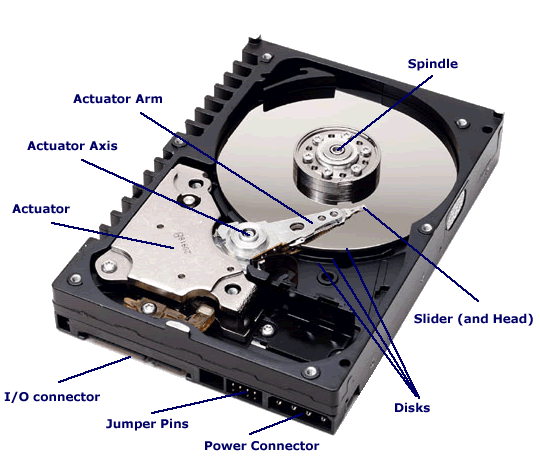

2，Engineering Developments
较小的拼盘直径提供了更好的刚性，重量更小，需要更少的功率来旋转spin，
这意味着更有用的便携式设备/usb功率，更少的噪音和热量，并提高了寻求性能。

较小的磁盘意味着一个较小的记录表面，但位密度技术已经增加到足以补偿。

更快的信号接口，提高了传输速度。

Smaller platter diameters
bit density technology
Faster Signaling Interfaces

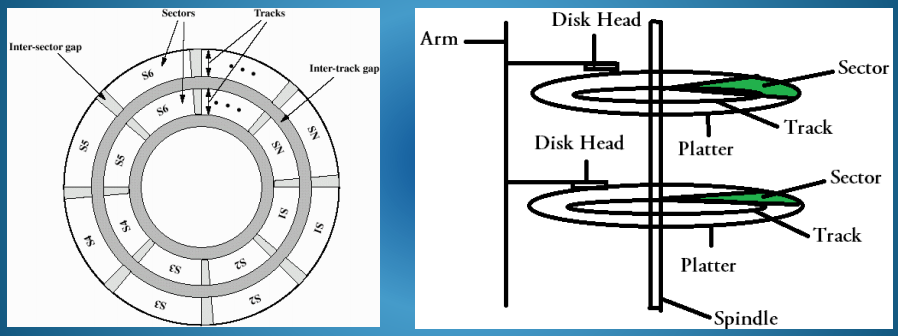
每个磁盘的表面被组织成一个同心的磁轨组，可能超过1000条，可以在上面存储数据
**每条轨道都被分成若干个固定大小的块，称为存储数据的扇区sectors。**
历史上，每个扇区有512个字节的数据，但在较新的大驱动器中有4k个字节
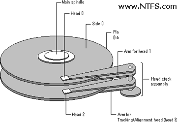

一个盘的一侧包含硬件轨道定位信息的空间，**操作系统不可用**
包含两个磁盘的磁盘程序集有三面可用于数据。
在工厂组装期间，跟踪定位数据被写入磁盘。
系统磁盘控制器读取此数据，以将驱动器头固定在正确的轨道位置。

3，
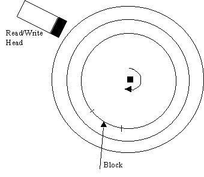
sector扇区/块block是可以寻址、读取或写入磁盘的最小数据存储单元
我们可以将磁盘视为虚拟存储设备，其扇区数组范围为0到n−1，
基本上是**驱动器的地址空间address space of the drive.**

某些操作系统可能会**将相邻的扇区分组为集群group adjacent sectors into clusters**。
集群是文件在磁盘上可以占用的最小空间量。保留集群可以使文件有所增长，同时保持非碎片访问的效率

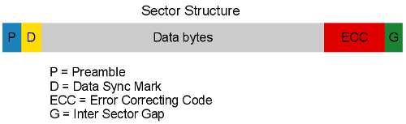
每个扇区区域的内容包括扇区标识信息、扇区状态码、引导读取头的同步位模式、
512或4k字节的数据、纠错码和扇区间隙。
The contents of each sector area include sector id information, sector status codes, synchronization bit
patterns to guide the read head, 512 or 4k bytes of data, error correction codes and sector gaps.

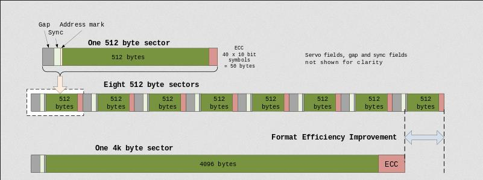
更大的扇区规模提高了管理效率，但以增加最小空间分配单位为代价。

## 二、Data Organisation & Performance
1，Zoned Bit Recording分区位记录
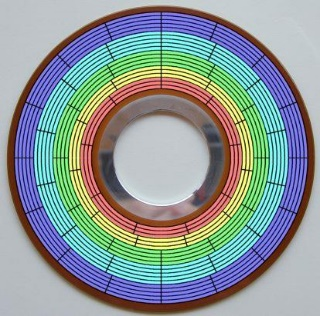
**较大的外部轨道**包含了比内部轨道**更大的记录材料面积。**
存储在**内部轨道**上的扇区的**数量受到磁性表面的位密度的限**制
轨道根据其距离中心的距离进行分组，外部区域被用于存储比内部区域更多的扇区

这也意味着，如果转速是恒定的，数据可以从外部轨道传输得比内部轨道更快。
当驱动器从外部填充时，它在新的和空时提供最佳性能

2，Solid State Drives固态驱动器

与硬盘驱动器相比，这些存储驱动器具有能源和性能优势，但成本更高，而且通常容量也更小。
Operating system may boot faster from SSD & file opening speeds maybe 20-40x faster than a standard HDD.

类似的包装，设计为硬盘驱动器的物理替代，但访问是电气而不是机械，使用浮动栅晶体管技术用于非易失性存储。

3，Hard Disk Drive Performance Metrics
**Capacity** –高可靠的高容量廉价解决方案
**Data Rate** – 驱动器和系统之间的带宽，由一个特定的接口连接。SATA1.5Gb/s、SATA-23Gb/s、SATA-36Gb/s、SATA3.216Gb/s
**Average Latency** –进入一个部门的时间了，例如。4ms-9ms
**Reliability** – (MTTF)平均故障间隔期

## 三、Disk Scheduling Algorithms
1，Scheduling Algorithms - Seek Time
访问磁盘块中最慢的部分是将头部物理地移动到正确的轨迹。This is called the seek time.

在多任务处理系统中，访问磁盘不同部分的请求来自不同的进程，或者文件块可能分散在磁盘上。

这些请求的正确调度可以通过减少头部必须旅行的平均距离来减少平均搜索时间。

本机命令队列(NCQ)是SATA协议的一个扩展，允许硬盘驱动器在内部优化接收到的读写命令的执行顺序。
2，算法
说轨道在外部编号为0-200。
头部目前坐在53号轨道上，
以下轨道请求正在排队。要服务每条轨道要走多远？
### 1）FCFS先到先得
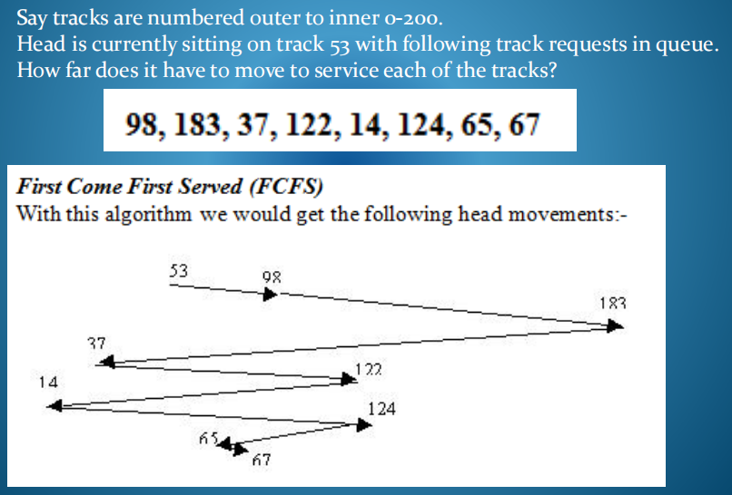

### 2）SSTF：选与当前的点最接近的点
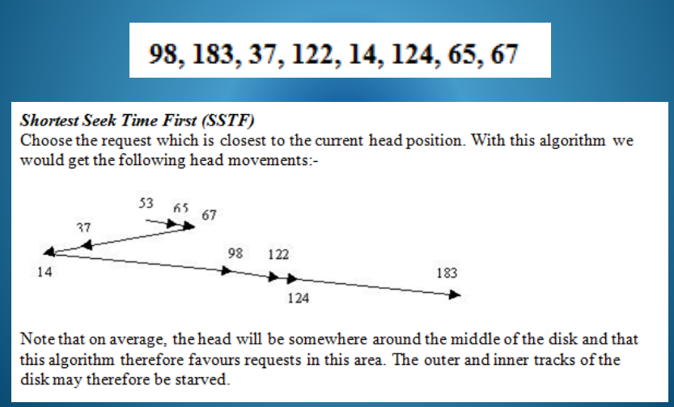

### 3）SCAN：
**向一个方向（外侧）移动，直到到达最外侧【一定要到磁盘的最外侧】再回头向内**
磁头向一个方向移动，要么向中心轨道，要么向最外层轨道，当它经过相应轨道时为请求提供服务。然后它转过来，
在另一个方向重复这个过程。
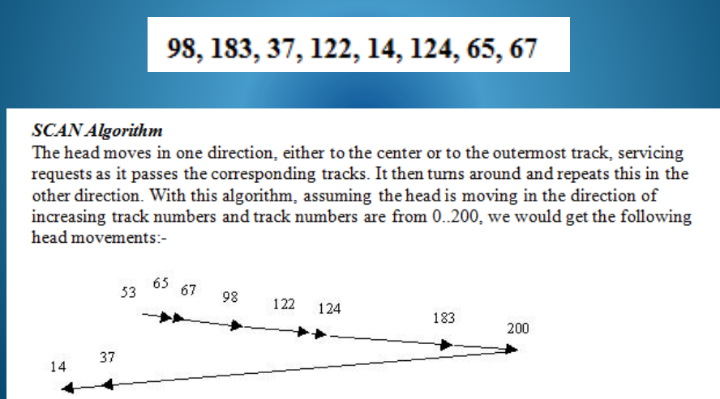

### 4）C-SCAN 
**从某点开始，向外侧扫描后到达最外侧【一定要到磁盘的最外侧】，直接飞回0点**，向一个方向继续扫描
该算法试图规范SCAN提供的服务分布。当头部完成一个方向的运动后，它会快速飞回起点，而不扫描表面，并开始在同一方向再次扫描。每个轨道然后有相同的时间之间的连续访问由磁头通过这个算法，我们得到以下头部运动:
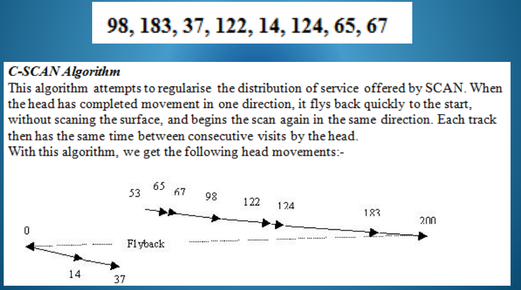

### 5）LOOK
LOOK算法与SCAN算法相同，不同之处在于SCAN在掉头前**总是在特定方向上继续最后一条轨道**，并且没有到磁盘最外侧
LOOK算法**只是在掉头前检查该方向上是否还有其他请求**。通过这个算法，我们得到了以下头部运动:
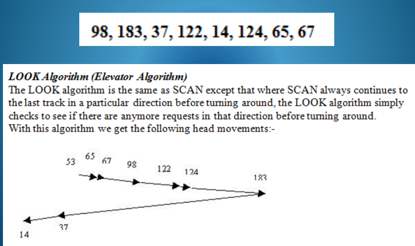

### 6）C-LOOK：
飞回0点开始检查
C-LOOK算法与C-SCAN相同，不同之处在于C-SCAN总是在返回前继续特定方向上的最后一条轨道，而C-LOOK算法只是在返回前检查该方向是否还有其他请求。
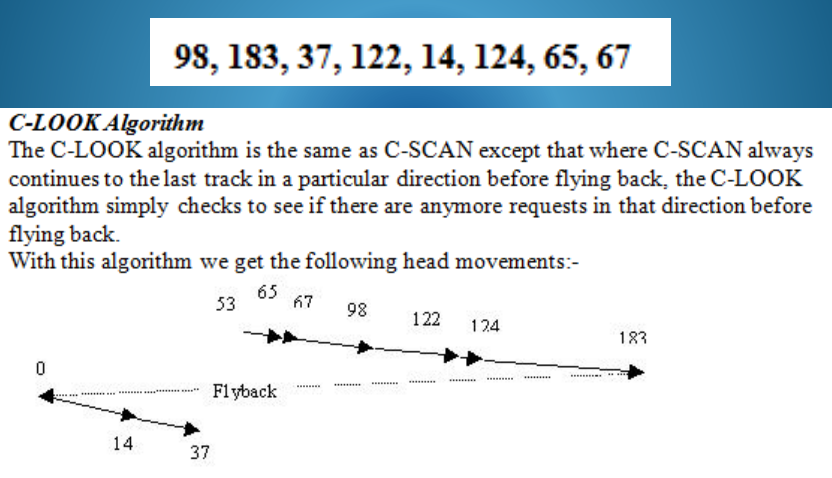

