Overview
<table>
<colgroup>
<col style="width: 100%" />
</colgroup>
<thead>
<tr class="header">
<th>
如何创建和终止进程，并控制C程序中的行为

Linux启动序列--创建第一个进程

通信的设计考虑事项，不同的实施方法

How to create and terminate processes and control behaviour from within C programs

The Linux Boot sequence – Creating the first process

Design considerations for communication, different implementation approaches
</th>
</tr>
</thead>
<tbody>
</tbody>
</table>

## 一、Unix Process Creation创建进程
1，每一个process进程都有一个**uuId**
在C中，创建进程用**fork()**
初始进程是父进程，新进程是子进程
子进程是父进程的精确副本，包括父进程的I/O描述符表的副本，因此它将继承对所有父进程打开的I/O设备的访问权限。
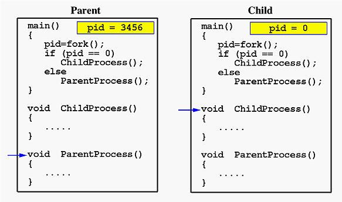
,
通常，**exec()**调用是在fork()之后使用的子进程调用
exec()调用将指定的二进制文件加载到进程的内存中（替换现有的程序映像）并开始执行它

2， Implementation of command initiation at the shell
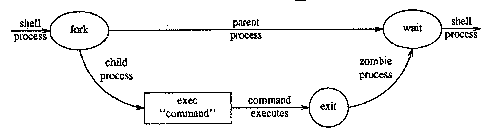

wait() : 暂停调用进程的执行，直到其中一个子进程终止。
**成功后，返回终止子级的进ID；**
**出现错误时，返回-1。**执行等待后，系统收回僵尸子级的资源。

3，创建子进程的代码
<table>
<colgroup>
<col style="width: 100%" />
</colgroup>
<thead>
<tr class="header">
<th>
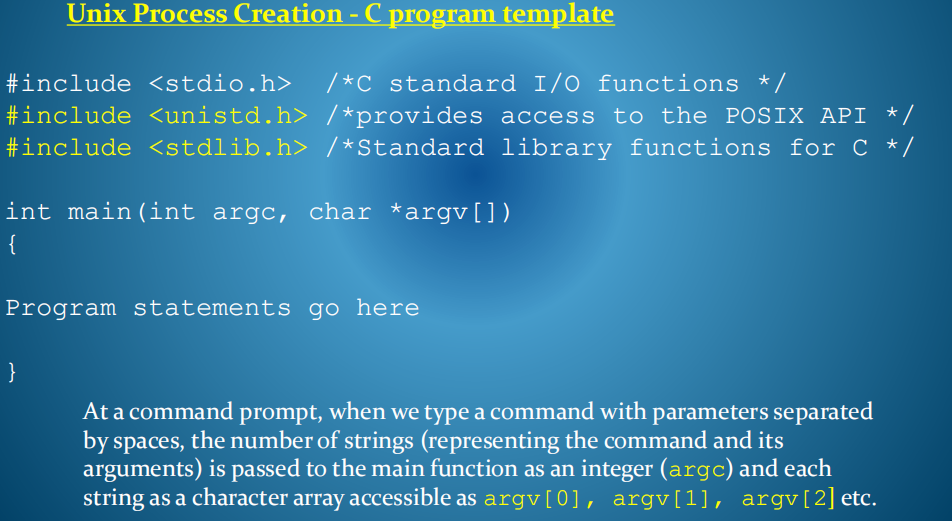

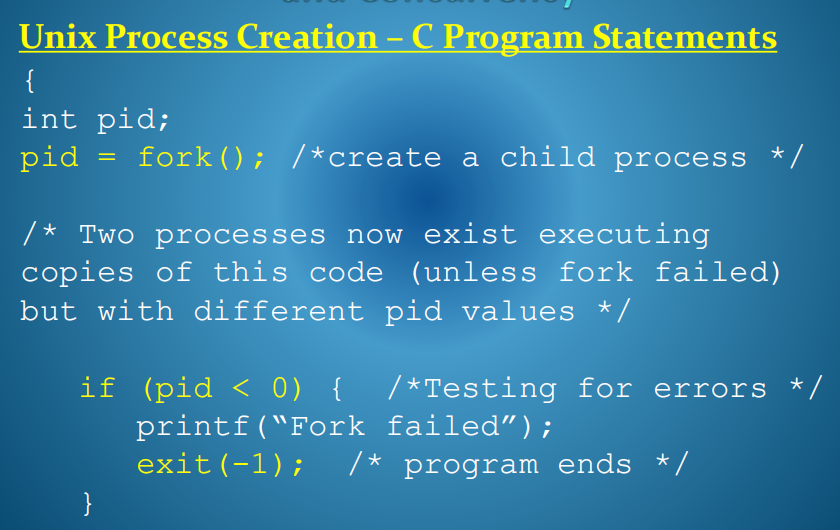

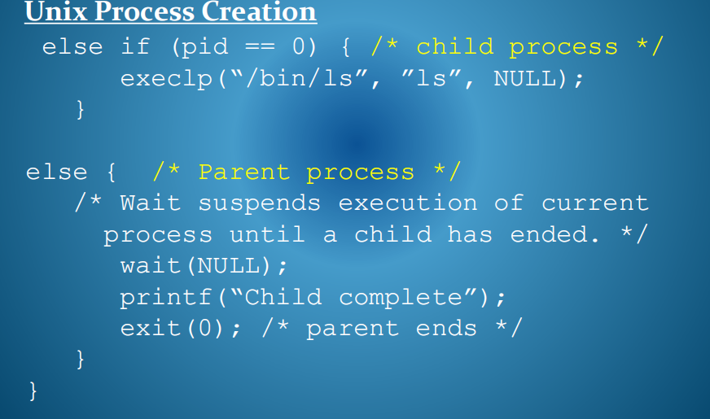
</th>
</tr>
</thead>
<tbody>
</tbody>
</table>

此程序创建了多少个进程？
<table>
<colgroup>
<col style="width: 88%" />
<col style="width: 11%" />
</colgroup>
<thead>
<tr class="header">
<th>

3个
</th>
<th></th>
</tr>
</thead>
<tbody>
</tbody>
</table>

## 二、Booting a Linux System - Master Boot Record
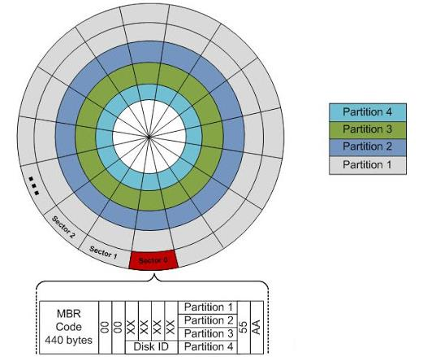
在打开自检电源和通过固件例程进行硬件识别后，选择第一个引导设备，并从该设备读取驱动器上的第一个扇区主引导记录。MBR包含初始引导代码和有关活动分区的信息。

1，硬盘分区Hard Disk Partitioning
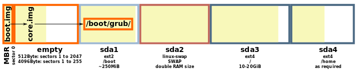
主引导记录(MBR)包含由BIOS调用的初始引导代码，以及有关主引导设备和活动分区的分区信息。
它始终位于磁盘上的第一个扇区中。原始二进制文件，440字节的代码。

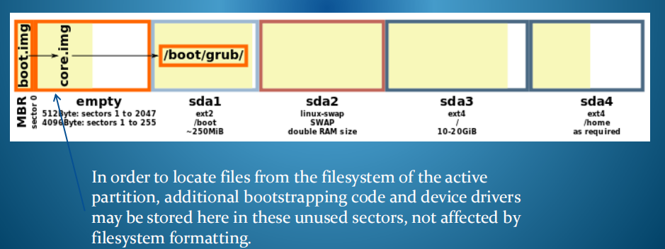
为了从活动分区的文件系统中找到文件，其他引导代码和设备驱动程序可以存储在这些未使用的扇区中，而不受文件系统格式的影响。

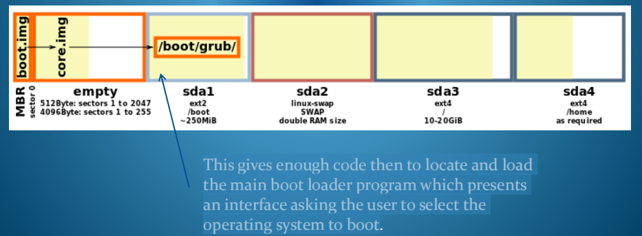
这就提供了足够的代码来定位和加载主引导加载器程序，该程序提供了一个界面，要求用户选择要引导的操作系统。

2，Unix Boot Sequence – Creating the first process
部件
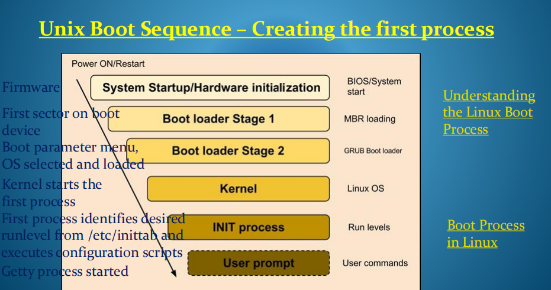

3，Linux Run Levels
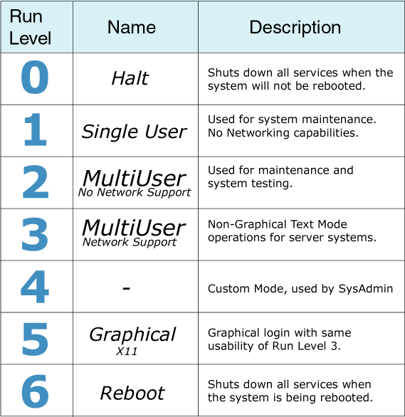

3，Init是初始启动过程。它的主要作用是根据选定的运行级别，
在启动过程中从存储在文件**/etc/inittab**的配置信息创建进程
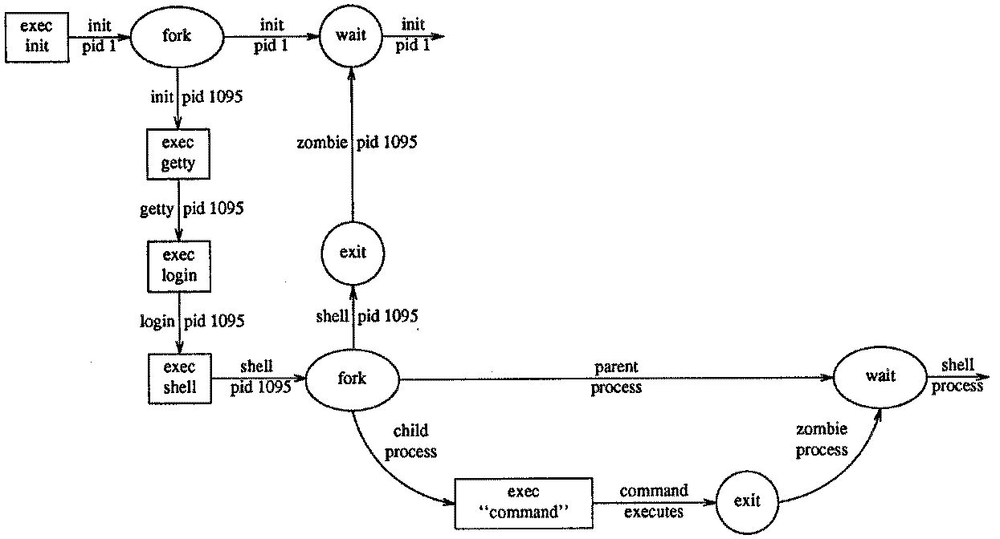

4， 进程间通信(IPC)
<u>进程间通信是指独立**独立可调度任务之间的信息交换或共享**。</u>
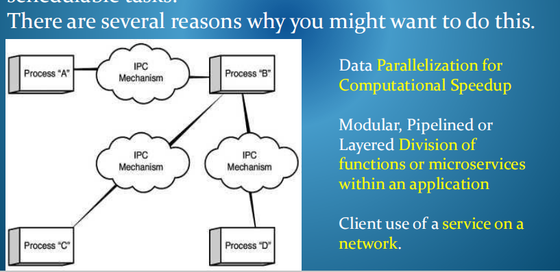

实现进程间通信有两种基本方法
1，通过使用所有通信各方都可访问的共享内存区域,shared region of memory
2，通过使用由操作系统的通信子系统提供的显式消息传递原语。message passing primitives

## 5，Shared Memory Communication
通常，独立进程可访问的地址空间是分开的。
共享内存通信将要求进程使用操作系统在它们之间建立一个共享的内存区域。
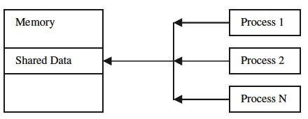

通常通信需要进程在同一主机上，它们通常是协作部分模型是面向应用程序的，属于同一应用程序。
模型是面向应用程序的，属于同一应用程序。适合于愿意共享内存的合作过程。
通过读写操作进行隐式通信。
高效，无通信协议。
需要建立同步机制。

## 6，Interprocess Communication
独立进程需要不同的通信方式，因为它们无法访问彼此的地址空间。进程可能彼此不信任，并且可能驻留在不同的主机上

消息传递设施是任何中间操作系统机制，它可以从一个进程的地址空间获取数据，并将其放在另一个进程可访问的区域中。
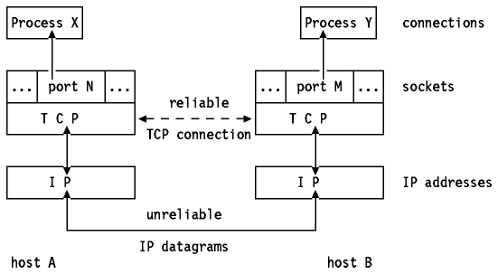

以其最简单的形式，消息传递机制必须实现两个基本的原语，**发送和接收**，或其等效物，它们处理显式调用来交换消息。

高级抽象，如远程过程调用，是这些基本原语的扩展。

## 三，Design Issues for Interprocess Communication
1，命名Naming
如何建立了两个进程之间的联系？
The sender may identify (as a parameter to the Send primitive) a **process ID or a mailbox or port ID** to which a message is to be sent.
间接沟通与直接沟通。
单通道或多通道。
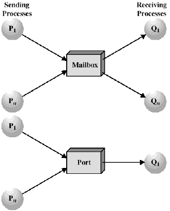

2，同步Synchronisation

消息传递操作：发送和接收可能是阻塞的或非阻塞的

<table>
<colgroup>
<col style="width: 25%" />
<col style="width: 74%" />
</colgroup>
<thead>
<tr class="header">
<th>Blocking Send:</th>
<th>在邮件传递机制将邮件传递到接收进程或邮箱之前，将阻止发送进程。</th>
</tr>
</thead>
<tbody>
<tr class="odd">
<td>Non-Blocking Send</td>
<td>发送过程传递消息，并可以在消息传递机制传递消息时<strong>立即继续其他任务。</strong></td>
</tr>
<tr class="even">
<td>Non-Blocking Receive</td>
<td>
接收器会等待，直到它接收到消息。非阻塞接收：

接收器获取可用消息，或者获取接收原语返回的空值。
</td>
</tr>
</tbody>
</table>

3，其中一些语义的实现需要管理一个 message buffer/queue.
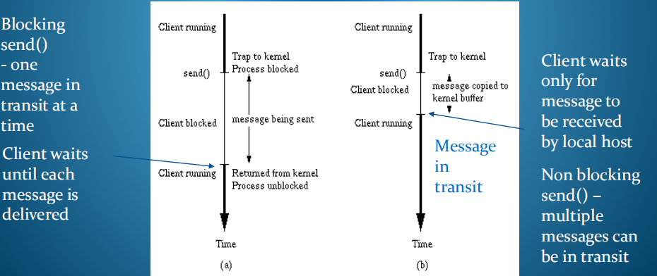

1）buffering
一个Link的容量是多少？
缓冲区是实现非阻塞语义的一个要求。一个link可以具有零的、有限的或无限的\*容量。

缓冲区增加了复杂性和对消息排序的需求。
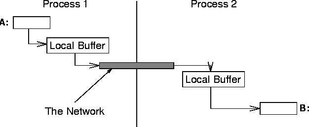

2)Message Parameters
消息数据包应该是什么大小？
固定大小的消息，更容易缓冲和管理带宽。
输入的消息在强类型语言环境中很有用。

3)Other issues - Reliability & Security可靠性和安全性

该机制必须处理网络通信的问题，如丢失和混乱的消息，以及安全问题
对于程序员来说，该系统应该是可靠、快速和易于使用。

不可靠的协议和不可靠的协议。
Unreliable vs Reliable protocol
一个可靠的传输协议将使用序列号和超时/应答机/反传任务机制，以确保消息序列正确到达
A reliable transmission protocol will use sequence numbers and timeouts/acks/retransmission mechanisms to ensure message sequences arrive correctly

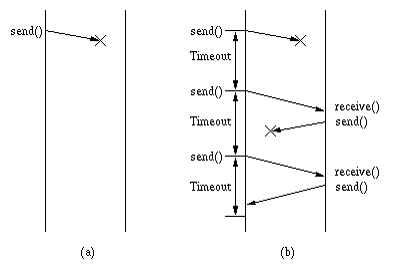

4)过程间通信的设计问题

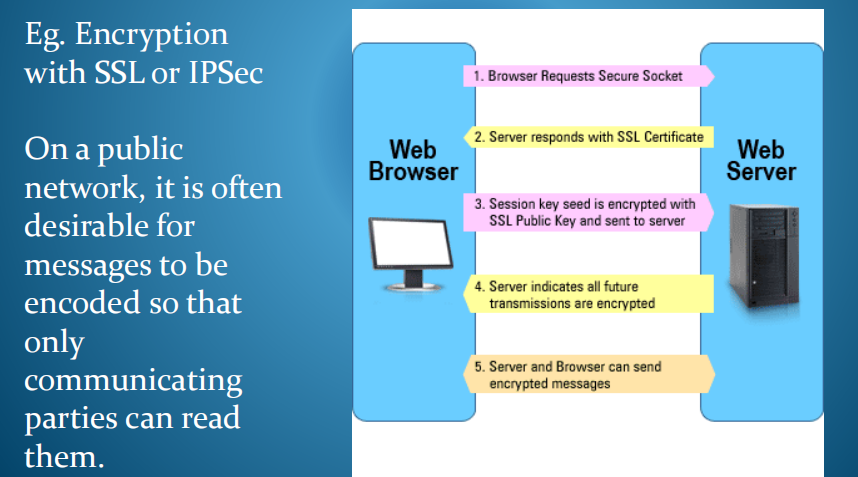

在公共网络上，通常需要对消息进行编码，以便只有通信方才能读取它们

