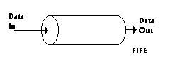
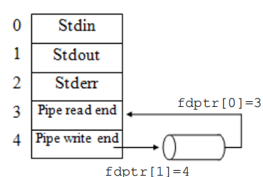
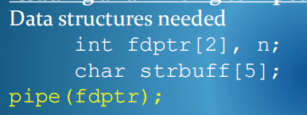
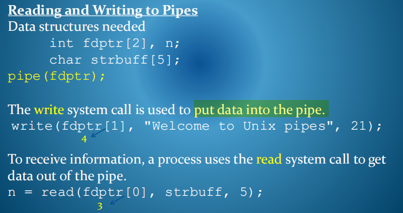
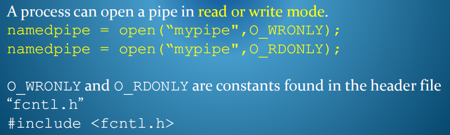
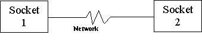
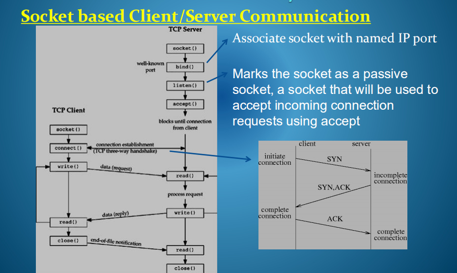

8-Unix进程间通信机制
2021年6月13日
9:15

介绍了管道，命名管道，network socket
| 管道（Pipe）：           | 管道可用于具有亲缘关系进程间的通信，允许一个进程和另一个与它有共同祖先的进程之间进行通信。                                                                                           |
|--------------------------|--------------------------------------------------------------------------------------------------------------------------------------------------------------------------------------|
| 命名管道（named pipe）： | 命名管道克服了管道没有名字的限制，因此，除具有管道所具有的功能外，它还允许无亲缘关系进程间的通信。命名管道在文件系统中有对应的文件名。命名管道通过命令mkfifo或系统调用mkfifo来创建。 |
| 套接口（Socket）：       | 更为一般的进程间通信机制，可用于不同机器之间的进程间通信。起初是由Unix系统的BSD分支开发出来的，但现在一般可以移植到其它类Unix系统上：Linux和System V的变种都支持套接字。             |

## 
## 一、Unix进程间通信机制
1,管道
通过创建层次结构相关并在同一台机器上运行的进程可以使用一种称为**管道的快速基于内核的流通信机制**。
管道是由内核维护的字节流通信通道的FIFO字节内存缓冲区。

一个进程将数据写入管道的一端，通常另一个进程从另一端读取数据。在可访问该管道的进程的生命周期内存在一个管道。

管道只能在**相关进程之间**使用，通常用作从父级到子级的单向通信信道，反之亦然。
父节点将在创建子管道之前创建该管道，以便子节点可以继承对该管道的访问权限

2，Creating a pipe from a C program
管道系统调用的语法如下：
**pipe(fdptr);**

fdptr是一个指向由两个整数组成的数组的指针
在C中声明为 int fdptr\[2\];
在系统调用管道后，此数组将包含两个文件标识符，用来标识新管道的两端。
<table>
<colgroup>
<col style="width: 100%" />
</colgroup>
<thead>
<tr class="header">
<th>
<strong>fdptr[0]</strong> is the <strong>read</strong> descriptor for the pipe and

<strong>fdptr[1]</strong> is the <strong>write</strong> descriptor.
</th>
</tr>
</thead>
<tbody>
</tbody>
</table>

流程输入/输出设备的详细信息存储在流程描述符表中。

3，在管道中读写

如果管道为**空**，则读取函数会**阻塞调用进程**，直到可以从管道中读取数据。
如果管道**不是空的**，但进程尝试读取超过管道中的数据，则读取成功返回管道中的所有数据和实际读取的字节数

## 二、Named Pipes
1，Named pipe该机制的一个变体称为命名管道，可用于可访问相同文件名空间的不相关进程之间的通信。

一个命名的管道由内核实现为一个特殊的FIFO文件，而不是一个内存缓冲区，因此可以通过文件系统的共享名称空间被独立的进程访问。

命名管道可以通过公用文件系统跨计算机进行共享。
Named pipes can be shared across machines with a common file system.

2,创建
在当前目录中创建一个名为“mypipe”的命名管道文件
| mknod(“mypipe", 010777, 0); |
|-----------------------------|

该文件类型是由代码010指定的fifo特殊文件
对管道的访问权限允许对值为777的所有者、组和word进行读取、写入和执行权限
mknod的最后一个参数与fifo管道无关

3,以与常规文件相同的方式打开命名管道，因此不相关的进程可以通过打开管道并读取或写入管道来进行通信。

4,Semantics
如果没有打开管道读取的进程，则打开管道读取的进程将阻塞。
类似地，如果没有打开管道进行读取，打开写入管道的进程将阻塞。

## 5，Network Sockets
套接字是独立进程之间更常见的通用通信手段，可以在内核数据结构或文件都不能共享时使用，例如通过互联网进行通信

一个通信信道可以看作是一对通信端点。

套接字是由应用程序创建的用来表示通信信道的数据结构。该套接字必须绑定或关联到通信系统中的某个实体（服务接入点或端口）。通过使用套接字接口的通信原语，进程然后将这些数据从其地址空间交换到处理传递的通信子系统的地址空间

通信服务(例如TCP/IP)提供了建立**属于不同进程的套接字之间的连接**，这些套接字通常在不同的机器和网络上，以及通过网络将消息传输和路由到目的地。在互联网上，IP地址和端口号被用作标识程序的插接字可能连接到的连接的端点的一种手段。

理解相同消息传递协议的通信子系统必须在消息传输网络的每个点上运行。在互联网上下文中，该子系统实现了一种被称为TCP/IP的通信协议

在创建传输控制协议(TCP)时，可以指定通过套接字传输邮件的不同级别的可靠性。

更快的交付可以用来换取更低的可靠性。数据报vs面向连接

**套接字可以通过底层通信协议“连接”到任何命名的远程套接字。连接后，发送到本地套接字的字节将传递到远程套接字。远程进程“侦听”其套接字，并接收发送到字节流中的数据**

