9-进程间通信机制
2021年6月13日
9:58

过程间的通信机制

## 一、Socket Communication
使用底层传输协议，如TCP，在网络上的**两个端点之间创建连接的套接字机制**

**成对的套接字在客户端和服务器之间形成一个双向流式通信通道**。

当客户端与服务器通信时，它通常需要在服务器上执行函数或检索某种数据。

使用套接字字节流通信对于创建自己的协议非常灵活，但它使程序员承担了编写识别和调用函数、交换和解析参数和结果所需的所有代码作为一系列字节串行消息交换的负担。

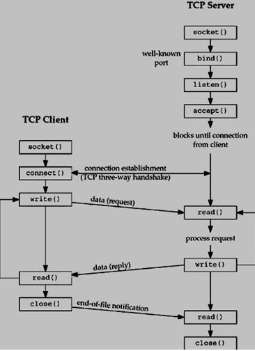

## 二、Remote Procedure Call
1,**RPC**是一种更方便的通信抽象，它构建在底层端点连接机制之上，比如TCP/IP上的套接字，旨在使<u>客户端服务器编程更容易。它允许您以与本地函数类似的方式调用远程函数。</u>

在像C这样的程序性语言中，这种机制被称为RPC，在像JavaVM这样的面向对象环境中，我们在远程对象上调用方法，它被称为RMI。（远程方法调用）
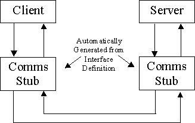

**RPC服务将定义一个接口，使该接口自动生成通信存根。stubs**
RPC机制的实现隐藏在通信存根代码中。然后**将存根与客户端和服务器代码静态链接。**

2，How RPC works...
客户端进程调用所需的过程并向其提供参数。客户端RPC存根机制将参数打包到消息中，并将其发送到适当的服务器进程。接收存根对其进行解码、标识过程、提取参数并在本地调用该过程。然后将结果打包成一条消息，并以回复的形式返回，回复由存根作为过程返回传递给客户端。
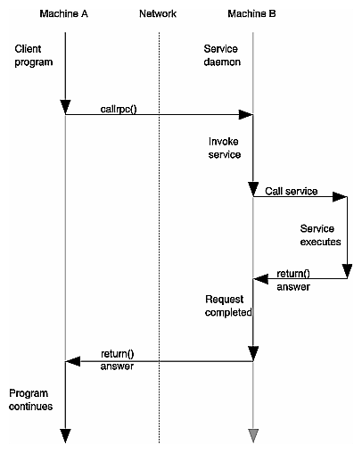

如何找到服务器的端口地址。。

尽管RPC存根机制理解如何与服务接口通信的规则，但它们可能不知道网络上特定服务的位置。该服务可以在使用任何通信端口的任何计算机上启动。
服务器的套接字首先与服务器注册的目录服务通信，然后建立可以进行RPC样式交换的连接。
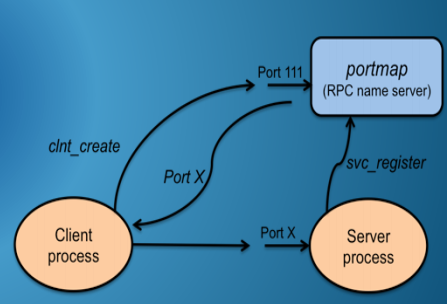

3，Resolving Address Space References
正在解析地址空间引用
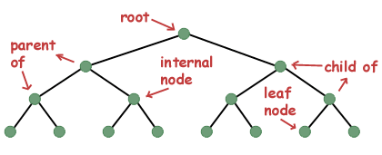

一些实现问题使得远程过程调用机制完全透明。
参数按值传递，如在远程地址空间中一样，无法正确计算指针引用。这使得很难传递基于内存指针的数据结构或对象引用。
## 
4，Data Format Translation
如果服务器在不同的机器架构上运行或者使用不同的编程语言编写，可能会导致另一个困难。RPC机制有必要找到一种令人愉快的外部数据表示格式来表示所交换的信息，**以便双方都能正确地解释它**。
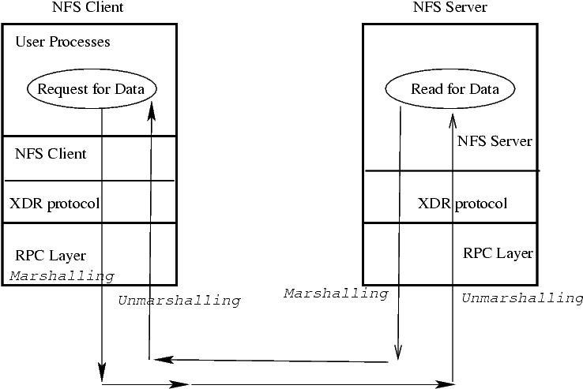

5，Failure Semantics

可能会应用不同的故障处理执行语义。
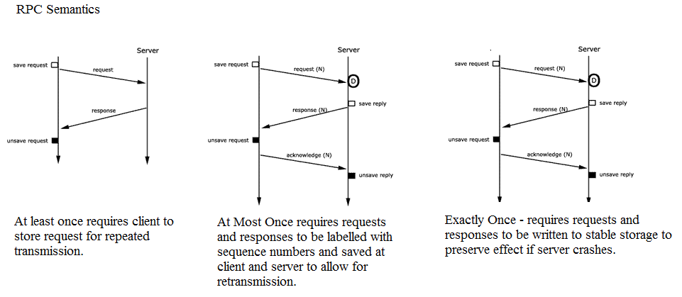

## 三，Message Queue Manager

1，消息队列允许进程以异步以整个消息的形式交换数据。不需要集合。
消息具有关联的优先级，并按优先级顺序排队。
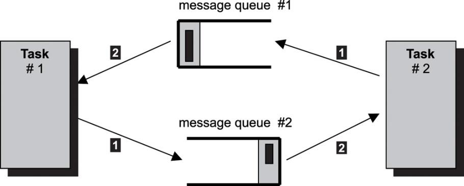

2，操作系统持久独立地维护消息队列，直到它被用户进程明确解除链接（销毁）或系统关闭为止。

通信进程必须具有对特定消息队列和消息队列API的访问权限。每个创建的消息队列都由的名称字符串标识
每个创建的消息队列由“/somename”的名称字符串标识
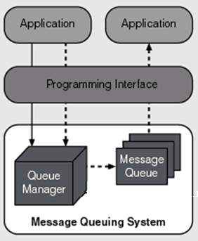

3，比较
| 管道                         | 消息队列                               |
|------------------------------|----------------------------------------|
| 没有内部结构，只有一个字节流 | 按用户设置的内部结构和几何图形         |
| 无法区分不同作者的内容       | 单独的消息是可区分的                   |
| 作者没有优先级               | 按消息优先级排序的队列                 |
| 无法确定管道内容的状态       | 进程可以确定队列的状态，最大消息的大小 |

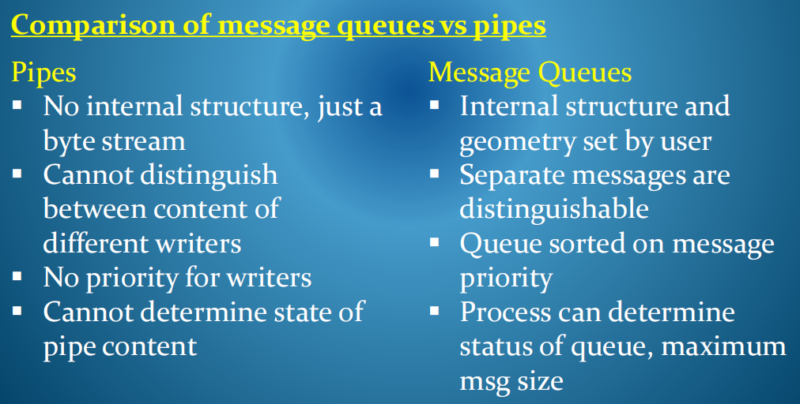

4，消息队列API中的主要函数如下：
The main functions in the message queue API are the following:
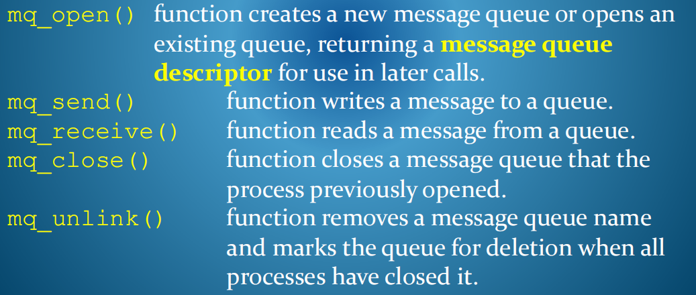
函数删除消息队列名称，并在所有进程关闭该队列时标记删除

5，内部结构-每个消息队列都有一组相关的属性，在创建时设置。

Internal Structure-每个消息队列都有一组相关的属性，这些属性在创建时设置。可以使用以下方法来查询属性：
**mq_getattr()**
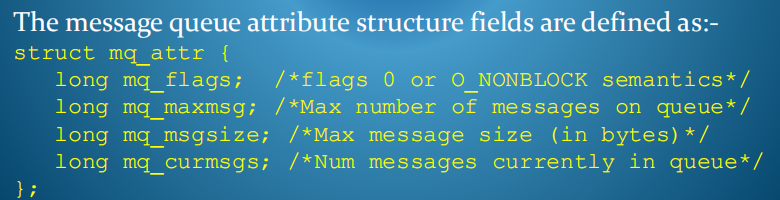
6，Kernel Data Structures and Message Queues
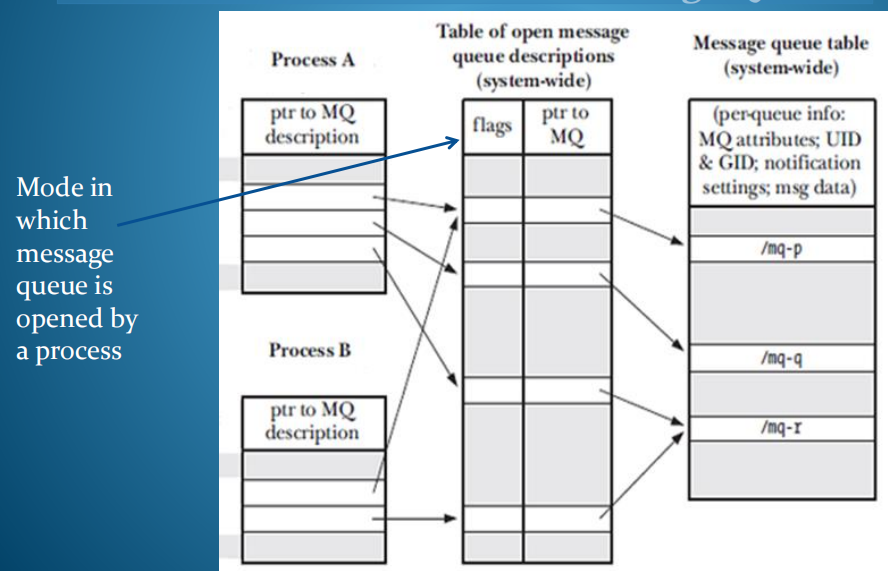

7，创建消息队列
strcpy把含有'\0'结束符的字符串复制到另一个地址空间，返回值的类型为char\*。
O_RDWR : 以读写的方式打开
？permission
对于自己，对于自己所在组，其他组

4+2=6 0 0
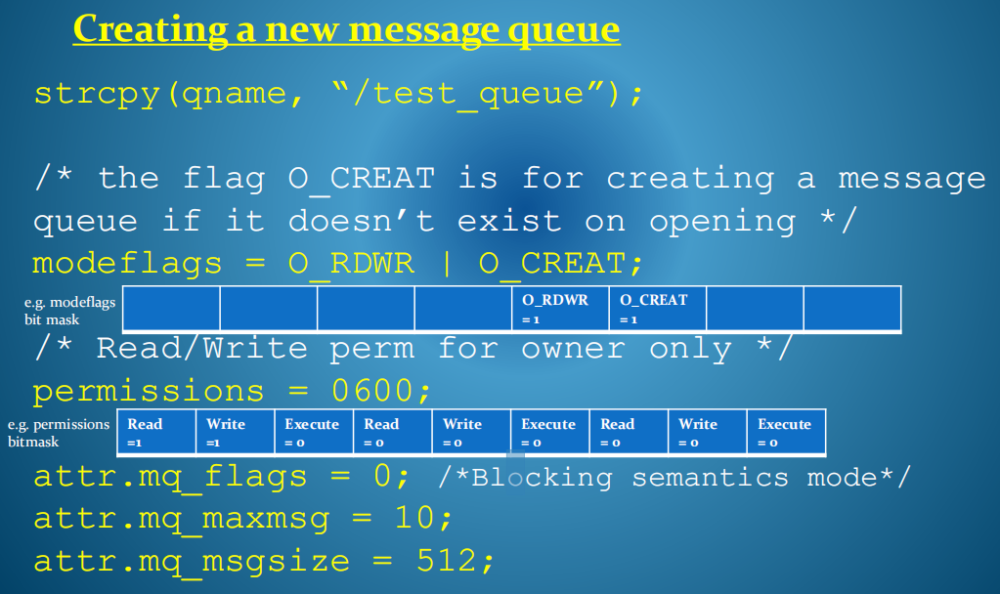

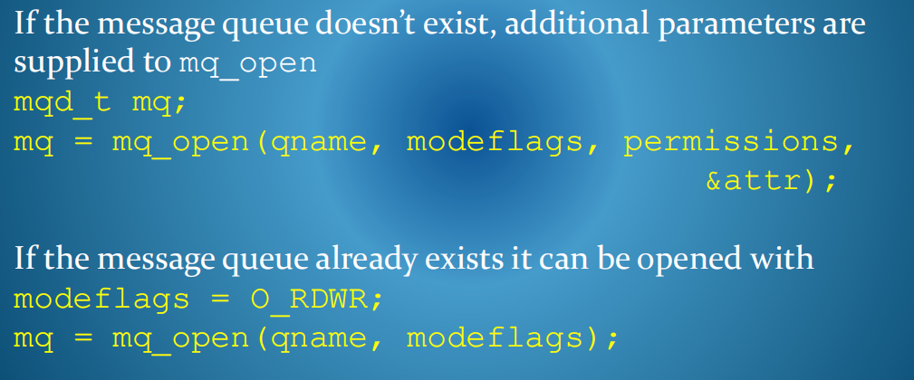

8，正在从已打开的消息队列中读取消息
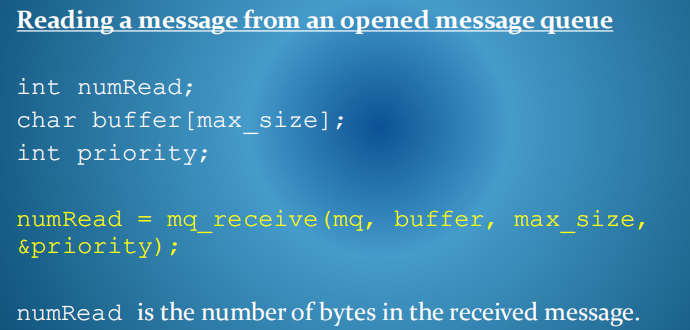

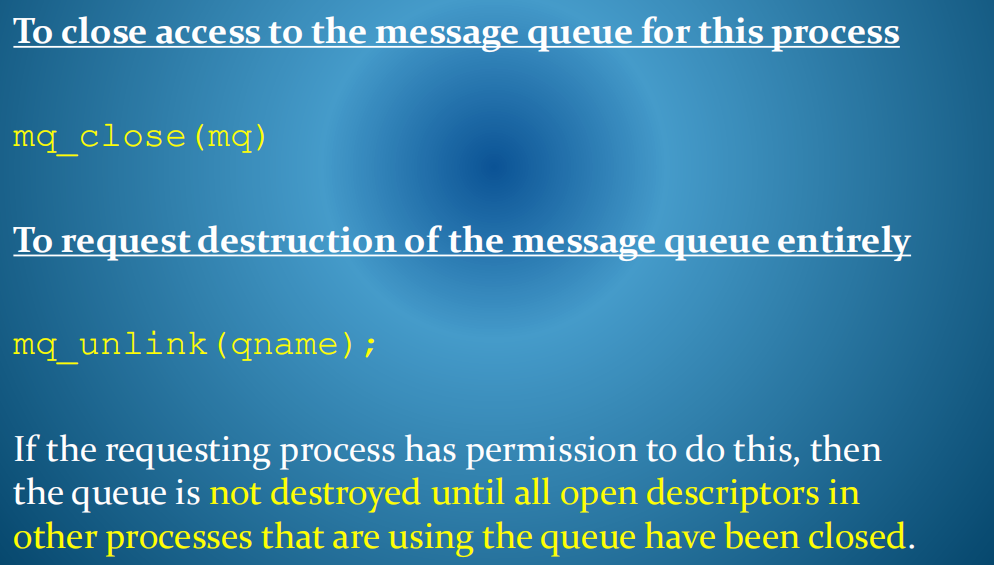
如果请求进程有这样做的权限，则在关闭使用该队列的其他进程中所有打开的描述符之前，才会销毁该队列。

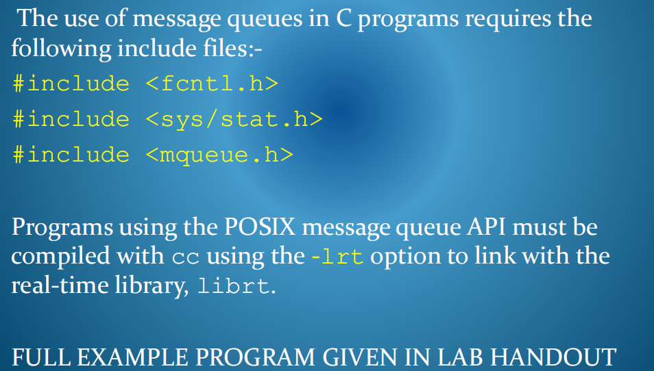

Summary of Unix Interprocess Communication Mechanisms

| Pipes                 | 基于快速内存，面向流，在相关进程之间               |
|-----------------------|----------------------------------------------------|
| Named Pipes           | 就像管道一样，但使用共享文件，可由不相关的进程使用 |
| Sockets               | 通常通过TCP/IP之间的低级互联网通信抽象             |
| Remote Procedure Call | 简化了客户端/服务器的编程设计                      |
| Message Queues        | 异步全消息通信                                     |

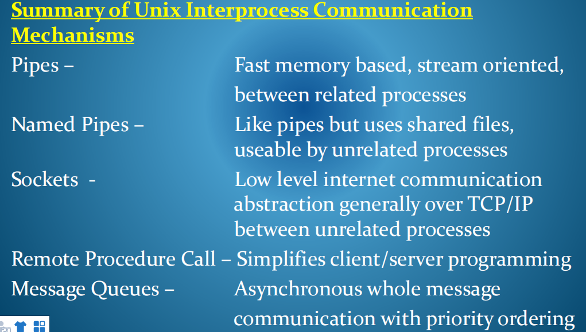

