Fundamentals (Chapter 0)
1\. Introduction.
2\. Evaluating a Polynomial.
3\. Binary Numbers (0, 1).
4\. Floating Point Representation.
5\. Loss of Significance.

1\. Introduction.
## 2. Evaluating a Polynomial.
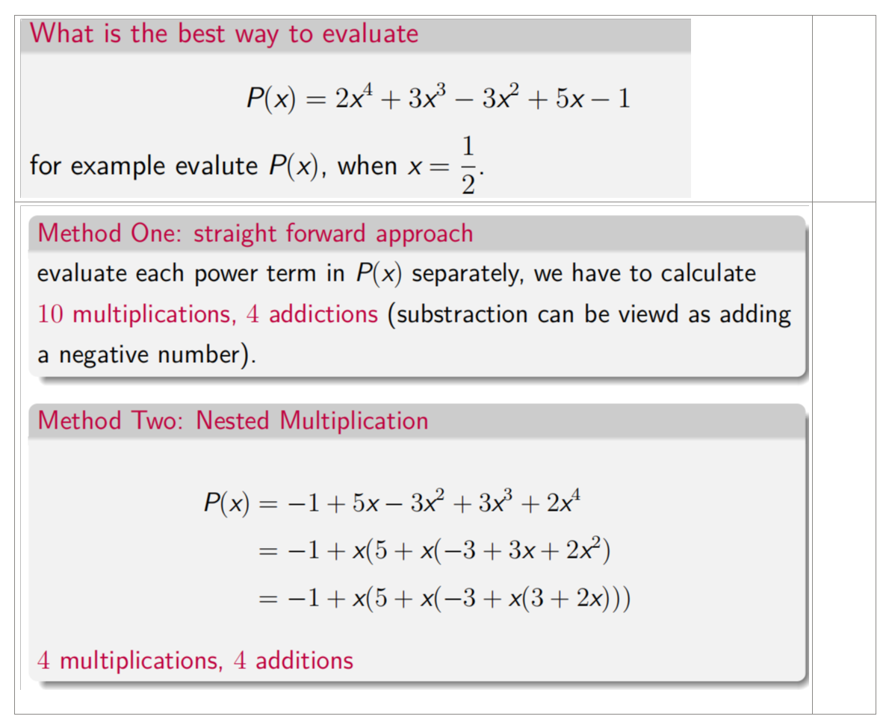
## 3. Binary Numbers (0, 1).
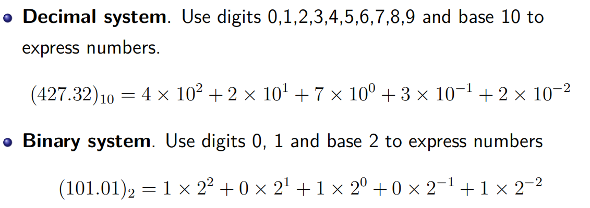

十进制转二进制
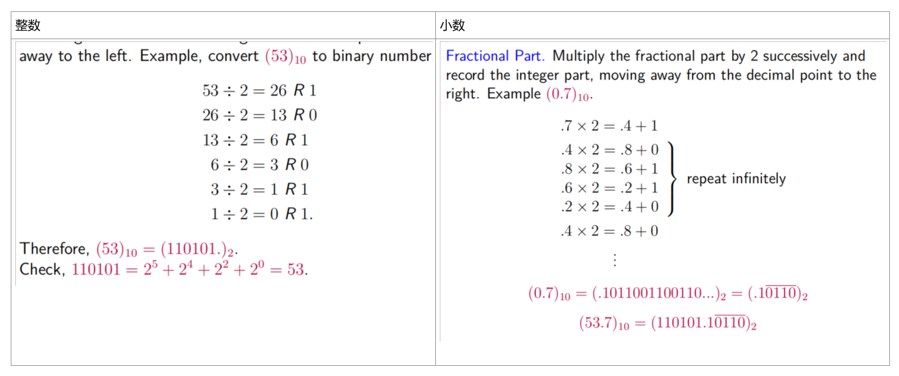
二进制转十进制
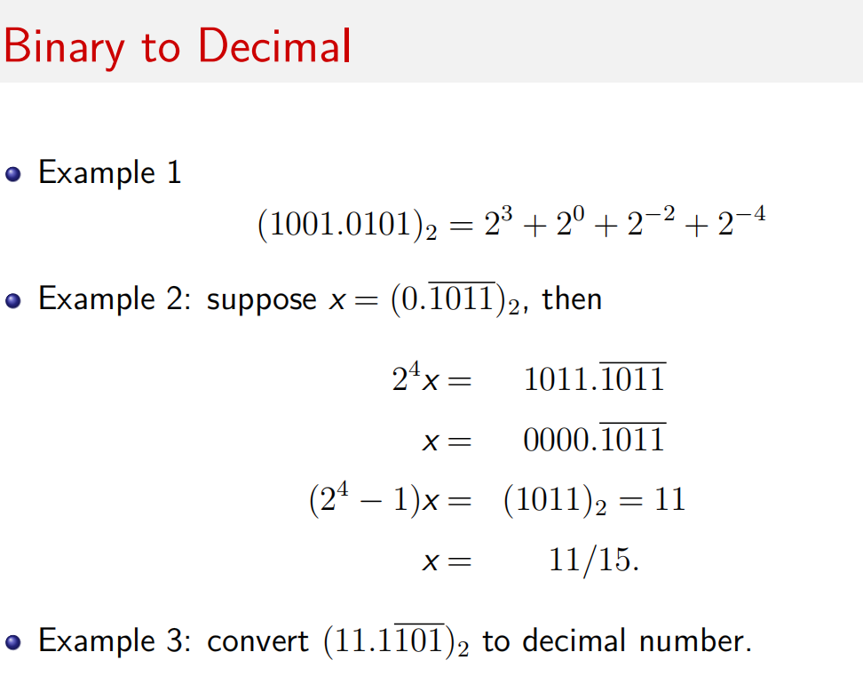

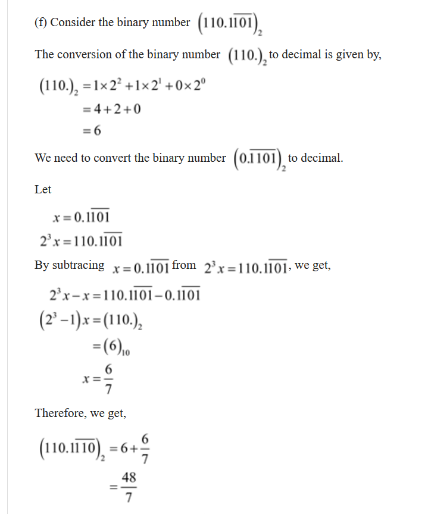

## 4. Floating Point Representation.
绝对误差和相对误差
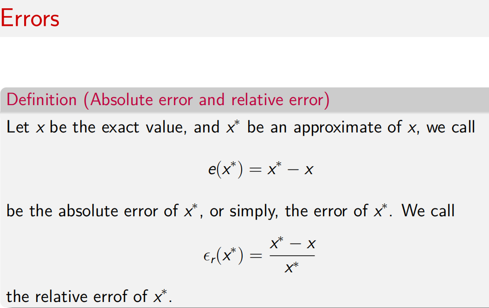

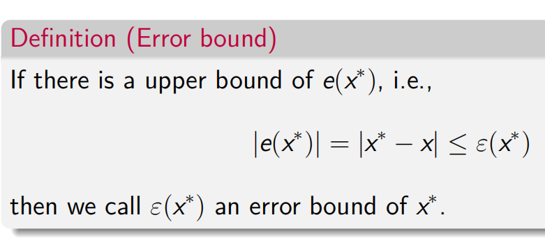

绝对条件数

有效数字
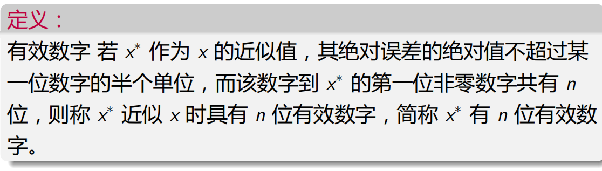

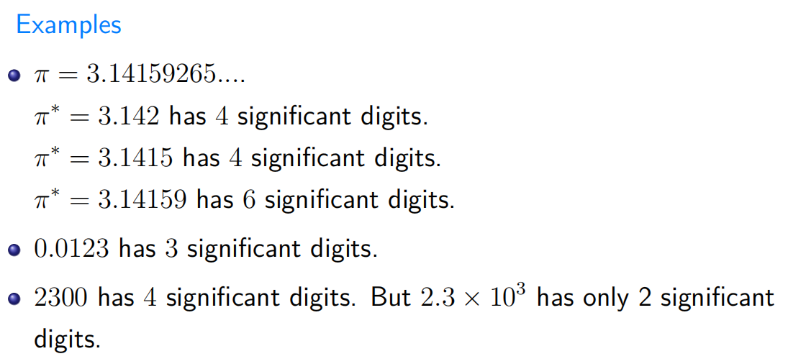

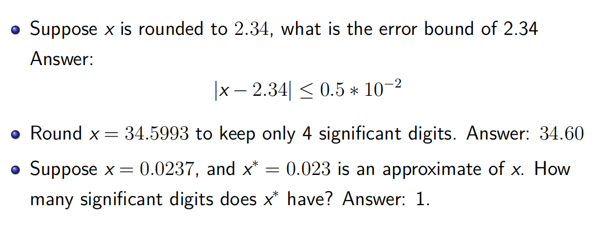

5\. Loss of Significance.

How to Avoid loss of significant number
避免大吃小吃
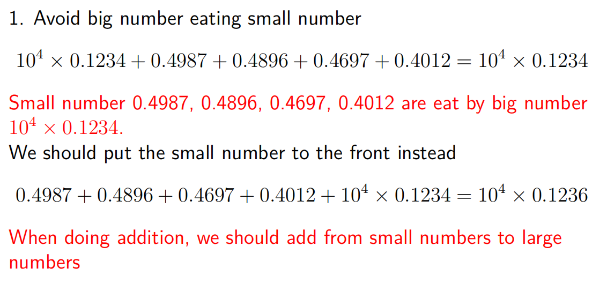
当做加法时，我们应该从小数加到大数
避免在两个接近的数字之间的相减
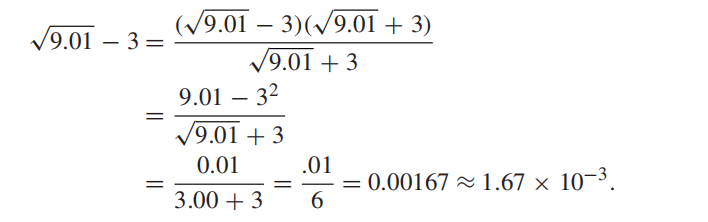

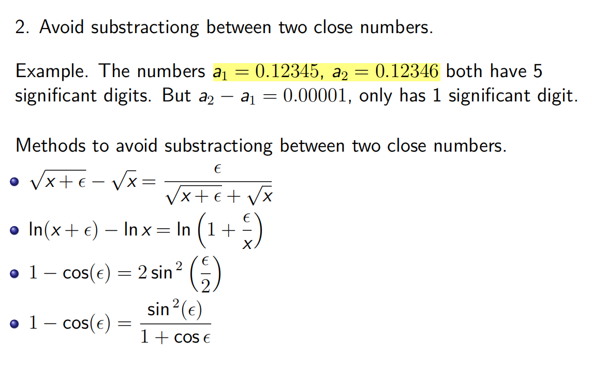

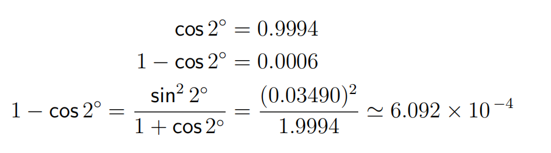

3.避免使用大乘数和小分母
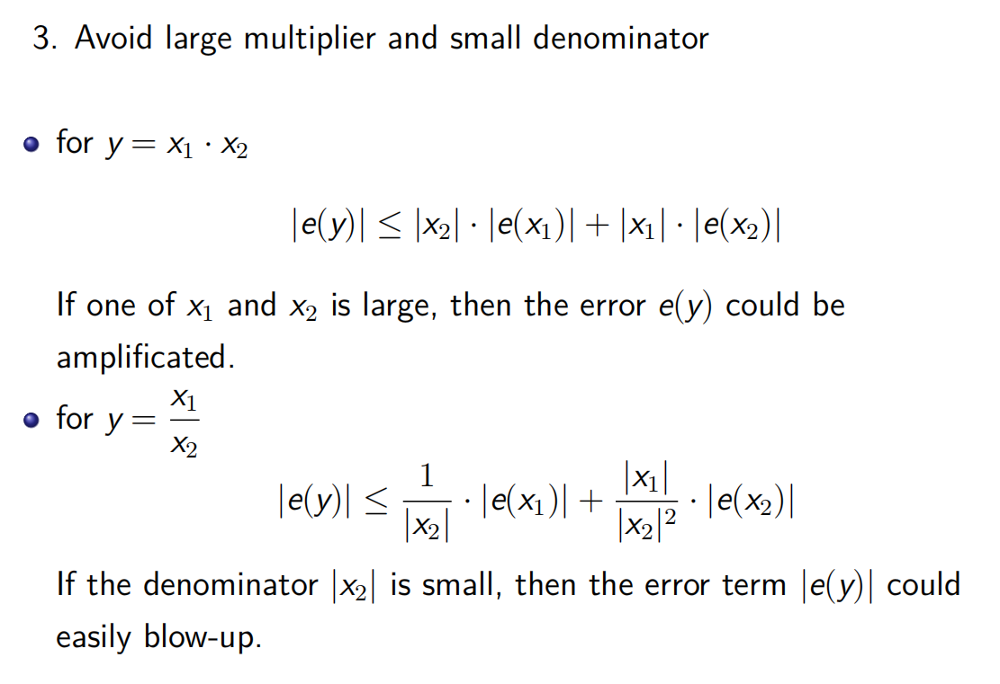

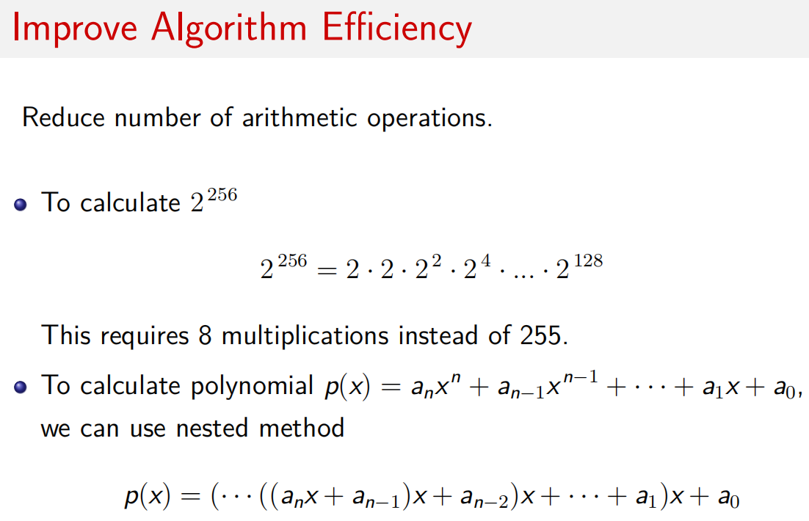

