## ▶ Bisection Method. 

▶ Corrected within *p* decimal places.
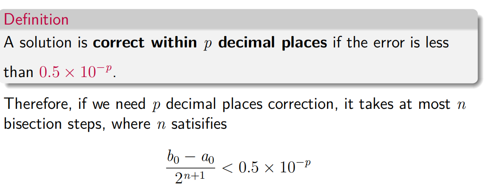

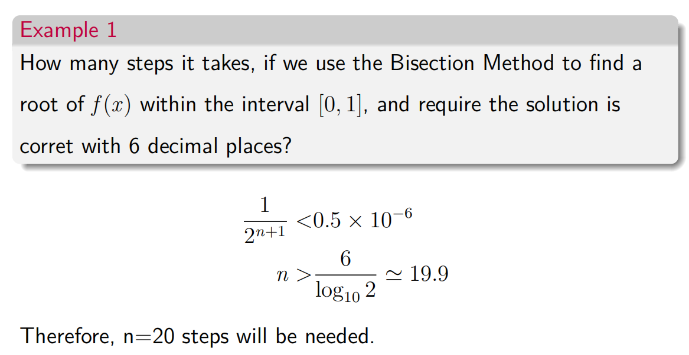

▶ Fixed-Point Iteration, contractive mapping, convergence analysis.

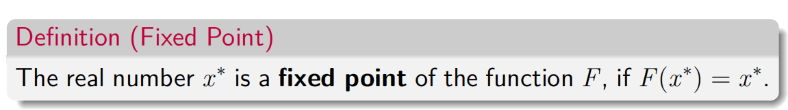

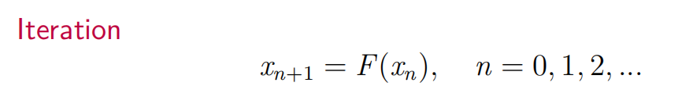
这可以产生收敛的或发散的序列！

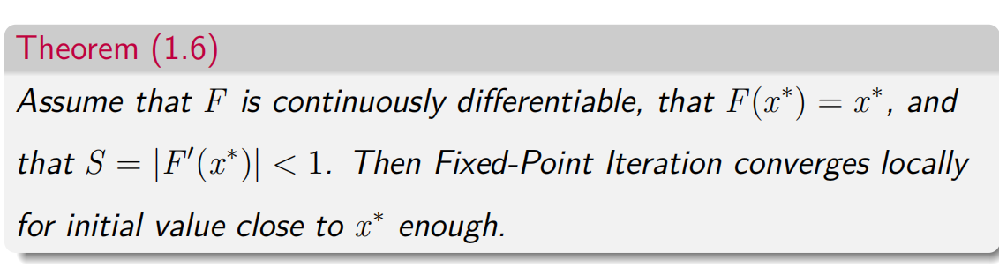

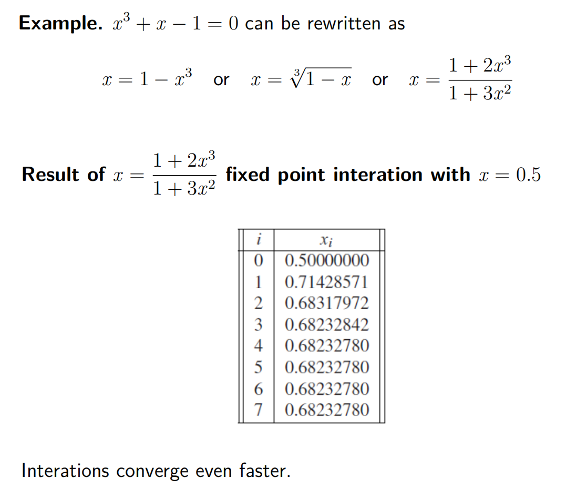
*局部收敛性：*
*S* = *\|F ′* (*x ∗* )*\| \<* 1 收敛converge

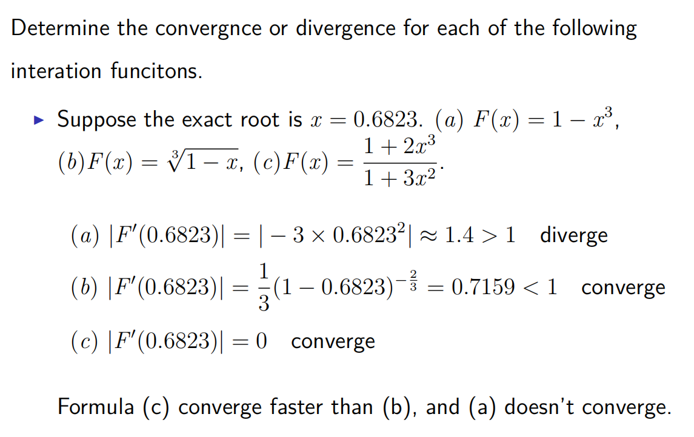

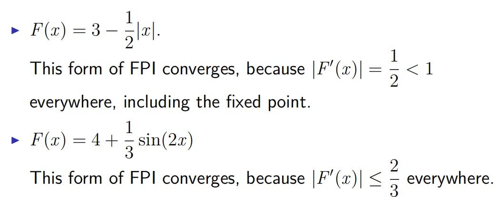

Error Analysis

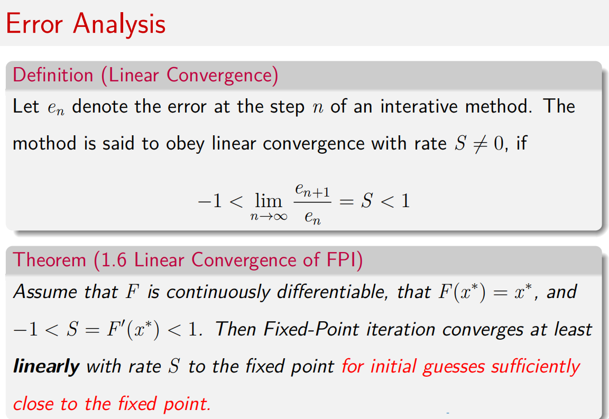

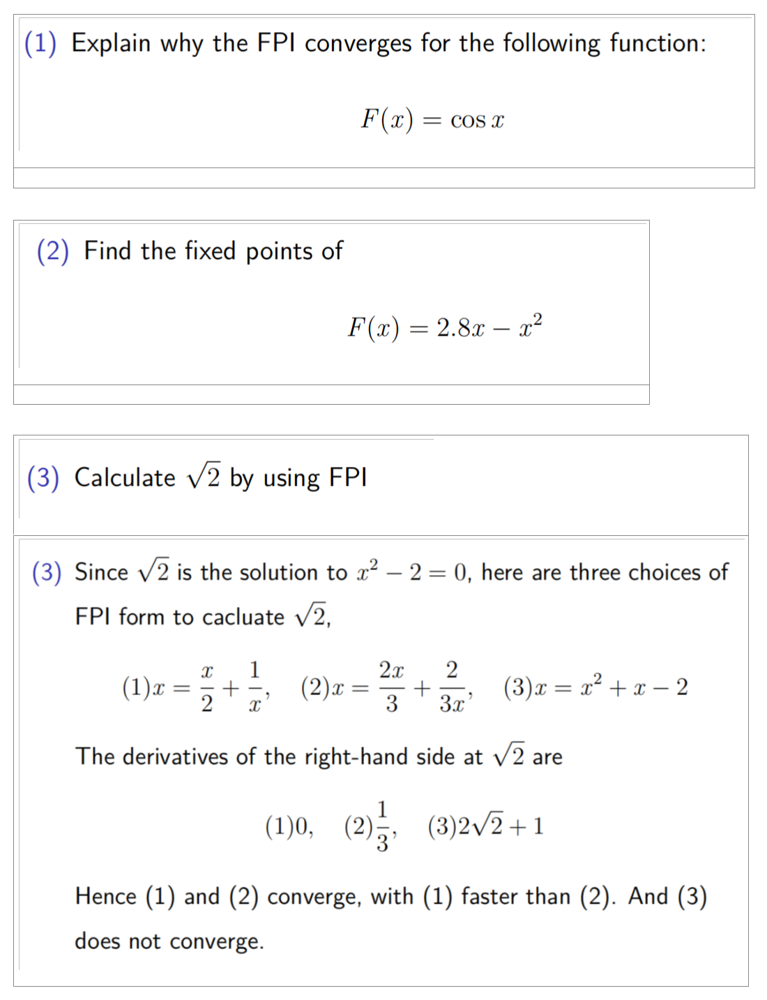
▶ Newton’s Method, modified newton’s method.
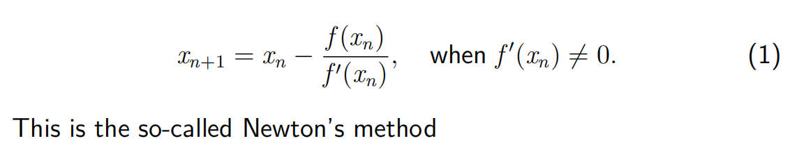

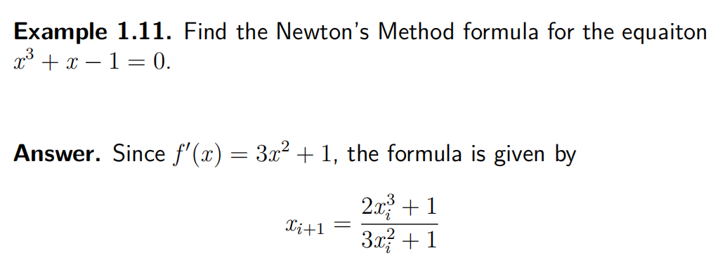

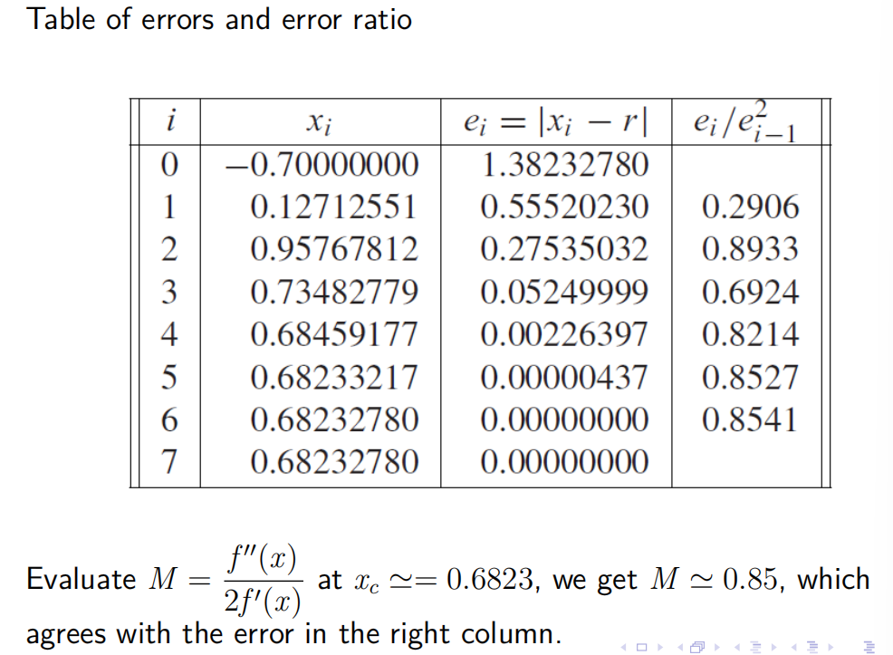

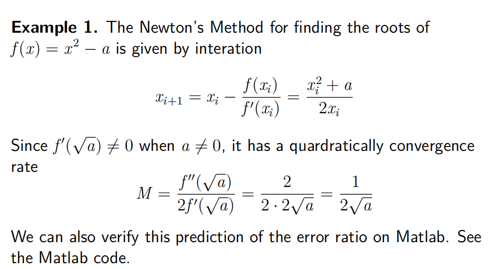

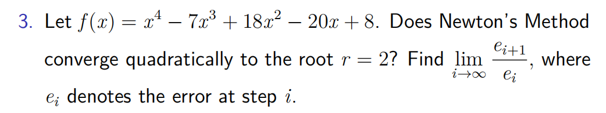

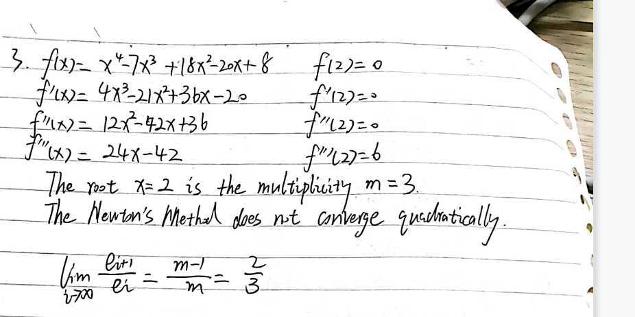

