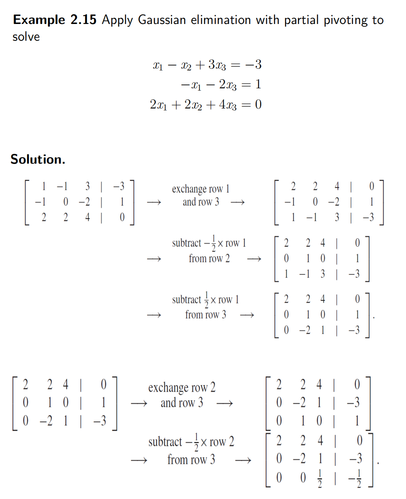

目的：求解线性方程组

1、高斯消元 Gaussian Elimination【变化对象：(A：b)】
思路：把线性方程A通过行变换，变成上三角矩阵，根据上三角矩阵列出方程求解
例题：

2、LU Factorization【变化对象：(A)】
（1）找A矩阵的LU分解

例题：找A矩阵的LU分解

例题：找A矩阵的LU分解

（2）通过LU factorization解决线性方程组
步骤：

例题

（4）何时可以使用LU分解
**==能用lu的时候主对角元素不能为0==**

3、Source of Errors（不想看）

4、Partial Pivoting 部分主元消元\[【变化对象：(A:b)】
思路：每次通过**行变换把**该区域的列的**绝对值最大**的行放在左上角，消除下面的元素，然后依次对下面区域进行重复操作

例题

5、PA=LU Factorization【变化对象：(A)】部分旋转高斯消去
（1）Permutation Matrices排列矩阵
【理解为单位矩阵，每次进行行变化时，排列矩阵也变换】
（2）PA=LU Factorization求解线性方程组
PA=LU分解是部分旋转高斯消去的矩阵公式，其中P代表置换矩阵，L和U代表下三角矩阵和上三角矩阵

例题

5、 Iterative Methods
▶ Jacobi Method
雅可比方法是一个方程组的不动点迭代的一种形式。为了求解Ax = b，我们写了A = D + L + U，
其中D是A的对角矩阵，L是A的下三角部分，U是A的上三角部分。

例题

▶ Gauss-Seidel Method

例题

### 2.5.3 Convergence of iterative methods, 
**The Jacobi Method**
### 
### the Gauss–Seidel Method

Coverage
1，检查主对角线是否严格占优
如果不是，用2
2，

