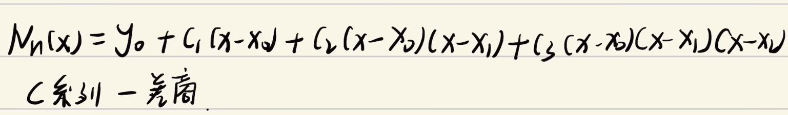

## 一、Lagrange form
### 1、拉格朗日插值多项式

例题

拟合两个点和拟合三个点的区别

### 2、Iterpolation error:
假设P (x)是拟合n点（x1、y1）、...，（xn、yn）的（n−1或更小）插值多项式。内插值误差为

## 二、Newton’s divided difference
### 1、牛顿

### 2、Interpolation Error

## 3.2 INTERPOLATION ERROR
3.2.1 Interpolation error formula

3.2.2 Proof of Newton form and error formula

