## 1、Normal Equation
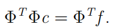

## 2、Fitting data by least squares
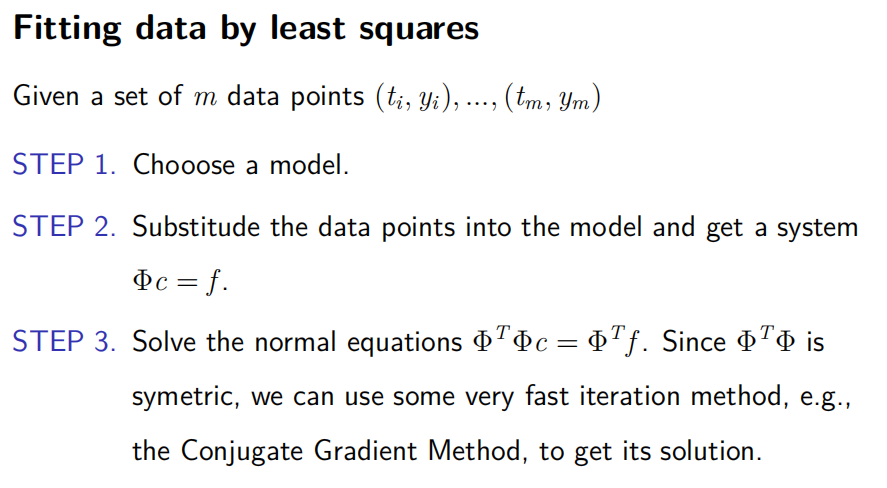
2.1 General linear least square.
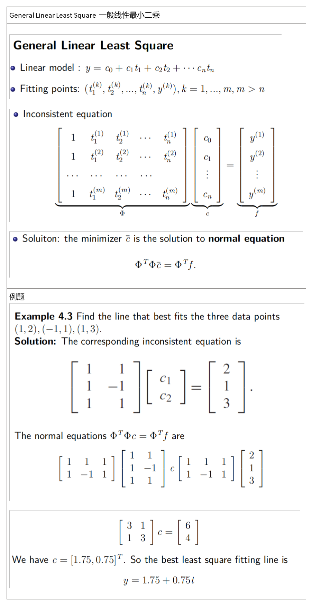
2.2 Least square fit polynomial
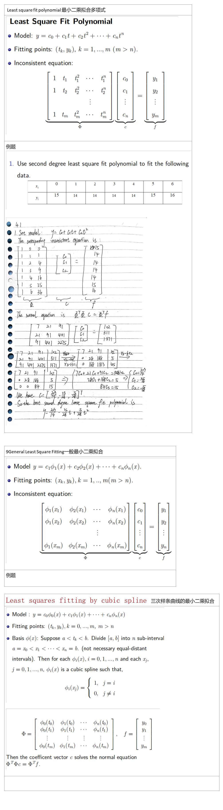
## 3、Data linearization. 
3.1 Exponential mdoel

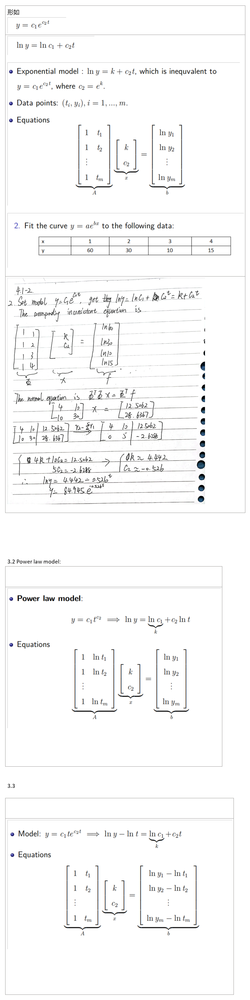
## 4、Gram-Schmidt orthogonization. 格莱姆-施密特正交化
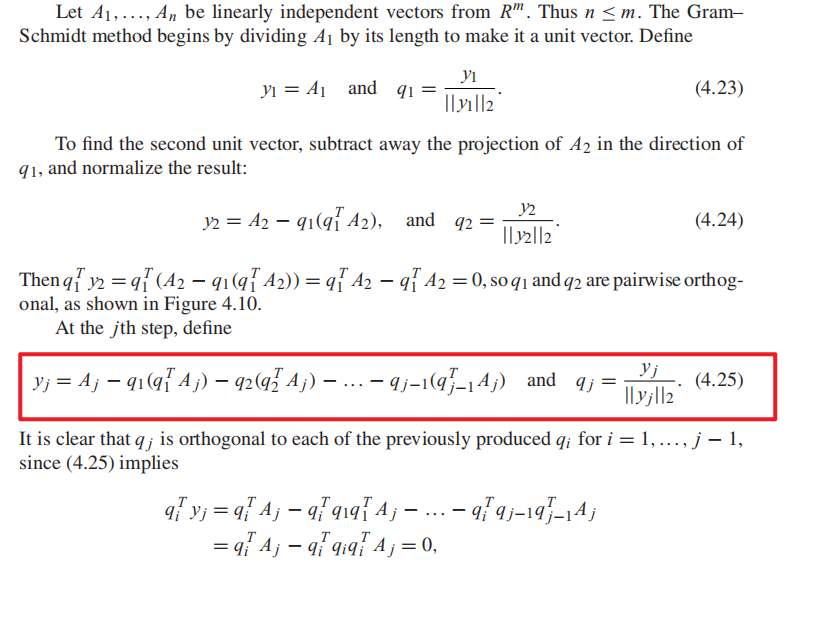

5、QR factorization.
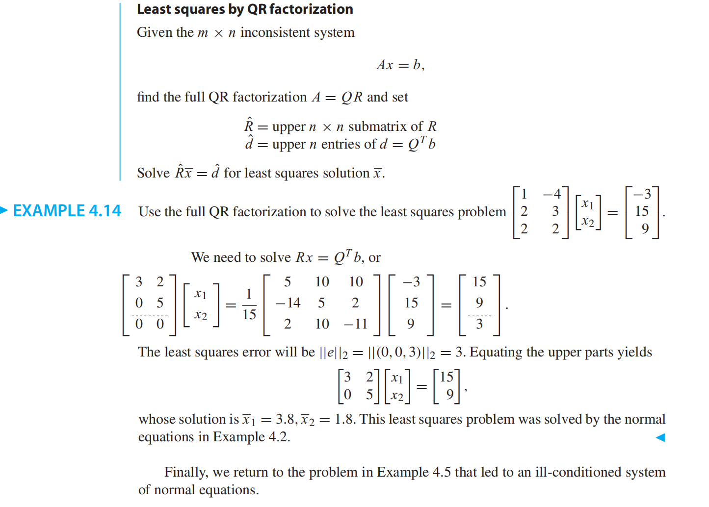
1.  **QR factorization by applying Gram-Schmidt orthogonalization**
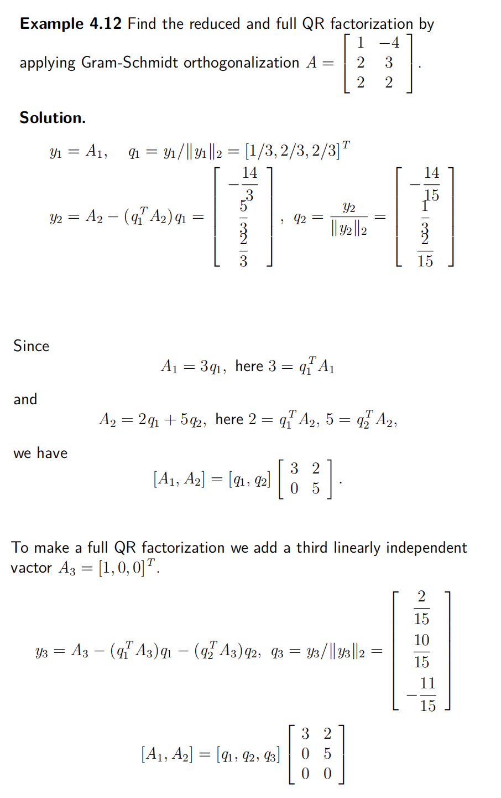

2\) Apply Householder reflectors to find the full QR factorization
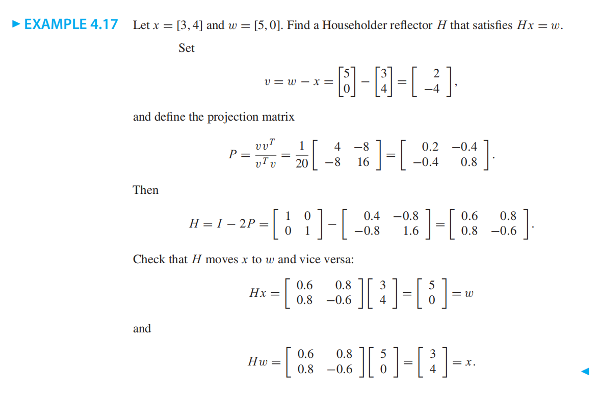

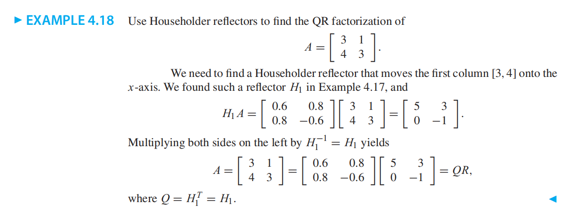

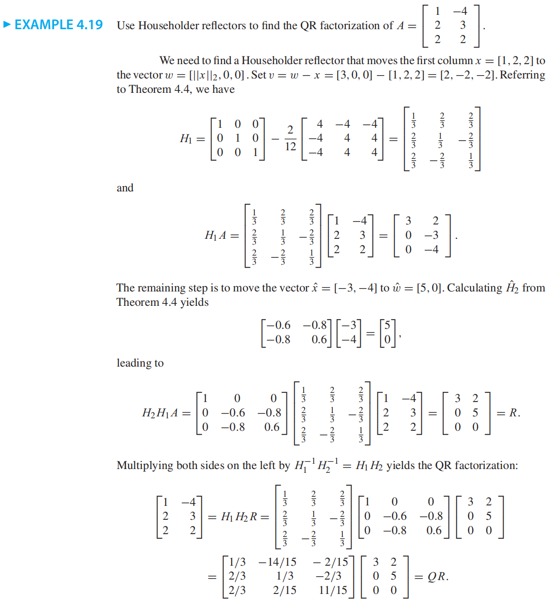

3)Use the QR factorization from Exercise 2, 4, or 6 to solve the least squares problem
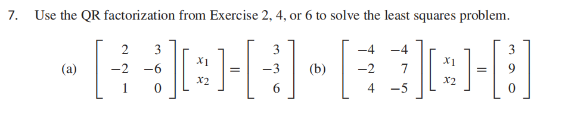

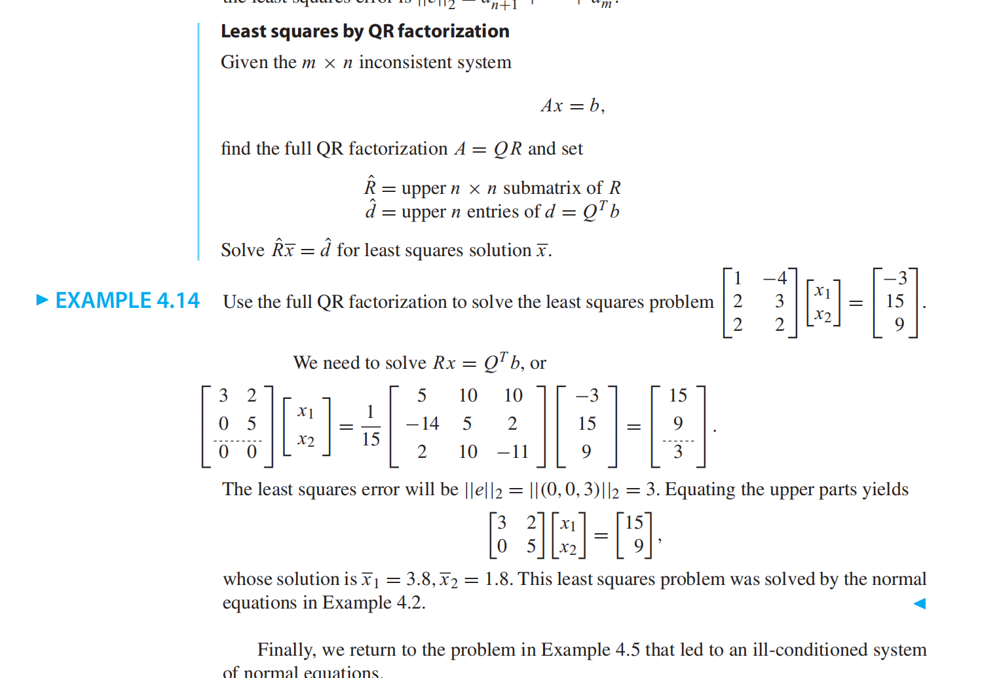

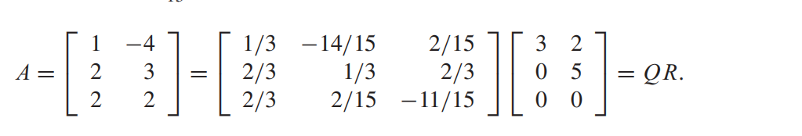

7、Nonlinear Least Squares
