## 4.1 LEAST SQUARES AND THE NORMAL EQUATIONS

### 4.1.1 Inconsistent systems of equations
概念1
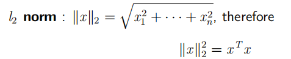

概念2
没有解的方程组称为inconsistent。

概念3
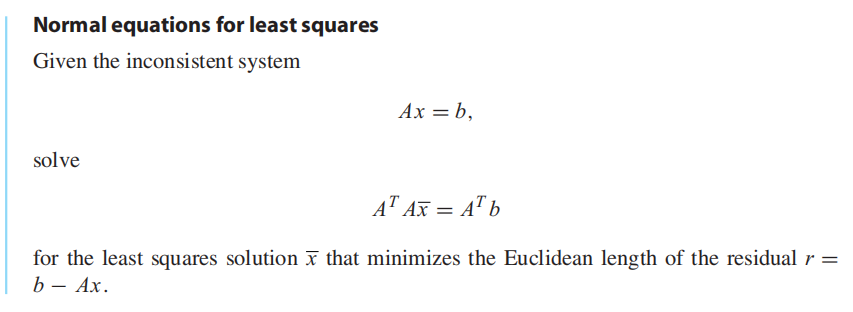

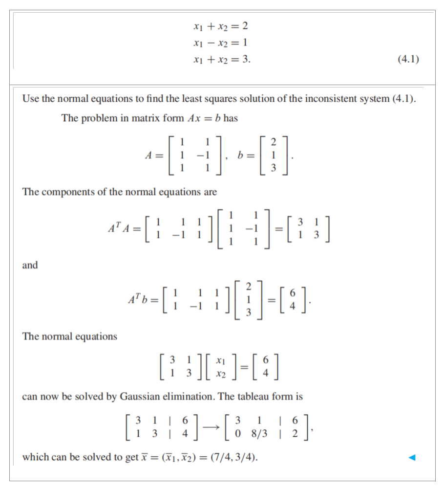

### 
### 
### 
### 4.2.2 Data linearization
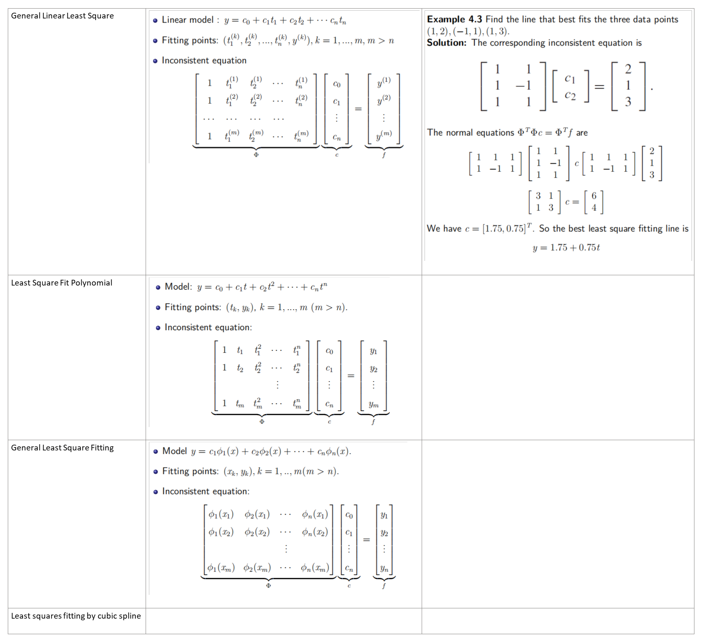

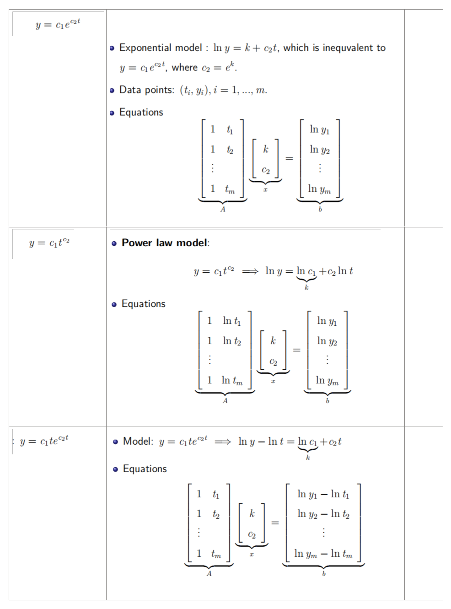

## 4.3 QR FACTORIZATION
### 4.3.1 Gram–Schmidt orthogonalization and least squares
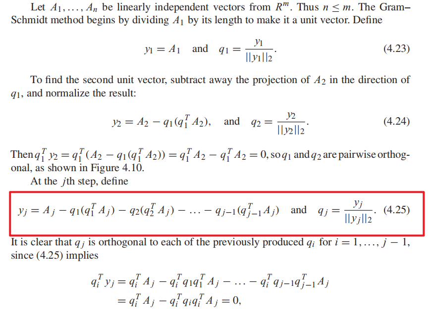

full QR factorization：补成方阵
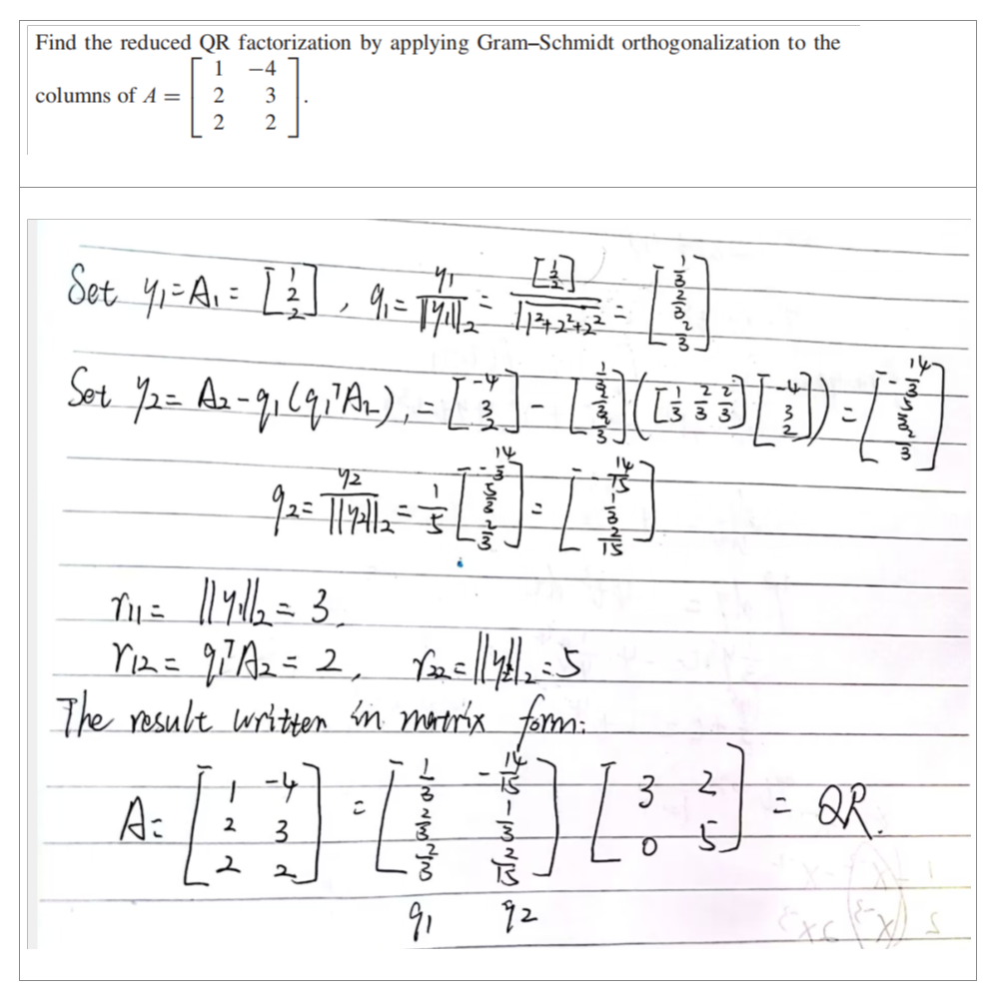

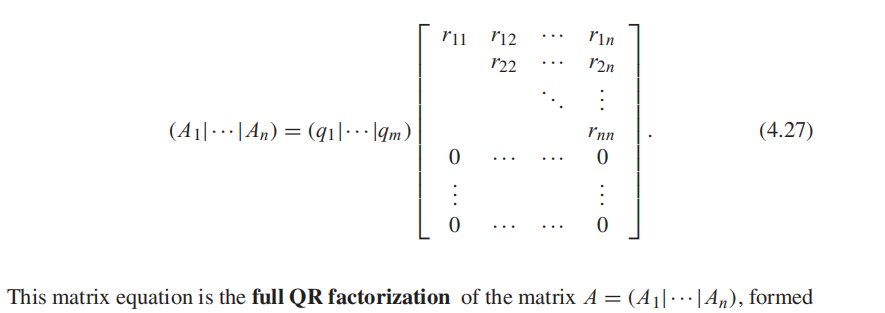

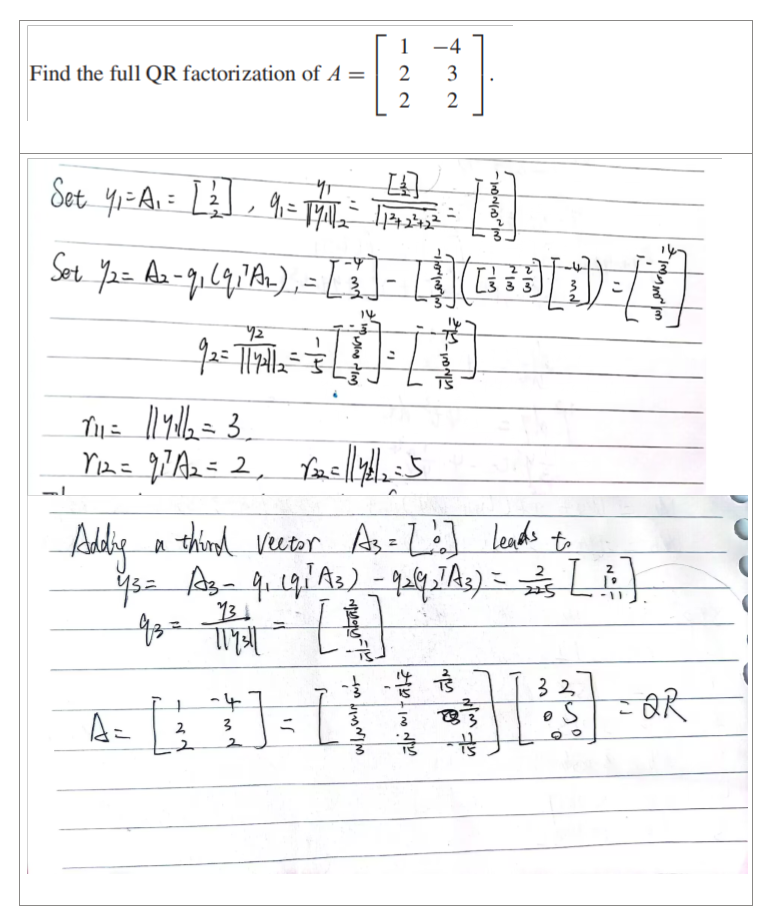

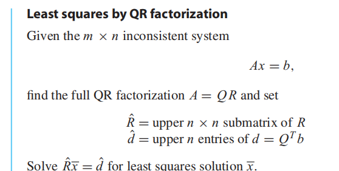

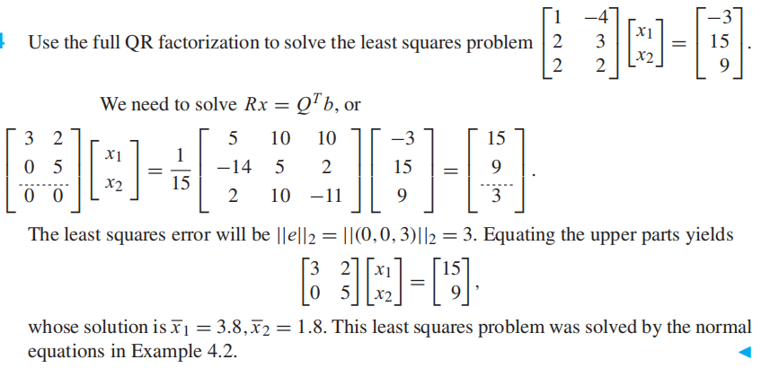

### 4.3.3 Householder reflectors

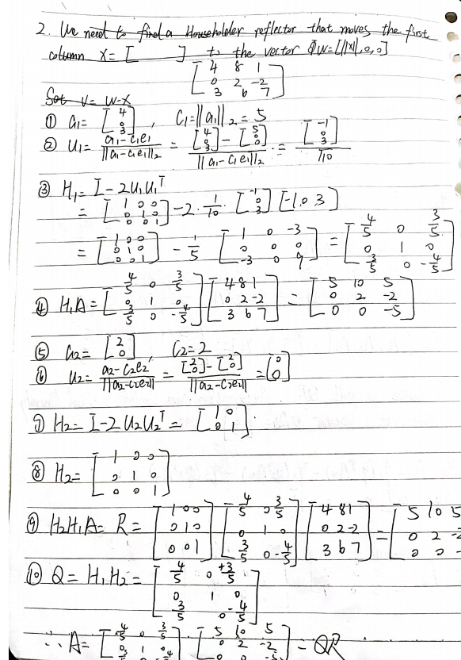

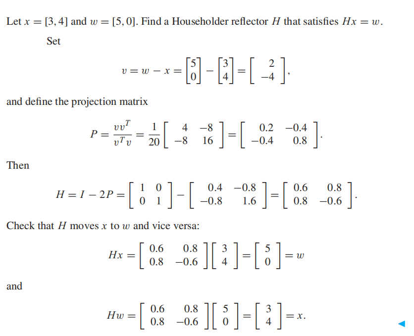

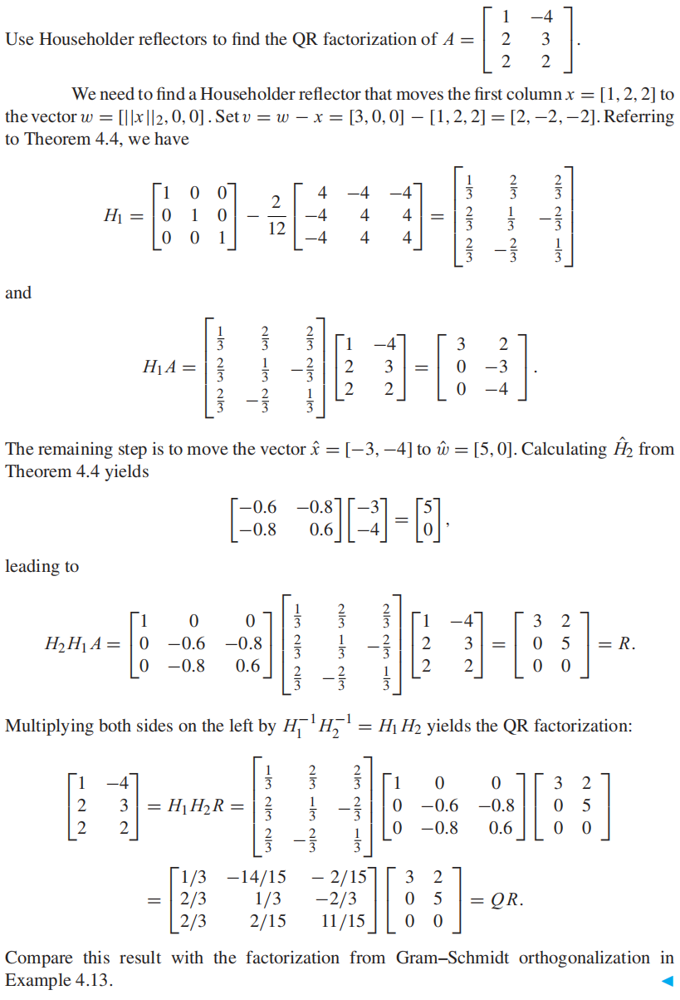
## 
## 
## 
## 
## 
## 4.5 NONLINEAR LEAST SQUARES 
### 

