## 5.1 NUMERICAL DIFFERENTIATION

### 5.1.1 Finite difference formulas有限差分公式
**1.两点正差公式**
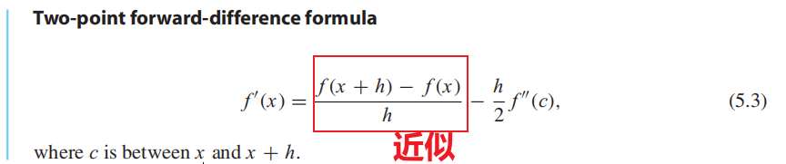
由泰勒展开式推导而来
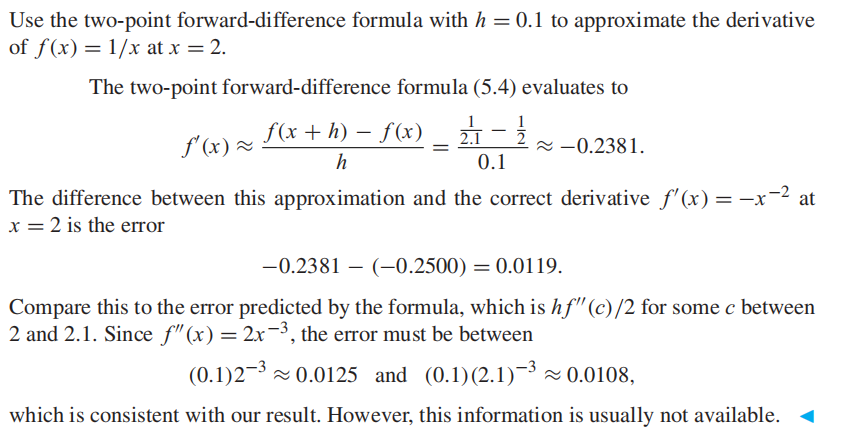

**2.三点正差公式**
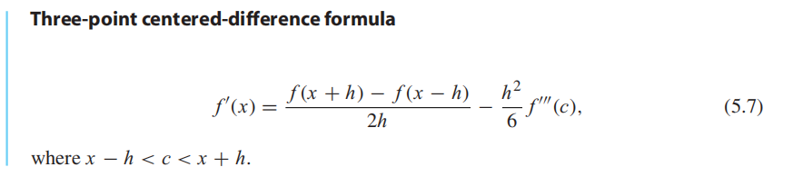

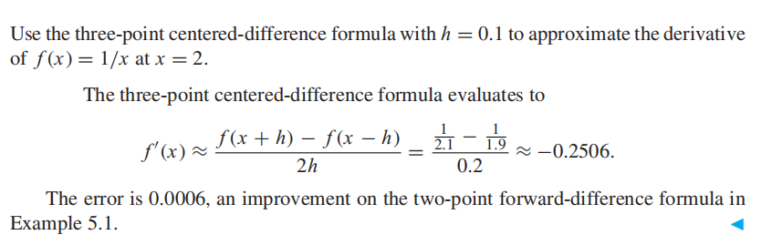

**3.二阶导数的三点中心差**

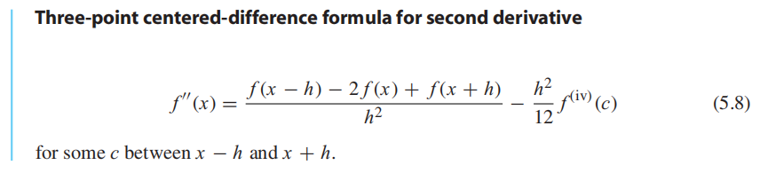

### 5.1.2 Rounding error（不用看）
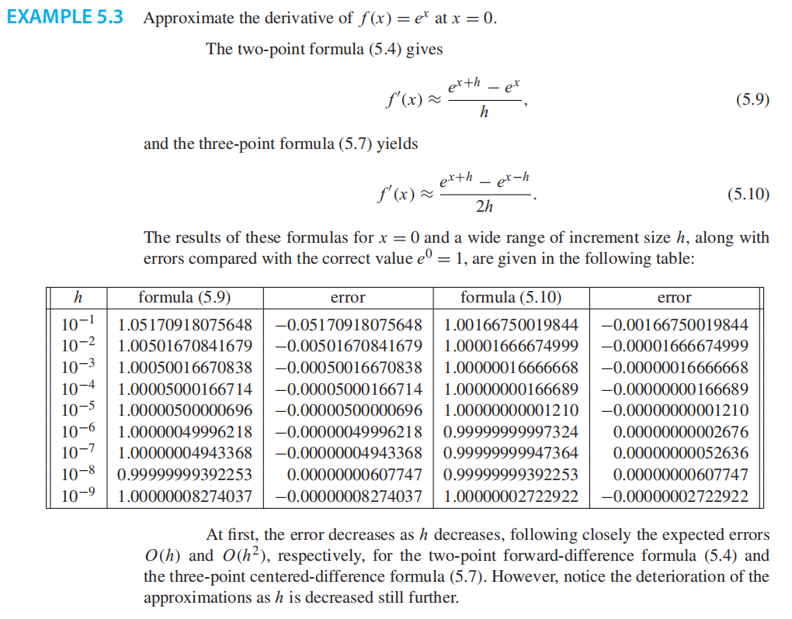

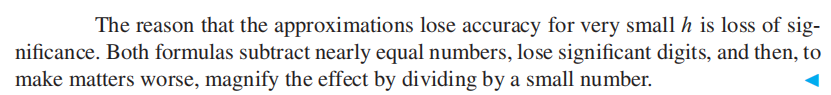

### 
### 5.1.3 Extrapolation（ Richardson extrapolation）
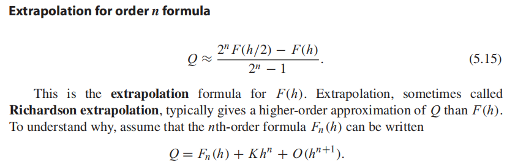

例题
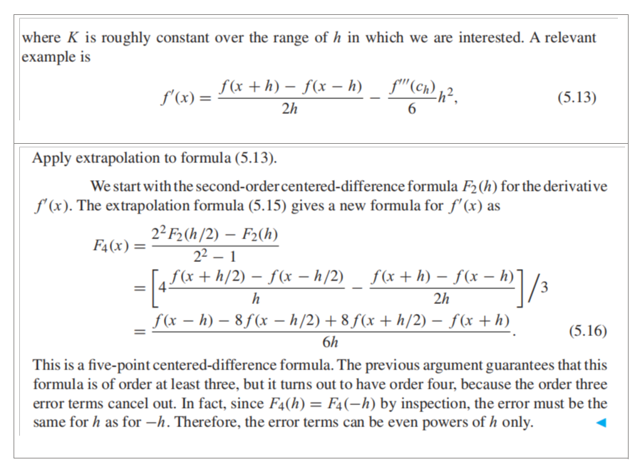

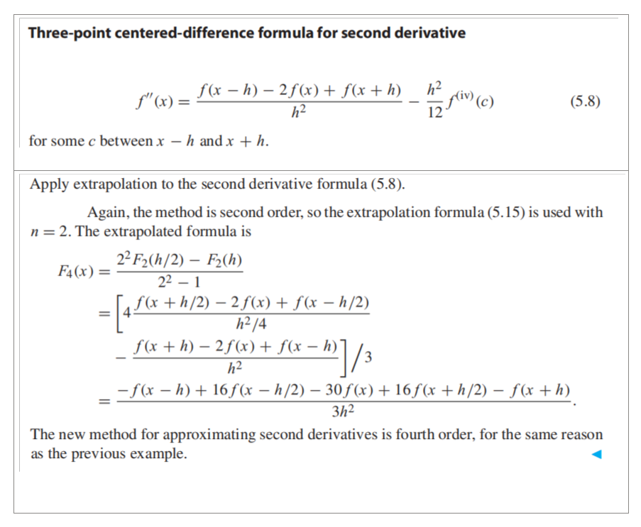

## 作业
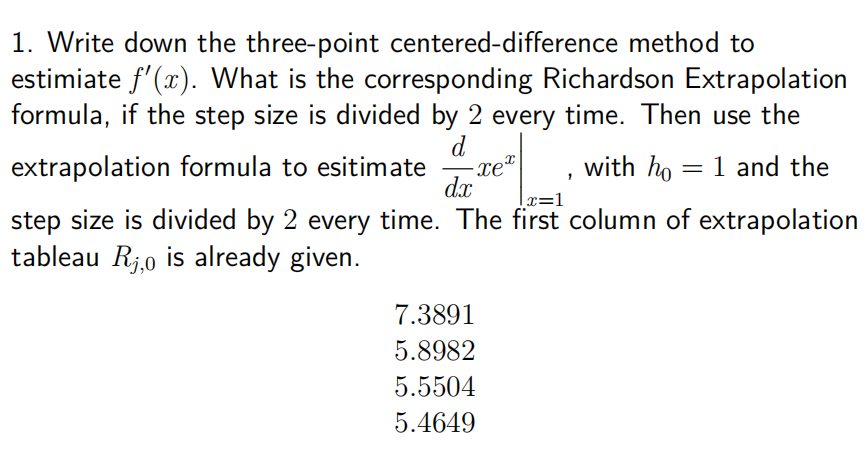
## 
## 
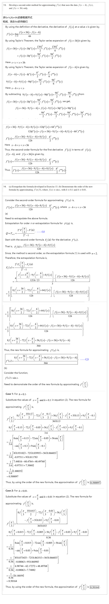
## 5.2 NEWTON–COTES FORMULAS FOR NUMERICAL INTEGRATION
### 5.2.1 Trapezoid Rule
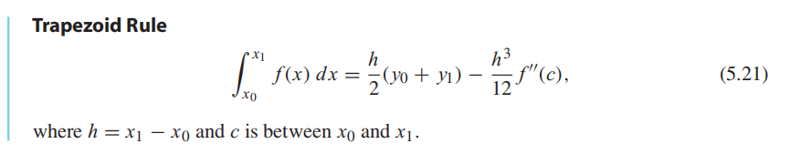
### 5.2.2 Simpson’s Rule
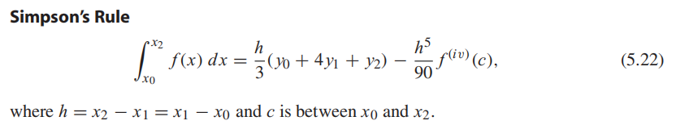

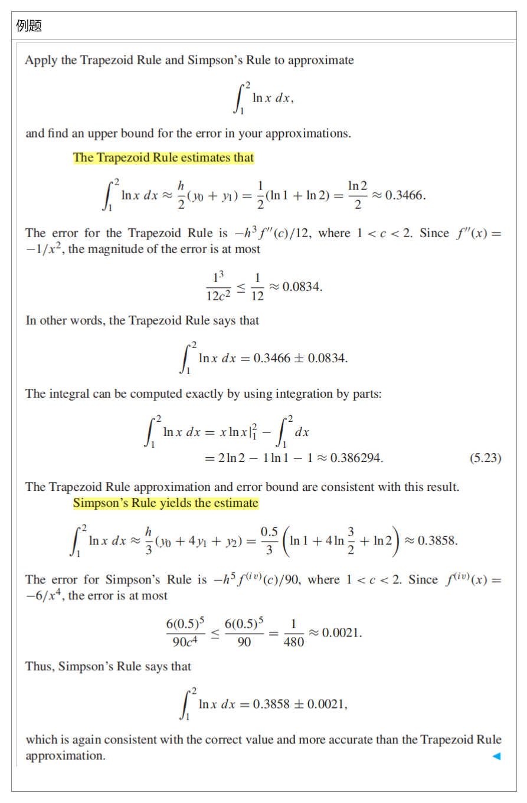

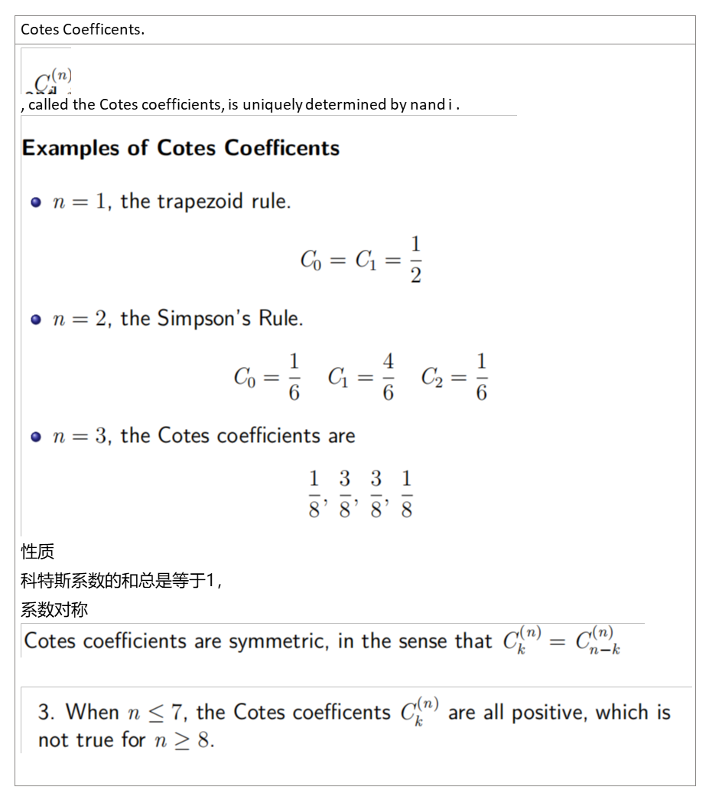

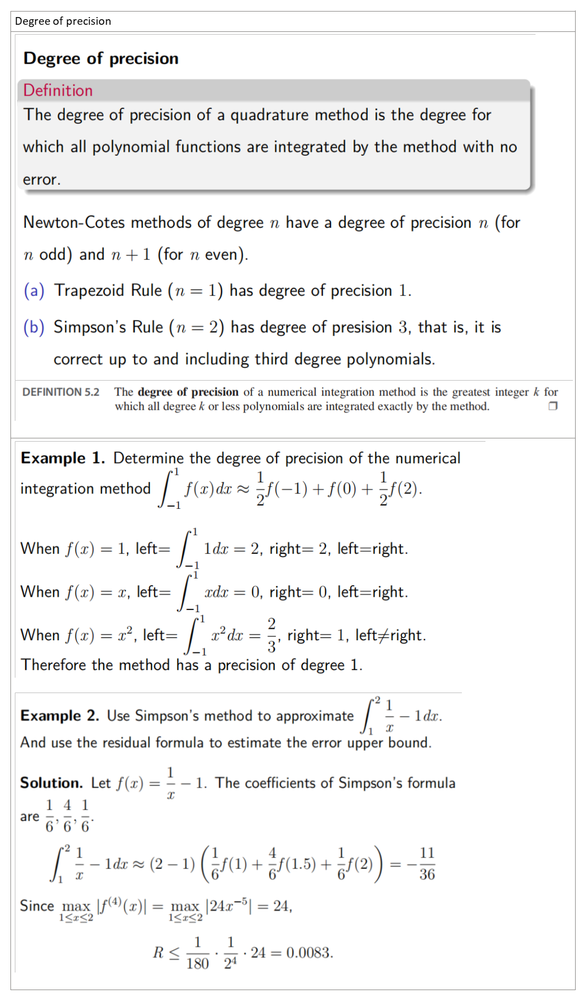

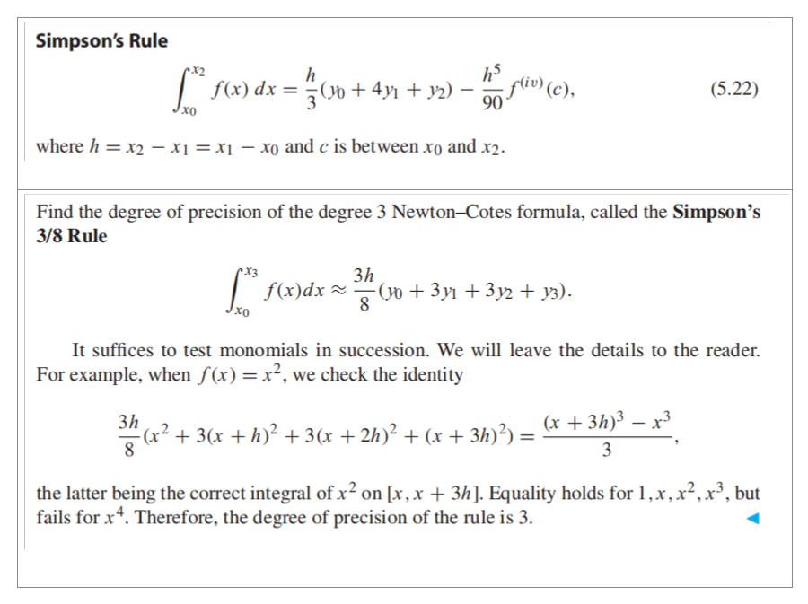

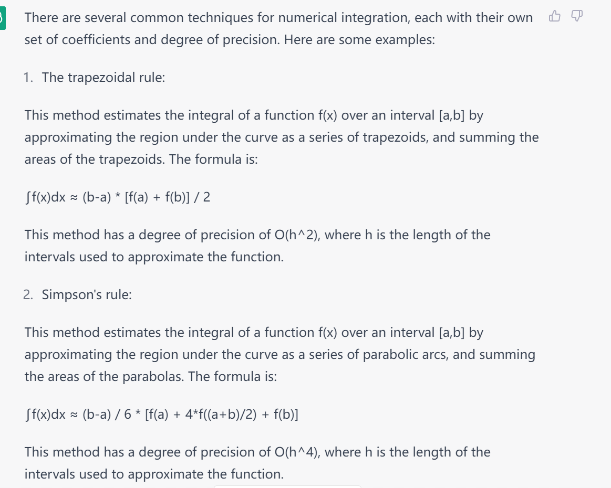

One numerical integration formula that has at least precision of degree 3 is the composite Simpson's rule.

### 5.2.3 Composite Newton–Cotes formulas
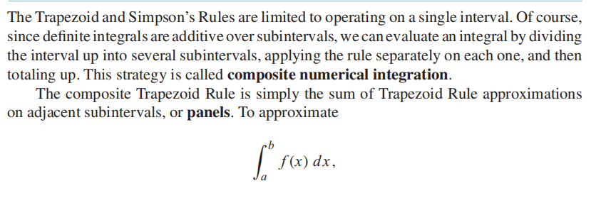

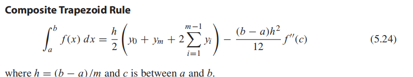

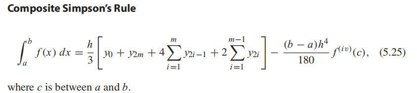

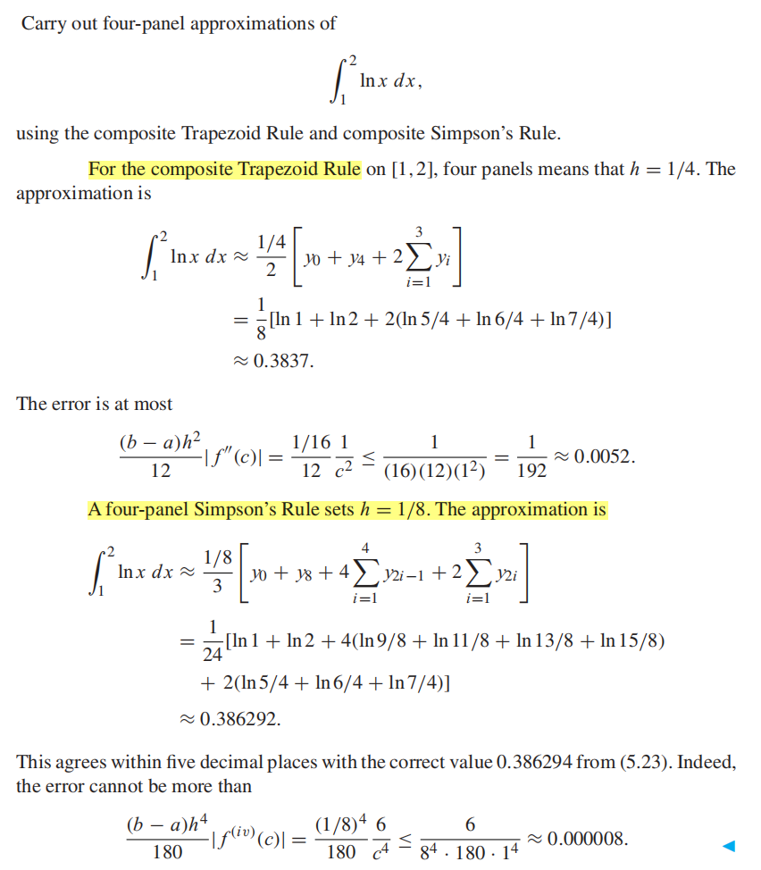

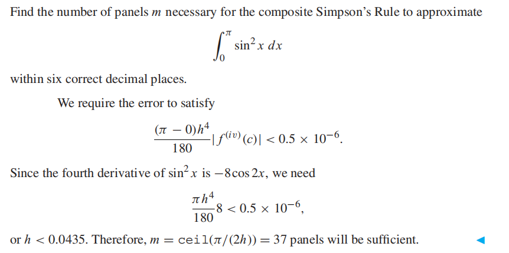
## 
## 
## 
## 5.3 ROMBERG INTEGRATION
计算定积分的方法可以通过添加数据来进行扩展，直到达到所需的精度为止。隆伯格积分是应用复合梯形规则进行外推的结果。
Romberg Integration is the result of applying extrapolation to composite Trapezoid Rule.
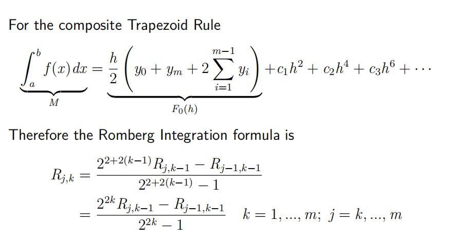
## 5.5 GAUSSIAN QUADRATURE
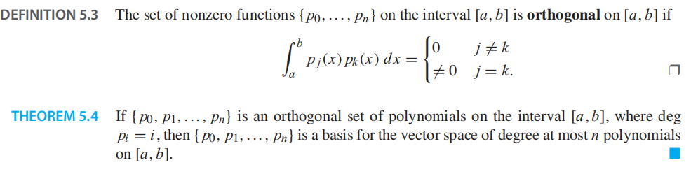
