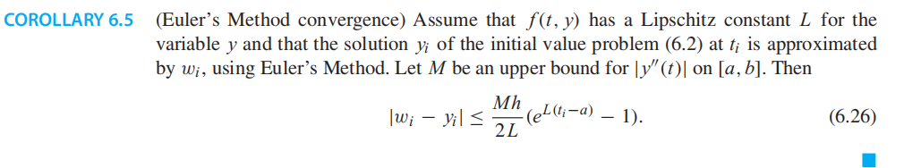

总结：

常微分方程是一个包含导数的方程。

形如，一阶常微分方程

## 6.1 INITIAL VALUE PROBLEMS
一阶常微分方程的initial value problem初值问题是该方程与特定区间a≤t≤b上的初始条件：

### 6.1.1 Euler’s Method

### 6.1.2 Existence, uniqueness, and continuity for solutions
本节为计算初值问题的方法提供了一些理论背景。在我们开始计算一个问题的解之前，知道这一点是有帮助的
(1)解决方案存在，
(2)只有一个解决方案

### 6.1.3 First-order linear equations
一类易于求解的特殊常微分方程提供了一套方便的说明性例子。
它们是一阶方程，其y变量的右侧是线性的。考虑初值问题

结论

带公式

Separation of variables

## 6.2 ANALYSIS OF IVP SOLVERS
## 6.2.1 Local and global truncation error

### 6.2.2 The explicit Trapezoid Method

### 6.2.3 Taylor Methods

<table>
<colgroup>
<col style="width: 100%" />
</colgroup>
<thead>
<tr class="header">
<th>

</th>
</tr>
</thead>
<tbody>
</tbody>
</table>

------------------------------------------------------------------------------------------------------

## 6.3 SYSTEMS OF ORDINARY DIFFERENTIAL EQUATIONS
微分方程的阶数是指在该方程中出现的最高阶导数。一阶系统具有这样的形式

6.3.1 Higher order equations

6.3.1 Higher order equations

6.3.2 Computer simulation: the pendulum
6.3.3 Computer simulation: orbital mechanics

## 6.4 Runge-Kutta Methods and applications
### 6.4.1 The Runge–Kutta family

6.5 VARIABLE STEP-SIZE METHODS
## 6.6 Implicit Methods and Stiff Equations

