常微分方程是一个包含导数的方程。

形如，一阶常微分方程

## 6.1 INITIAL VALUE PROBLEMS
一阶常微分方程的initial value problem初值问题是该方程与特定区间a≤t≤b上的初始条件：
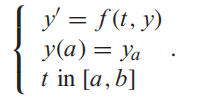

### 6.1.1 Euler’s Method
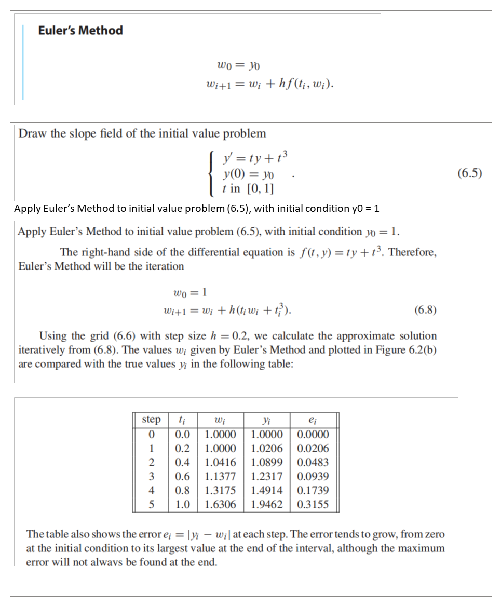

### 6.1.3 First-order linear equations
一类易于求解的特殊常微分方程提供了一套方便的说明性例子。
它们是一阶方程，其y变量的右侧是线性的。考虑初值问题
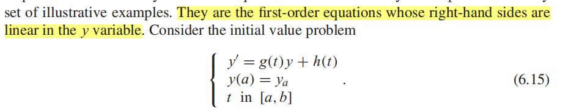
结论

带公式
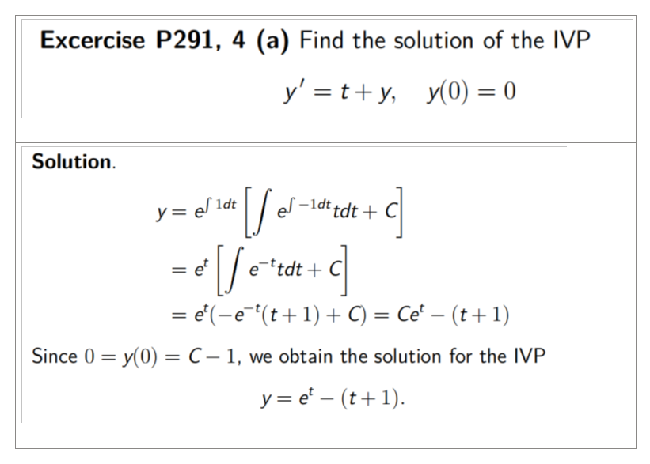

Separation of variables

## 6.2 ANALYSIS OF IVP SOLVERS
## 6.2.1 Local and global truncation error

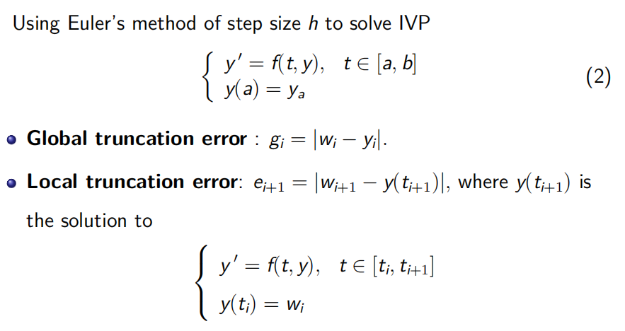

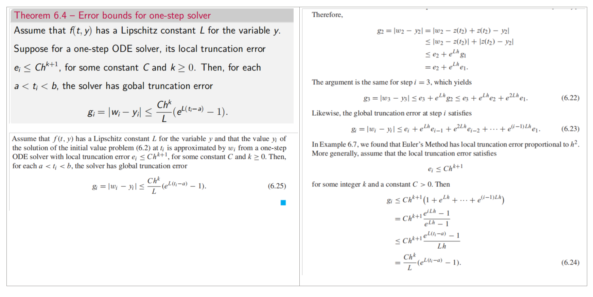

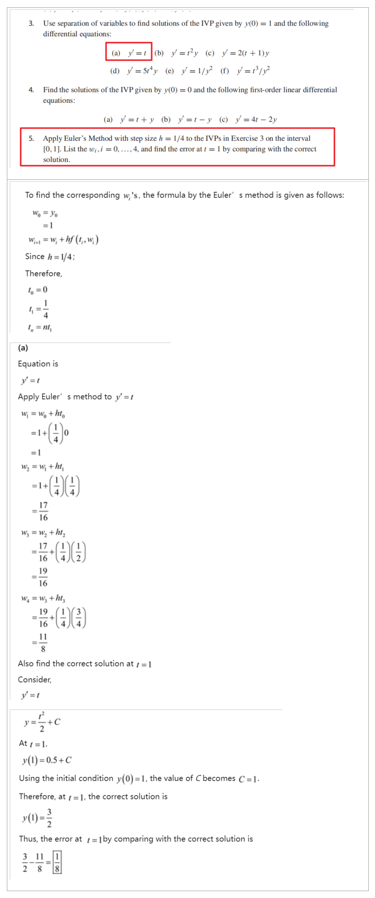

## 6.6 Implicit Methods and Stiff Equations

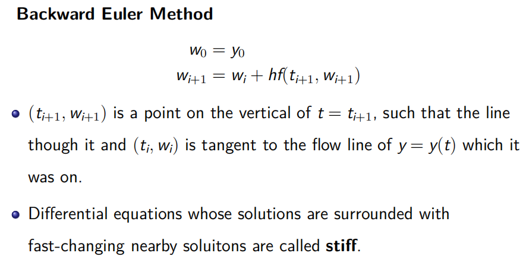

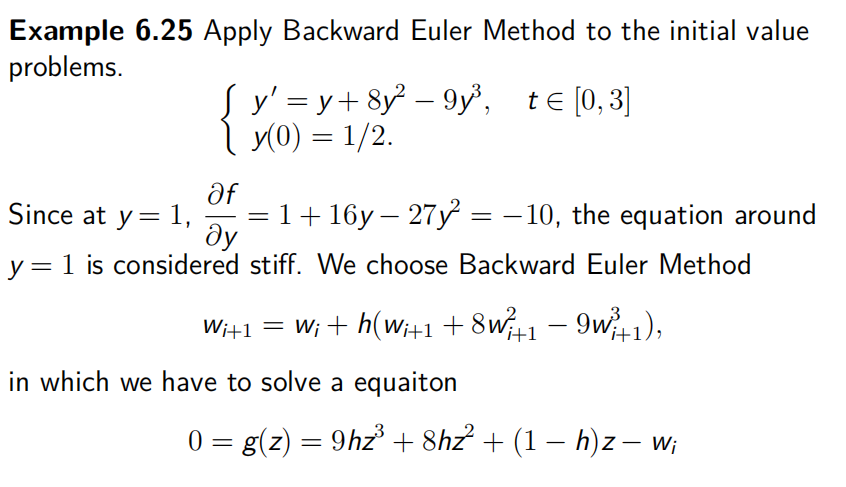

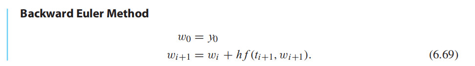

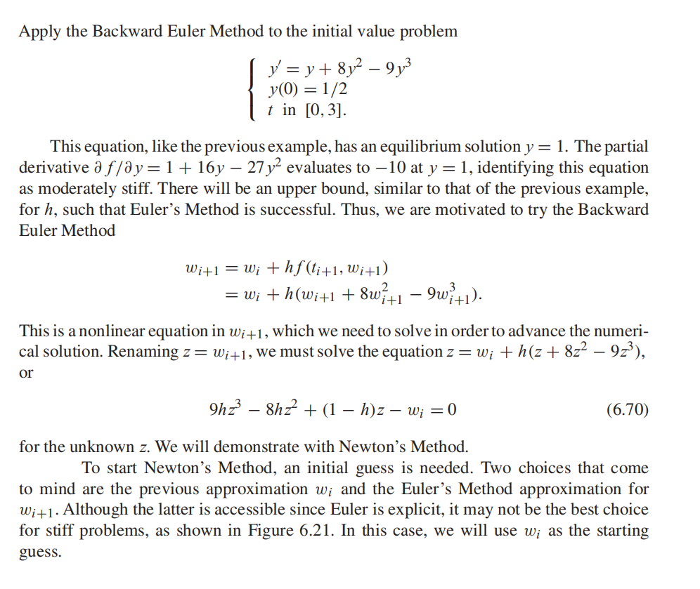

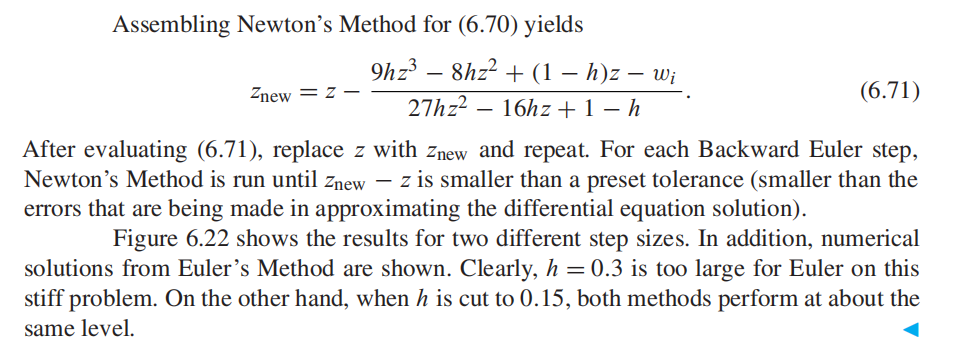

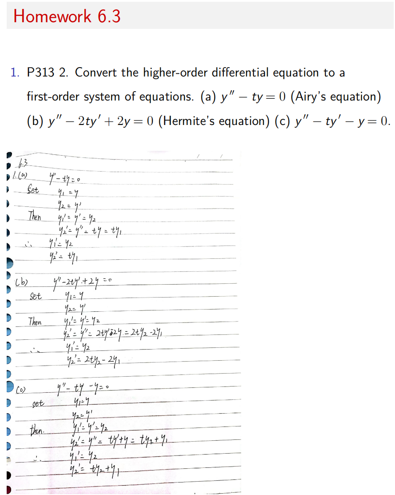
