1.什么是常微分方程
微分方程是一个包含导数的方程。
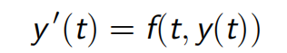
**初始值问题（IVP）**
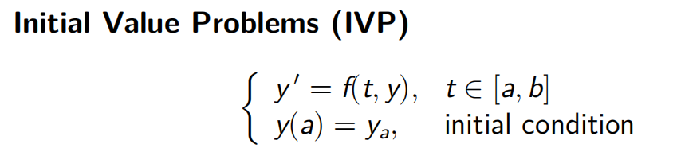

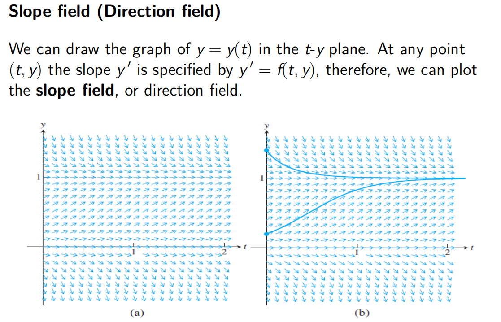

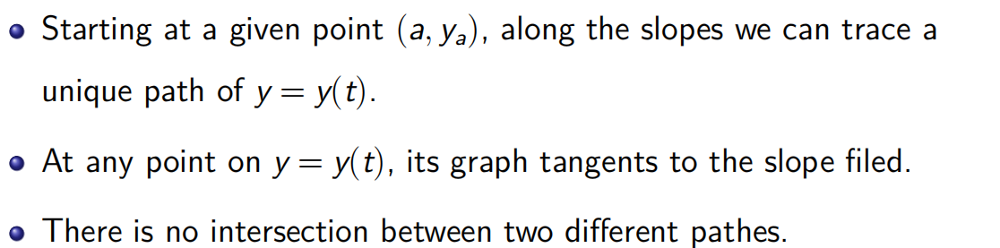
**欧拉方法**
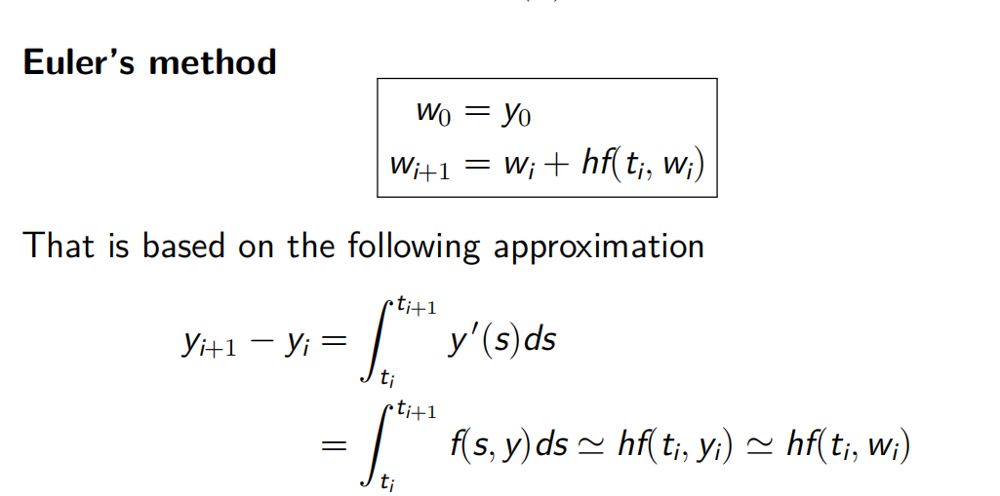

**6.1.2 Existence, Uniqueness, and Continuity**
**6.1.2的存在性、唯一性和连续性**
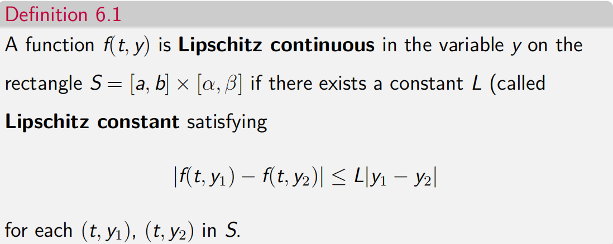
在y中是Lipschitz连续的函数在y中是连续的，但不一定是可微的。

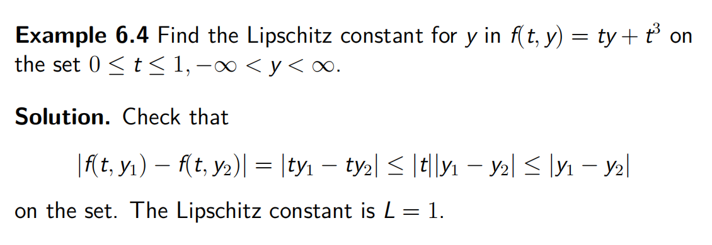

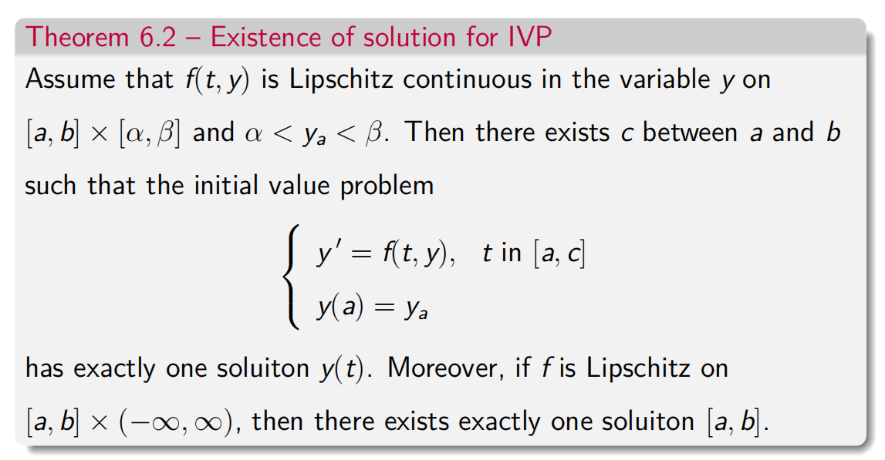

**6.1.3 First-order Linear Equation**

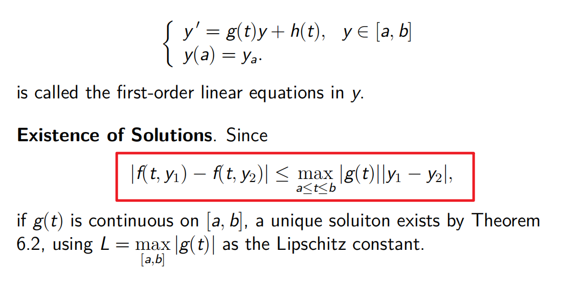

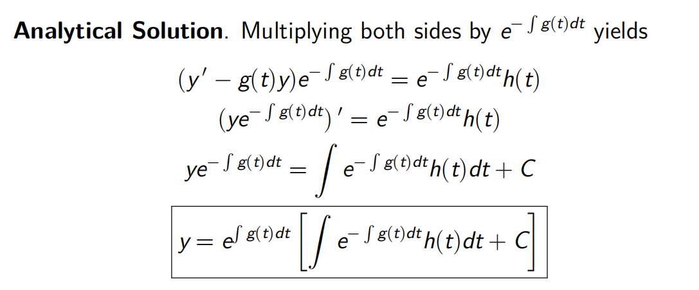

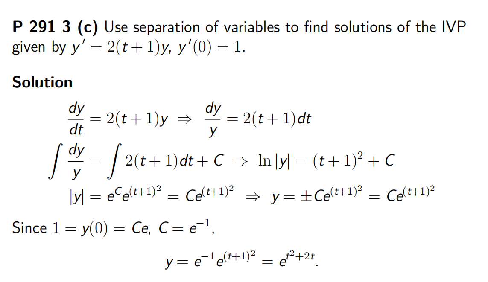

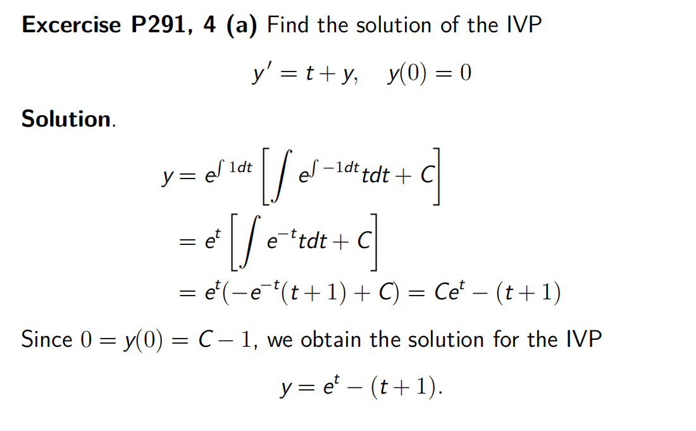
--------------------------------------------------------------------------------------------------------------------------
6.2.1 Local and global truncation error
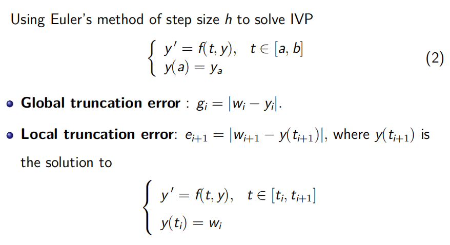

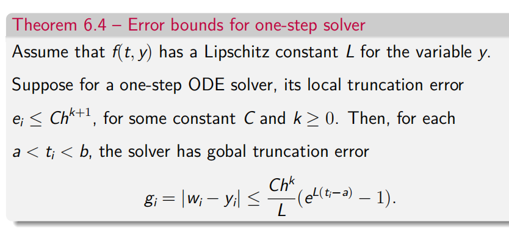

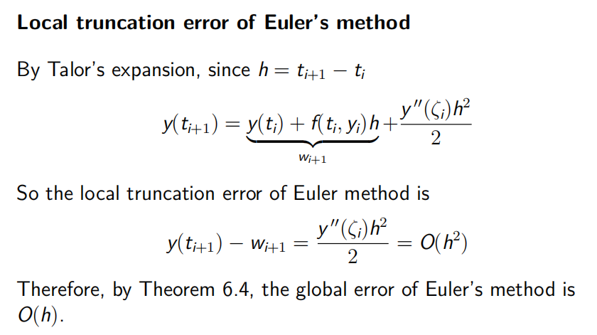

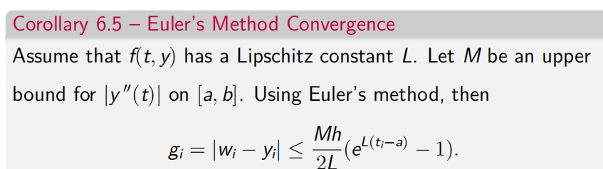

6.2.2 The explicit Trapezoid Method

