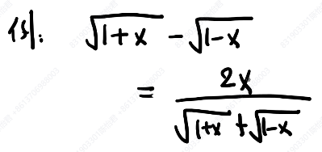

第0章
1、多项式计算
1.常规方法

2.nested form

要会这两个方法，知道分别进行多少次加法乘法计算
2、有效数位，定义
比如，给一个很长的数字，
四舍五入求8位有效数字

绝对误差，相对误差要会算

3、二进制与十进制（小数，分数也要会）

4、利用数学公式防止误差损失
近似的数相加减

第1章
1、二分法
1.误差限公式

给某个方程，要求误差不超过xxx，需要几步

2.迭代法
会判断收敛性

在零点处的导数值

比如给你一个迭代公式，问你在某点收不收敛
3.牛顿法：（重要）
要知道公式

收敛性

会算

第二章
1.LU分解（必考）
1.给A，写出LU分解

利用LU分解写方程

Ly=b, Ux=y

2.LU分解不需要置换的条件
3.迭代法：Jacobi, Gauss-Seidel
公式

收敛性

会计算

第三章 插值
1.拉格朗日插值，牛顿插值
插值公式

会计算

**3.1 练习**

第四章 最小二乘
**4.1 练习**
1.法方程
2.求解

第五章 数值积分（不是重点）
看基本概念
数值积分，高斯积分

第六章 常微分方程
1.Ealer方法
改进前后

公式

会计算

误差公式，局部截断误差公式
其他稍微看看概念
不用花

2.高阶方程转化为一阶方程组
计算公式（可能让你写公式）

第七章：边值问题
重点复习例子P 358 7.8

