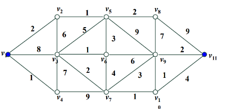
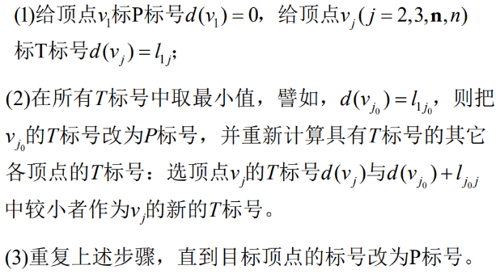
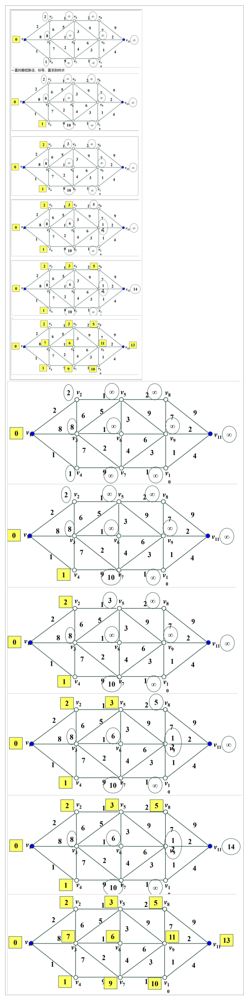
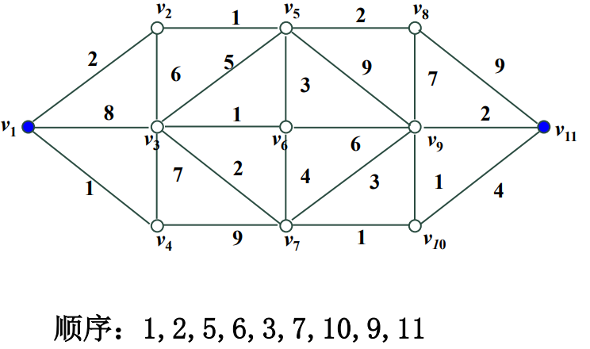
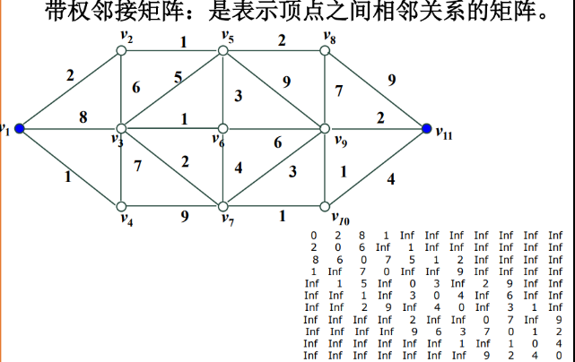
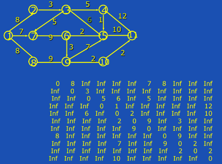
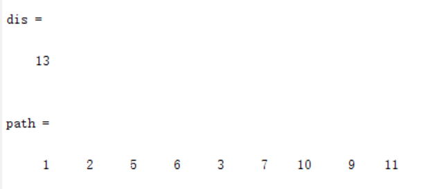

图论模型-Dijkstra算法
2020年11月12日
9:51

需求；找到最小路径

一、Dijkstra算法
1，能求一个顶点到另一顶点最短路径。
Dijkstra算法是一种标号法：给赋权图的每一个顶点记一个数，称为顶点的标号（临时标号，称T标号，或者固定标号，称为P标号）。T标号表示从始顶
点到该标点的最短路长的上界；P标号则是从始顶点
到该顶点的最短路长。

2，步骤

结果

三、实现
1，带权邻接矩阵
注意无向和有向
无向

有方

2，代码

<table>
<colgroup>
<col style="width: 100%" />
</colgroup>
<thead>
<tr class="header">
<th>
function [min,path]=dijkstra(w,start,terminal)

n=size(w,1); label(start)=0; f(start)=start;

for i=1:n

if i~=start

label(i)=inf;

end, end

s(1)=start; u=start;

while length(s)&lt;n

for i=1:n

ins=0;

for j=1:length(s)

if i==s(j)

ins=1;

end,

end

if ins==0

v=i;

if label(v)&gt;(label(u)+w(u,v))

label(v)=(label(u)+w(u,v));

f(v)=u;

end,

end,

end

v1=0;

k=inf;

for i=1:n

ins=0;

for j=1:length(s)

if i==s(j)

ins=1;

end,

end

if ins==0

v=i;

if k&gt;label(v)

k=label(v); v1=v;

end,

end,

end

s(length(s)+1)=v1;

u=v1;

end

min=label(terminal); path(1)=terminal;

i=1;

while path(i)~=start

path(i+1)=f(path(i));

i=i+1 ;

end

path(i)=start;

L=length(path);

path=path(L:-1:1);
</th>
</tr>
</thead>
<tbody>
<tr class="odd">
<td>执行代码</td>
</tr>
<tr class="even">
<td>
weight= [0 2 8 1 Inf Inf Inf Inf Inf Inf Inf;

2 0 6 Inf 1 Inf Inf Inf Inf Inf Inf;

8 6 0 7 5 1 2 Inf Inf Inf Inf;

1 Inf 7 0 Inf Inf 9 Inf Inf Inf Inf;

Inf 1 5 Inf 0 3 Inf 2 9 Inf Inf;

Inf Inf 1 Inf 3 0 4 Inf 6 Inf Inf;

Inf Inf 2 9 Inf 4 0 Inf 3 1 Inf;

Inf Inf Inf Inf 2 Inf Inf 0 7 Inf 9;

Inf Inf Inf Inf 9 6 3 7 0 1 2;

Inf Inf Inf Inf Inf Inf 1 Inf 1 0 4;

Inf Inf Inf Inf Inf Inf Inf 9 2 4 0;];

[dis, path]=dijkstra(weight,1, 11)
</td>
</tr>
</tbody>
</table>

